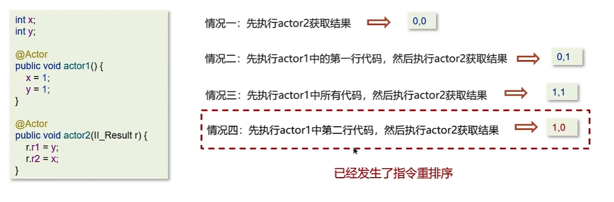

# 线程基础

问：线程和进程的区别

答：

* 进程是正在运行程序的实例，进程中包含了线程，每个线程执行不同的任务
* 不同的进程使用不同的内存空间，在当前进程下的所有线程可以共享内存空间
* 线程更轻量，线程上下文切换成本一般要比进程上下文切换低

---

问：创建线程的方式有哪些

一共有四种方式

* 继承Thread类
* 实现runnable接口
* 实现Callable接口
* 线程池创建线程（项目中使用方式）

---

问：runnable和callable都可以创建线程，他们有什么区别？

答：

* Runnable接口run方法没有返回值，无法拿到线程执行之后的结果

* Callable接口call方法有返回值，是个泛型，和Future、FutureTask配合可以用来获取异步执行的结果
* Callable接口的call方法允许抛出异常；而Runnable接口的run方法的异常只能在内部消化，不能继续上抛

---

问：run方法和start方法有什么区别

* start：**用来启动线程**，通过该线程调用run方法执行run方法中所定义的逻辑代码。start方法只能被调用一次
* run：封装了要被线程执行的代码，可以被调用多次

---

线程包括哪些状态，状态之间是如何变化的

线程的状态可以参考JDK中Thread类中的枚举State


具体的线程流程如下


创建完线程对象后，线程处于新建状态。调用start方法，线程进入Runnable状态，runnable状态中有就绪态和运行态，如果抢到了cpu，那么就变成运行态。执行完代码以后就是终止态了。

在运行的过程中，如果线程没抢到我们加的Synchronize锁，就变成阻塞态。释放锁才重新变成Runnable状态。

在运行的过程中，调用了wait方法，就变成等待状态。被notify后才回到runnable状态。

在运行的过程中，调用了sleep方法，就变成计时等待状态。时间结束后才回到runnable状态。

---

新建T1、T2、T3三个线程，如何保证他们按顺序执行？

答：使用join。T1中写`t2.join()`，说明t1要等待t2执行结束。

好理解的方式。原本是t1一个箭头往后走，如果有了`t2.join()`，那么t1就会停住，箭头被切断，然后中间加入t2，t2结束之后，再继续运行t1。字面意思就是t2加入进来了，所以是`t2.join()`。

---

问：`notify()`和`notifyAll()`有什么区别？

* `notifyAll()`：唤醒所有wait的线程
* `notify：`只随机唤醒一个wait线程

---

问：java中wait方法和sleep方法的区别？

**共同点：**

他们都能让当前线程暂时放弃CPU的使用权，进入阻塞状态

**不同点：**

1、方法归属不同

* `sleep(long)`是 Thread 的静态方法
* `wait()、wait(long)`都是 Object 的成员方法，每个对象都有

2、醒来时机不同

* 执行`sleep(long)`和`wait(long)`的线程都会在等待响应毫秒后醒来
* `wait(long)`和`wait()`还可以被notify唤醒，`wait()`如果不唤醒就一直等待下去
* 他们都可以被打断唤醒

3、锁特性不同(重点)

* wait方法的调用必须先获取wait对象的锁（配合synchronize使用），而sleep没有这个限制
* wait方法执行后会释放对象锁，允许其他线程获得该对象锁（我放弃cpu，但你们还能用）
* 而sleep如果在synchronized代码块中执行，并不会释放对象锁（我放弃cpu，你们也用不了）

---

如何停止一个正在运行的线程

有三种方式可以停止线程

* 使用退出标志，使线程正常退出，也就是run方法完成后线程终止

* 使用stop方法强制停止

* 使用interrupt方法中断线程
  * 打断阻塞的线程(sleep，wait，join)，线程会抛出`InterruptedExceptoin`异常
  * 打断正常的线程，可以根据打断状态来标记是否退出线程


# 线程中的并发安全

## Synchronized

 问：Synchronized的原理


64位虚拟机中 一个对象由mark word和class word组成， classword存储类的相关信息，mark word由hash值，分代年龄，锁标识组成。

重量级锁：将mark word指向monitor，如果owner为空。则monitor的owner标记为本线程，如果已经有owner了，则进入EntryList。等待owner释放之后，EntryList中的线程再竞争锁

答：

* Synchronized采用互斥的方式让统一时刻最多只有一份线程能持有对象锁
* 底层由monitor实现，monitor是jvm级别的对象（ c++实现），线程获得锁需要使用对象（锁）关联monitor
* 在monitor内部有三个属性，分别是owner、entrylist、waitset。owner是关联的获得锁的线程，并且只能关联一个线程；entrylist关联的是处于阻塞状态的线程；waitset关联的是处于waiting状态的线程

---

轻量级锁：

1. 线程生成**锁记录**，并且将锁记录的地址与对象锁的mark word交换。
2. 有新线程要获取锁了，新增一条锁记录，然后去Object中尝试cas，如果发现锁记录地址是自己的线程。就说明是重入。如果不是自己的线程，就进入锁膨胀
3. 释放锁就锁记录逐个消除


---

锁膨胀：

Thread-1获取锁发现锁记录地址不是自己，就让Object指向monitor，monitor的owner是Thread-0,自己进入EntryList

释放锁的时候就正常设置owner为null然后唤醒EntryList中的线程。


---

偏向锁：

哪个线程先占有锁对象，锁对象的Mark Word就指向哪个线程的栈帧中的锁记录。

轻量级锁在没有竞争时(就自己这个线程)，每次重入仍然需要执行CAS操作。

Java6中引入了偏向锁来做进一步优化：只有第一次使用CAS将**线程ID**（偏向锁是**锁记录**）设置到对象的 Mark Word头，之后发现这个线程ID是自己的就表示没有竞争，不用重新CAS。以后只要不发生竞争，这个对象就归该线程所有


---

自适应锁：

重量级锁竞争的时候，还可以使用自旋来进行优化，如果当前线程自旋成功(即这时候持锁线程已经退出了同步块，释放了锁)，这时当前线程就可以避免阻塞。


---

### 问：你了解过锁升级吗？

答：Java中的synchronized有偏向锁、轻量级锁、重量级锁三种形式，分别对应了锁只被一个线程持有、不同线程交替持有、多线程竞争锁三种情况。

偏向锁：只被一个线程使用。第一次获得锁时，会有一个cas操作，之后该线程再获取锁，只需要判断markword中是否是自己的线程id即可，而不是开销相对较大的CAS命令。

轻量级锁：线程加锁的时间是错开的，即无竞争时使用该锁。它修改了对象头的锁标志，相对重量级锁性能提升很多。每次修改都是CAS操作，保证了原子性。

重量级锁：底层使用monitor实现，涉及到了用户态和内核态的转换，进程的上下文切换。成本较高，性能较低。

---

### synchronized执行流程

1）线程抢锁时，JVM首先检测内置锁对象Mark Word中biased_lock（偏向锁标识）是否设置成1，lock（锁标志位）是否为01，如果都满足，确认内置锁对象为可偏向状态。

2）在内置锁对象确认为可偏向状态之后，JVM检查Mark Word中线程ID是否为抢锁线程ID，如果是，就表示抢锁线程处于偏向锁状态，抢锁线程快速获得锁，开始执行临界区代码。

3）如果Mark Word中线程ID并未指向抢锁线程，就通过CAS操作竞争锁。如果竞争成功，就<font   color=red>将Mark Word中线程ID设置为抢锁线程</font>，偏向标志位设置为1，锁标志位设置为01，然后执行临界区代码，此时内置锁对象处于偏向锁状态。

4）如果CAS操作竞争失败，就说明发生了竞争，撤销偏向锁，进而升级为轻量级锁。

5）JVM使用CAS将锁对象的<font color=red>Mark Word替换为抢锁线程的锁记录指针</font>，如果成功，抢锁线程就获得锁。如果替换失败，就表示其他线程竞争锁，JVM尝试使用CAS自旋替换抢锁线程的锁记录指针，如果自旋成功（抢锁成功），那么锁对象依然处于轻量级锁状态。

6）如果JVM的CAS替换锁记录指针自旋失败，轻量级锁膨胀为重量级锁，后面等待锁的线程也要进入阻塞状态。

### 三种内置锁的对比


### 说一说JMM（Java内存模型）

答：

* JMM定义了**共享变量**中**多线程程序读写操作**的行为规范，通过这些规则来规范对内存的读写操作，从而保证指令的正确性
* JMM把内存分为两块，一块是私有线程的工作区域（工作内存），一块是私有线程的共享区域（主内存）
* 线程和线程之间相互隔离，线程和线程交互需要通过主内存

---

### 说一说CAS

CAS全称是Compare and Swap，体现的是乐观锁的思想，在无锁情况下保证线程操作共享数据的原子性。在JUC包下实现的很多类都用到了CAS操作。

* AQS
* AtomicXXX类

自旋锁：

```java
while(true) {
    int old = V;
    int newVal = old + 1;
    if(compareAndSwap(old, newVal)) {
        //成功，退出循环
    }
}
```

CAS底层依赖于一个`Unsafe`类来直接调用操作系统底层的CAS指令


问：说一说CAS

答：

* CAS全称是Compare and Swap，它体现的是乐观锁的思想，**在无锁状态下保证线程操作数据的原子性**
* AQS框架、AtomicXXX类都使用到了CAS
* 在操作共享变量的时候使用自旋锁，效率上更高一些
* CAS的底层调用Unsafe类中的方法，是操作系统提供的

---

问：乐观锁和悲观锁的区别

答：

CAS是基于乐观锁的思想：最乐观的估计，不怕别的线程来修改，如果被改了，那我就重试。

synchronized是基于悲观锁的思想：我上锁了，你们都不能改，我解锁了你们才可以改。

---

## volatile

说说volatile

一旦一个共享变量（类的成员变量、类的静态成员变量）被volatile修饰之后，就具备了两层语义：

* **保证线程间的可见性**

  用volatile修饰共享变量，能防止编译器优化。让一个线程对共享变量的修改一定对另一个线程可见。

  ```java
  class VolatileDemo {
      //不加volatile程序就会死循环
      private volatile static int run = 0;
  
      public static void main(String[] args) throws InterruptedException {
          new Thread(() -> {
              while (run == 0) {
              }
          }).start();
          Thread.sleep(1000);
          run = 1;
          System.out.println(run);
      }
  }
  ```

* **禁止进行指令重排序**

​		用volatile修饰共享变量会在读、写共享变量时加入不同的屏障，阻止其他读写操作越过屏障，从而达到阻止重排序的效果。



在**变量y**上添加volatile，禁止指令重排序，可以解决问题


如果变量x加上volatile，是无法解决问题的。原因：


所以volatile的使用技巧是：

* volatile修饰的**写**变量，在代码最后的位置
* volatile修饰的**读**变量，在代码最前的位置


ps：volatile不保证原子性

---

问：谈谈对volatile的理解

答：

1）保证线程之间的可见性

​	用volatile修饰共享变量，能防止编译器等优化发生，让一个线程对共享变量的修改对另一个线程可见

2）禁止指令重排序

指令重拍：用volatile修饰共享变量会在读、写共享变量时加入不同的屏障，阻止其他读写操作越过屏障，从而达到阻止重排序的效果

---
问：说说volatile原理

答：

volatile 可以保证线程可见性且提供了一定的有序性，但是无法保证原子性。在 JVM 底层是基于**内存屏障**实现的。

- 当对非 volatile 变量进行读写的时候，每个线程先从内存拷贝变量到 CPU 缓存中。如果计算机有多个 CPU，每个线程可能在不同的 CPU 上被处理，这意味着每个线程可以拷贝到不同的 CPU cache 中
- 而声明变量是 volatile 的，JVM 保证了每次读变量都从内存中读，跳过 CPU cache 这一步，所以就不会有可见性问题
  - **对 volatile 变量进行写操作时，会在写操作后加一条 store 屏障指令，将工作内存中的共享变量刷新回主内存；**
  - **对 volatile 变量进行读操作时，会在读操作前加一条 load 屏障指令，从主内存中读取共享变量；**

---

## 单例模式

```java
package com.sll.practise.juc.singleton;

/**
 * 懒汉式单例
 */
public class Lazy {
    private Lazy() {
        System.out.println(Thread.currentThread().getName() + " ok ");
    }

    private volatile static Lazy lazy;

    //double check
    public static Lazy getInstance() {
        if(lazy == null) {
            synchronized (Lazy.class) {
                if(lazy == null) {
                    //该操作不是原子性操作
                    /**
                     * 1.分配内存空间
                     * 2.执行构造方法，初始化对象
                     * 3.分配指针
                     */
                    lazy = new Lazy();
                }
            }
        }
        return lazy; //指令重拍：先3再2，会出问题。所以要加上volatile
    }

    //多线程并发
    public static void main(String[] args) {
        for (int i = 0; i < 10; i++) {
            new Thread(()-> {
                Lazy.getInstance();
            }).start();
        }
    }
}

```


## AQS

什么是AQS

全称是`AbstractQueuedSynchronizer`，即抽象队列同步器，他是构建锁或者其他同步组件的**基础框架**

AQS和Synchronized的区别


AQS的常见实现类：

* ReentrantLocak 阻塞式锁
* Semaphore 信号量
* CountDownLatch 倒计时锁

---

问：什么是AQS？

* AQS是多线程中的队列同步器，是一种锁机制，它是作为一个**基础框架**的使用的。`ReentrantLocak、Semephore`都是基于AQS实现的
* AQS内部维护了一个先进先出的双向队列，队列中存储排队的线程
* 在AQS内部还有一个属性state，这个state就相当于是一个资源，默认是0（无锁状态），如果队列中有一个线程成功修改了state为1，则当前线程就等于获取了资源
* 在对state修改的时候使用了cas操作，保证多个线程修改时的原子性

---

## ReentrantLocak

ReentrantLock的实现原理

默认非公平实现，`NofairSync`示意图：


Thread-0：CAS成功，`exclusiveOwnerThread`标记为Thread-0。

Thread-1：CAS失败，tryAcquire失败，构造AQS队列，进入AQS队列等待。

Thread-0释放锁以后，唤醒AQS队列中的第一个等待线程Thread-1，Thread-1会再次尝试tryAcquire。如果锁已经释放，就CAS成功，修改state为1。如果被插队了，重新进入等待队列。

只要进入aqs队列了，就一定是先后顺序。Reentrant lock非公平锁的非公平体现在还没有进入aqs队列的线程可以插队。


ReentrantLock相对于synchronized具备以下特点：

* 可中断
* 可以设置超时时间
* 可以设置公平锁
* 支持多个条件变量
* 与synchronized一样，都支持重入

```java
//创建锁对象
ReentrantLock lock = new ReentarantLock();
try{
    //获取锁
    lock.lock();
} finally {
    //释放锁
    lock.unlock();
}
```

ReentrantLock主要**利用CAS +AQS（CLH）队列**实现，支持公平锁和非公平锁，两者的实现类似

构造方法接受一个可选的公平参数（默认不公平），当设置为true时，表示公平。公平锁的效率没有非公平锁高。

-----

问：说一说ReentrantLock的原理

* ReentrantLock表示支持重新进入的锁，调用lock方法获取了锁以后，再次调用lock就不会再阻塞
* ReentrantLock主要利用CAS + AQS队列实现

* 支持公平锁和非公平锁

---

synchronized和lock有什么区别？

* 语法层面
* 功能层面
* 性能层面

1、语法层面

synchronized是关键字，源码在jvm中，用c++语言实现。lock是接口，源码由jdk提供，用java语言实现。使用synchronized时，退出同步代码块锁会自动释放，而使用lock时，需要手动调用unlock方法释放锁。

2、功能层面

二者都是悲观锁，lock比synchronized更加强大，比如公平锁、可打断、可超时、多条件变量。

Lock由适合不同场景的实现，比如ReentrantLock， ReentrantReadWriteLock（读写锁）

3、性能层面

没有竞争时，synchronized做了很多优化，比如偏向锁、轻量级锁，性能较好

竞争激烈时，Lock的实现会提供更好的性能。

---

问：死锁产生的条件是什么

答：

* 互斥：资源只供一个线程使用
* 请求并保持：线程持有的同时还在请求别的资源
* 不可剥夺：线程持有就不可以被剥夺
* 环路等待释放：多个线程请求资源形成环路等待释放

---

问：如何进行死锁诊断？

* jdk自带的工具：jps，jstack
* 可视化工具jconsole、VisualVM

---

问：说一说`ConcurrentHashMap`

答：ConcurrentHashMap是一种线程安全的高效Map集合

底层数据结构：

* JDK1.7采用分段数组+链表

* JDK1.8采用数组+链表/红黑树

  * CAS控制数组节点的添加
  * synchronized只锁定当前链表或红黑二叉树的**首节点**，只要hash不冲突，就不会产生并发问题，效率得到提升

  


---

导致并发程序出现问题的根本原因是什么？（Java程序中怎么保证多线程的执行安全）

Java并发编程三大特征：

* 原子性  synchronized 、 lock
* 可见性  volatile、synchronized、 lock
* 有序性（指令重排序）   volatile


## 线程安全的阻塞队列

```java
import java.util.LinkedList;
import java.util.Queue;

public class CustomBlockingQueue<T> {
    private final Queue<T> queue = new LinkedList<>(); // 用于存储队列元素
    private final int capacity; // 队列的容量

    public CustomBlockingQueue(int capacity) {
        this.capacity = capacity;
    }

    // 添加元素到队列中（阻塞操作）
    public synchronized void put(T item) throws InterruptedException {
        while (queue.size() == capacity) {
            wait(); // 队列已满，阻塞当前线程
        }
        queue.add(item); // 添加元素到队列
        notifyAll(); // 唤醒其他线程（可能是消费者线程）
    }

    // 从队列中取出元素（阻塞操作）
    public synchronized T take() throws InterruptedException {
        while (queue.isEmpty()) {
            wait(); // 队列为空，阻塞当前线程
        }
        T item = queue.poll(); // 获取并移除队列头部的元素
        notifyAll(); // 唤醒其他线程（可能是生产者线程）
        return item;
    }

    // 返回队列的当前大小
    public synchronized int size() {
        return queue.size();
    }
}
```


# 线程池

问：说一下线程池的核心参数

答：

* `corePoolSize`核心线程数目
* `maximumPoolSize `最大线程数目 = 核心线程+ 究极线程的最大数目
* `keepAliveTime`生存时间 ： 救急线程的生存时间，生存时间内没有新任务，次线程资源会释放
* `unit` 时间单位：救急线程的生存时间单位，如秒、毫秒等
* workQueue：当没有空闲核心线程时，新来任务会加入到此队列排列，队列满会创建救急线程执行任务
* threadFactory：线程工厂，可以定制线程队形的创建
* handler：拒绝策略，当所有线程都在繁忙，workQueue也放满时，会触发拒绝策略

---

问：说一下线程池的执行原理


---

线程池的拒绝策略：


---

在很多公司（如阿里、华为等）的编程规范中，非常明确地禁止使用Executors快捷创建线程池.

使用Executors创建的**“固定数量的线程池”(newFixedThreadPool)和“单线程化线程池”(newSingleThreadExecutor)**的潜在**问题主要存在于其workQueue上**，其值为LinkedBlockingQueue（无界阻塞队列）。如果任务提交速度持续大于任务处理速度，就会造成队列中大量的任务等待。如果队列很大，很有可能导致JVM出现OOM（Out Of Memory）异常，即内存资源耗尽。

使用Executors创建的**“可缓存线程池”(newCachedThreadPool)**和**可调度线程池(ScheduledThreadPoolExecutor)**的潜在问题存在于其最大线程数量不设上限。由于其maximumPoolSize的值为Integer.MAX_VALUE（非常大），可以认为是无限创建线程的，如果任务提交较多，就会造成大量的线程被启动，很有可能造成OOM异常，甚至导致CPU线程资源耗尽。

总结：

（1）FixedThreadPool和SingleThreadPool这两个工厂方法所创建的线程池，工作队列（任务排队的队列）长度都为Integer.MAX_VALUE，可能会堆积大量的任务，从而导致OOM（即耗尽内存资源）。

（2）CachedThreadPool和ScheduledThreadPool这两个工厂方法所创建的线程池允许创建的线程数量为Integer.MAX_VALUE，可能会导致创建大量的线程，从而导致OOM问题。

# ThreadLocal


**什么是ThreadLocal？**

ThreadLoca就是线程本地量，它其实是一种线程的隔离机制，保障了多线程环境下对于共享变量访问的安全性。

**和Synchronized区别是什么？**


通过上图发现ThreadLocal其实是一种线程隔离机制，而Synchronized是一种基于Happens-Before规则中的监视器锁规则从而保证同一个时刻只有一个线程能够对共享变量进行更新。通俗来说，ThreadLocal是将共享变量从公共区域拿到自己的领地去处理，而Synchronized是线程前往公共区域去处理共享变量。

**ThreadLocal的使用场景**

1.用来替代参数链传递：在编写API接口时，可以将需要传递的参数放入ThreadLocal中，从而不需要在每个调用的方法上都显式地传递这些参数。这种方法虽然不如将参数封装为对象传递来得常见，但在某些情况下可以简化代码结构。

2.数据库连接和会话管理：在某些应用中，如Web应用程序，ThreadLocal可以用来保持对数据库连接或会话的管理，以简化并发控制并提高性能。例如，可以使用ThreadLocal来维护一个连接池，使得每个请求都能共享相同的连接，而不是每次都需要重新建立连接。

3.全局存储信息：例如在前后端分离的应用中，ThreadLocal可以用来在服务端维护用户的上下文信息或者一些配置信息，而不需要通过HTTP请求携带大量的用户信息。这样做可以在不改变原有架构的情况下，提供更好的用户体验。

**总结：**ThreadLocal 适用于每个线程需要自己独立的实例且该实例需要在多个方法中被使用，也即变量在线程间隔离而在方法或类间共享的场景

**ThreadLocal原理**


对应上述图中，解释一下。

1. 图中有两个线程Thread1以及Thread2。
2. Thread类中有一个叫做threadLocals的成员变量，它是ThreadLocal.ThreadLocalMap类型的。
3. ThreadLocalMap内部维护了Entry数组，每个Entry代表一个完整的对象，**key是ThreadLocal本身**，value是ThreadLocal的泛型对象值。

**内存泄漏：**

1. ThreadLocalMap中维护的Entry继承了WeakReference，其中key为==弱引用==的ThreadLocal实例，value是线程变量的副本。GC会回收掉key，保留value。

解决：在finally中把ThreadLocal  Remove掉。确保任务结束后ThreadLocal被删除。

**除了用户登陆外，还有哪些和用户信息无关的场景可以用到？**

数据库连接管理、事务管理、日志追踪

## 持有者

**早期版本的ThreadLocalMap的持有者是ThreadLocal，而新版本的ThreadLocalMap的持有者是Thread。**

原因：早期版本ThreadLocalMap的拥有者为ThreadLocal，在Thread（线程）实例被销毁后，ThreadLocalMap还是存在的；新版本的ThreadLocalMap的拥有者为Thread，现在当Thread实例被销毁后，ThreadLocalMap也会随之被销毁，在一定程度上能减少内存的消耗。

**早期版本的key为Thread实例，新版本的key实例为ThreadLocal实例**

原因：每个ThreadLocalMap存储的“Key-Value对”数量变少。早期版本的“Key-Value对”数量与线程个数强关联，若线程数量多，则ThreadLocalMap存储“Key-Value对”数量也多。新版本的ThreadLocalMap的Key为ThreadLocal实例，多线程情况下ThreadLocal实例比线程数少。

## 内存泄漏问题

**1.key的泄漏**

栈上的ThreadLocal Ref引用不再使用了，即当前方法结束处理后，这个对象引用就不再使用了，那么，ThreadLocal对象因为还有一条引用链存在，如果是强引用的话，这里就会导致ThreadLocal对象无法被回收，可能导致OOM。

解决方案：**使用弱引用**


线程中的栈帧对Threadocal实例一定是强引用的，在线程执行完funcA()，funcA()的方法栈帧将被销毁，栈帧中的引用会解除。此刻如果Map中的key是强引用，就会导致Key引用指向的ThreadLocal实例及其Value值都不能被GC回收，这将造成严重的内存泄漏，如图所示：


由于ThreadLocalMap中Entry的Key使用了弱引用，在下次GC发生时，就可以使那些没有被其他强引用指向、仅被Entry的Key所指向的ThreadLocal实例能被顺利回收。并且，在Entry的Key引用被回收之后，其Entry的Key值变为null。后续当ThreadLocal的get()、set()或remove()被调用时，ThreadLocalMap的内部代码会清除这些Key为null的Entry，从而完成相应的内存释放

**2.value的泄漏**

假设我们使用了线程池，如果Thread对象一直被占用使用中（ 如在线程池中被重复使用 ），但是此时我们的ThreadLocalMap（thread 的内部属性）生命周期和Thread的一样，它不会回收，这时候就出现了一个现象：Value这条引用链（Entry中的value引用的值）就一直存在，那么就会导致ThreadLocalMap无法被JVM回收，可能导致OOM。

解决方法：

**1）探测式清理**

当线程调用 ThreadLocal 的 get() 、 set() 或 remove() 方法时，会触发对 ThreadLocalMap 的清理。此时，ThreadLocalMap 会检查所有键（ThreadLocal 实例），并移除那些已经被垃圾回收的key键及其对应的value 值。这种清理是主动的，因为它是在每次操作 ThreadLocal 时进行的。

**2）启发式清理**

在 ThreadLocalMap 的 set() 方法中，有一个阈值（默认为 ThreadLocalMap.Entry 数组长度的1/4）。当 ThreadLocalMap 中的 Entry 对象被删除（通过键的弱引用被垃圾回收）并且剩余的 Entry 数量大于这个阈值时，会触发一次启发式清理操作。这种清理是启发式的，因为它不是每次操作都进行，而是基于一定的条件和概率。


**最好的方案：手动清理**

这通常发生在使用线程池的场景中，因为线程池中的线程通常是长期存在的，它们的ThreadLocal变量也不会自动清理，这可能导致内存泄漏。前面讲了，JDK已经用尽全力去解决了，JDK 用了三个办法，来解决内存泄漏。尽管有弱引用以及这些清理机制，但最佳实践业务主动清理，业务上解决这个问题的一个方法是，每当使用完ThreadLocal变量后，显式地调用 remove() 方法来清除它：如何业务主动清理？在使用完 ThreadLocal 后显式调用 remove()方法 ，以确保不再需要的值能够被及时回收，key和value 都同时清理，一锅端。这样可以避免潜在的内存泄漏问题，并减少垃圾回收的压力


## static final 修饰

规范：推荐使用static final 修饰ThreadLocal对象

ThreadLocal 实例作为ThreadLocalMap的Key，针对一个线程内所有操作是共享的，所以建议设置static修饰符，以便被所有的对象共享。

由于静态变量会在类第一次被使用时装载，只会分配一次存储空间，此类的所有实例都会共享这个存储空间，所以使用 static 修饰ThreadLocal 就会节约内存空间。

另外，为了确保ThreadLocal 实例的唯一性，除了使用static修饰之外，还会使用 final 进行加强修饰，以防止其在使用过程中发生动态变更。参考的实例如下：

```java
//推荐使用static final线程本地变量
private static final ThreadLocal<Foo> LOCAL_FOO = new ThreadLocal<Foo>();
```

<font color="red">由于使用static 、final修饰TheadLocal对象实例， 导致了这个被 ThreadLocalMap中Entry的Key所引用的ThreadLocal对象实例，一直存在强引用。</font>

这里有一个严重后果，这个 使用static 、final修饰TheadLocal对象实例 一直不会被GC，一直存在，一直存在......


## **InheritableThreadLocal**

在 Java 中，每个线程都有自己的线程本地变量，称为 ThreadLocal 变量。然而，在使用线程池或创

建线程组时，可能会遇到一个问题：子线程无法访问父线程的 ThreadLocal 变量，这就是线程继承问

题。

InheritableThreadLocal 的作用就是解决这个问题。

* 当一个线程创建子线程时，子线程会继承父线程的 InheritableThreadLocal 变量的值。

* 这样，子线程就可以直接访问父线程的 InheritableThreadLocal 变量，而不需要手动传递值。

使用 InheritableThreadLocal 类似于使用普通的 ThreadLocal ，你可以通过 set() 方法设置变量

的值，通过 get() 方法获取变量的值。但是， InheritableThreadLocal 会在创建子线程时自动继

承父线程的变量值。

InheritableThreaLocal 主要是要用于主子线程之间传递参数的，这种方式有一个问题，那就是**必须要是在主线程中手动创建的子线程才可以**，但对于使用线程池等池化复用线程的执行组件的情况，很多时候线程都是通过线程池进行创建和复用的，这时候 InheritableThreaLocal 就无计可施了。

**1.线程不安全**

如果说线程本地变量是只读变量不会受到影响，但是如果是可写的，那么任意子线程针对本地变量的修改都会影响到主线程的本地变量（本质上是同一个对象），子线程写入后会覆盖掉主线程的变量，也是通过这个结果，我们确认了子线程TLMap里变量指向的对象和父线程是同一个。

**2.线程池中可能失效** 

按照上述实现，在使用线程池的时候，ITL会完全失效，因为父线程的TLMap是通过init一个Thread的时候进行赋值给子线程的，而线程池在执行异步任务时可能不再需要创建新的线程了，因此也就不会再传递父线程的TLMap给子线程了。

## **TransmittableThreadLocal** 

主要解决了传统 ThreadLocal 和 InheritableThreadLocal 在 **线程池或异步执行框架**中使用时的上下文传递问题。

在多线程或线程池环境中，InheritableThreadLocal 允许子线程继承父线程的变量，但它无法处理线程池场景，因为线程池中的线程是重复使用的，子线程执行完任务后，线程会被归还线程池，变量可能残留或被覆盖，导致数据不一致或泄露。而 TransmittableThreadLocal 专门为了解决这一问题。

TTL 通常用于需要在线程池中执行任务，并且需要在**任务之间传递 ThreadLocal 值**的场景。

例如，在 Web 应用中，可能需要在异步任务中访问当前用户的会话信息，而使用 TTL 可以确保子线程能够正确访问父线程设置的会话信息。

他本质上也是一个InheritableThreadLocal

```java
public class TransmittableThreadLocal<T>
extends InheritableThreadLocal<T> implements TtlCopier<T> {}
```

 具体值是保存在线程内部的**inheritableThreadLocals**，不涉及线程池时可以当成

InheritableThreadLocal使用。

**TransmittableThreadLocal重要核心属性holder**：

```java
1. holder 本质上是一个 InheritableThreadLocal(a ThreadLocal).

2. 内部的值的类型是 WeakHashMap<TransmittableThreadLocal<Object>, ?>.

 	2.1 这个 WeakHashMap 被当成一个 Set 使用:这个WeakHashMap的value永远是null, 不会被使用到.

  2.2 WeakHashMap 支持 null 作为value.

```

通过holder可以找到Java进程中所有的TransmittableThreadLocal（即使用WeakHashMap收集线程中所有的TransmittableThreadLocal）。

ThreadLocal.ThreadLocalMap和WeakHashMap的区别？

1. 相同点：ThreadLocalMap.Entry和WeakHashMap都继承弱引用，弱引用的reference都指

向key ：ThreadLocalMap.Entry:

2. 不同点：ThreadLocalMap是一个用移位解决hash冲突的简易Map，而WeakHashMap是一

个用链表解决hash冲突的简易Map；

## FastThreadLocal

FastThreadLocal 是 Netty 框架提供的一个高效线程局部变量（Thread Local）实现。它基于 ThreadLocal，但相比 Java 自带的 ThreadLocal，它具有更高的性能和更低的内存消耗。FastThreadLocal 的设计目标是为 Netty 提供一个在高并发环境下表现出色的线程局部变量解决方案，以适应 Netty 的网络编程需求。


Netty 的 FastThreadLocal 使用了线程局部存储（Thread-Local Storage, TLS）的概念，但它通过一

些优化手段减少了内存占用和性能开销。

1. **内存池化**： FastThreadLocal 使用了一个对象池来管理线程局部变量的实例，从而避免了频繁的创建和销毁操作。

2. **索引快速访问**： FastThreadLocal 使用了一个数组来存储每个线程的局部变量副本。通过计算线程的哈希码并作为索引， FastThreadLocal 可以快速地访问和修改线程局部变量的值。

FastThreadLocal 的原理与 ThreadLocal 类似，都是通过在每个线程中维护一个线程本地变量的副本来实现的。不同之处在于， FastThreadLocal 使用了一种更加高效的数据结构来管理线程本地变量，从而提高了访问速度和减少了内存消耗。

**为什么这么快？**

采用了InternalThreadLocalMap替代了ThreadLocal的ThreadLocalMap

1. **数组存储结构**

​	•	InternalThreadLocalMap **使用了一个数组**来存储线程局部变量（类似于 Object[]），每个 FastThreadLocal 都有一个唯一的索引值，可以直接通过索引访问对应的数组槽位。这种方式避免了哈希冲突和线性探测操作，从而显著提高了读取和写入的效率。

​	•	和 ThreadLocalMap 不同，InternalThreadLocalMap 不需要通过键进行哈希计算，而是直接通过索引定位变量，性能非常接近于 O(1)。

2. **索引唯一性**

​	•	每一个 FastThreadLocal 在创建时都会分配一个全局唯一的索引值，这个索引值直接对应到 InternalThreadLocalMap 的数组槽位。

​	•	相比于传统的 ThreadLocalMap，不需要进行哈希冲突的处理和扩容。

3. **避免线性探测**

​	•	Java 的 ThreadLocalMap 是基于哈希表的，当发生哈希冲突时会采用线性探测法处理，而这在高并发和大量线程局部变量的情况下性能会下降。

​	•	InternalThreadLocalMap 直接使用数组存储，完全消除了这种线性探测的复杂性。


# LockSupport

**LockSupport是用来创建锁和其他同步工具类的基本线程阻塞原语。**AQS就是通过`lockSupport.park()和lockSupport.unpark()`实现线程的阻塞和唤醒的。

## 三种让线程等待和唤醒的方法

1. Object的wait()和notify()

2. JUC包中Condition的await()方法让线程等待，使用sinal()方法唤醒
3. LockSupport类可以阻塞当前线程以及唤醒指定被阻塞的线程

