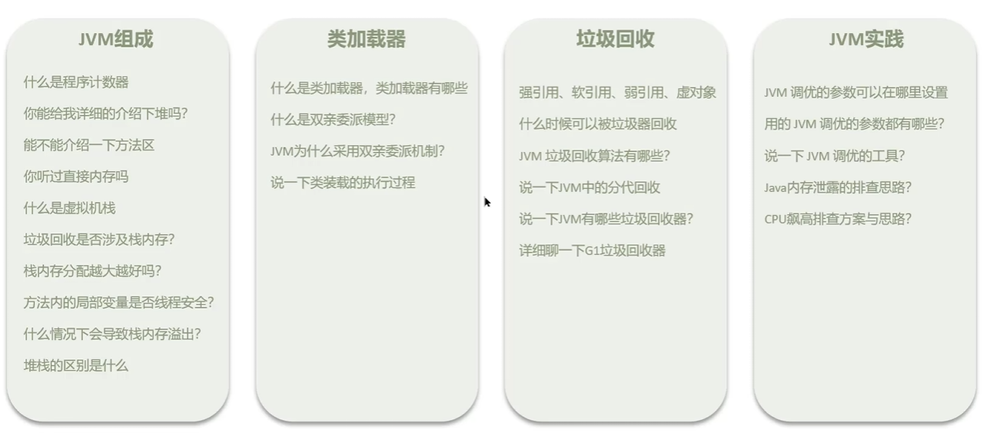


# 内存结构

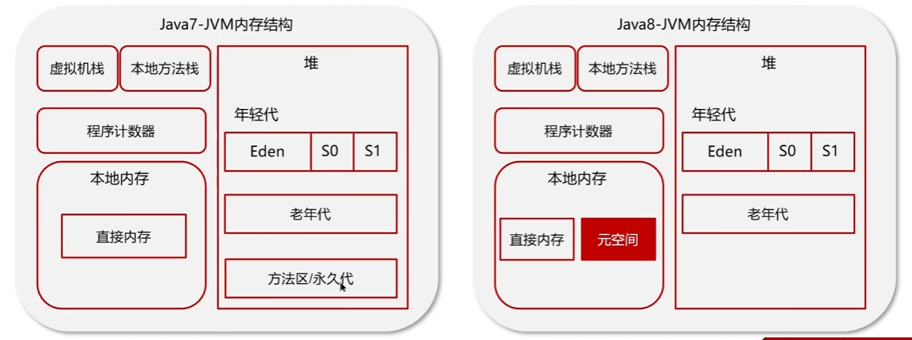

---

问：什么是程序计数器

程序计数器：线程私有的，内部保存的字节码的行号。用于记录正在执行的字节码指令的地址。

当线程运行一半时被别的线程抢夺了cpu，再次回来的时候，需要过pc来找到原来的位置。

---

问：说一说Java堆

* Java中堆是线程共享的区域，主要用来保存对线实例、数组等，当堆中没有内存空间可分配给实例，再也无法扩展时，就会抛出OOM异常
* 组成：年轻代+老年代
  * 年轻代分为Eden区和两个大小相同的survivor区
  * 老年代主要保存生命周期长的对象，一般是一些老的对象
* Jdk1.7和1.8的区别
  * 1.7中永久代在堆中，存储的类信息、静态变量、常量、编译后的代码
  * 1.8移除了永久代，变成了**本地内存中**的元空间，防止内存溢出

---

问：什么是虚拟机栈？

* 每个线程运行时所需要的内存，称为虚拟机栈，先进后出
* 每个栈由多个栈帧组成，对应着每次方法调用时所占用的内存
* 每个线程只有一个活动栈帧，对应着当前正在执行的那个方法

---

问：垃圾回收是否设计栈内存？

垃圾回收主要指堆内存，当栈帧弹栈以后，内存会释放

---

问：栈内存分配越大越好吗？

不是，默认栈内存通常为1024k。机器总内存是有限的，栈帧过大会导致线程数变少。

---

问：方法内的局部变量是否线程安全？

* 如果方法内局部变量没有逃离方法的作用范围，它是线程安全的
* 如果是局部变量引用了对象，并逃离方法的作用范围，需要考虑线程安全 

---

问：什么情况下导致栈内存溢出：

* 栈帧过多导致栈内存溢出，典型问题：递归调用
* 栈帧过大导致栈内存溢出

---

问：堆栈的区别是什么？

* 栈内存一般会用来存储局部变量和方法调用，但堆内存是用来存储java对象和数组的。堆会GC垃圾回收，而栈不会
* 栈内存是线程私有的，而堆内存是线程共有的
* 两者异常错误不同，栈是Stack over flow，堆是oom

---

问：解释一下方法区

答：

* 方法区是各个**线程共享的内存区域**
* 主要存储类的信息、运行时常量池
* 虚拟机启动的时候创建，关闭虚拟机时释放
* 如果方法区中的内存无法满足分配请求，会抛出OOM:Metaspace

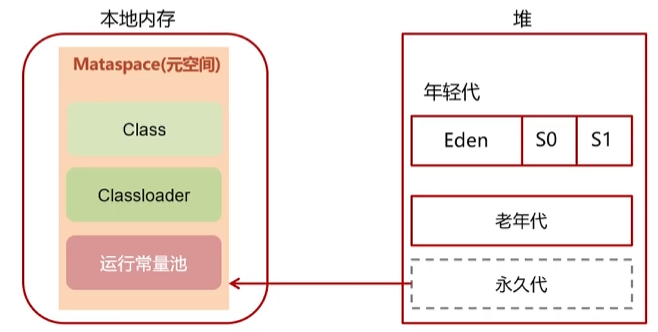


---

问：介绍一下运行时常量池

* 常量池：可以看作是一张表，虚拟机指令根据这张常量表找到要执行的类名、方法名、参数类型、字面量等信息

* 当类被加载的时候，他的常量池信息会放入**运行时常量池**，并把里面的**符号地址变为真实地址**

---

说一说直接内存

* 直接内存：不属于JVM中的内存结构，不由JVM进行管理，是虚拟机的系统内存

* 常见于NIO操作时，用于数据缓冲区，他的读写性能高，但是分配回收成本也高，并且不受JVM内存回收管理

---

# 类加载器

什么是类加载器，类加载器有哪些

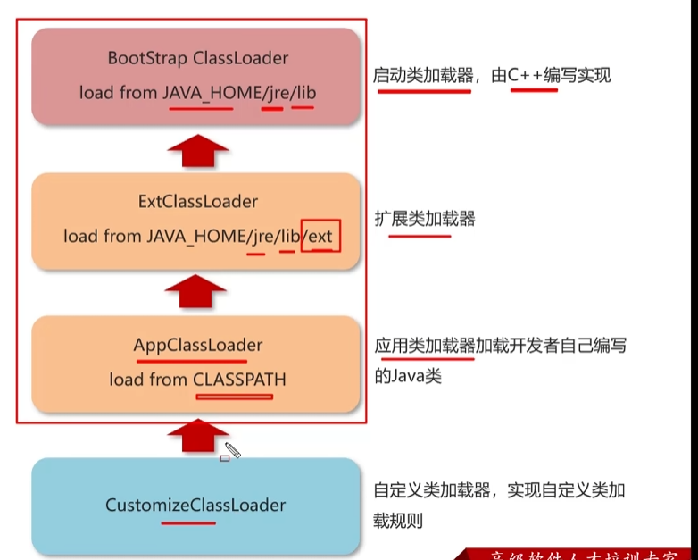

---

问：什么是类加载器？

JVM只会运行二进制文件，类加载器的作用就是将**字节码文件加载到JVM中**，从而让Java程序能够启动起来

---

类加载器有哪些？

* 启动类加载器：加载`JAVA_HOME/jre/lib目录下的库`
* 扩展类加载器：主要加载JAVA_HOME/jre/lib/ext目录中的类
* 应用类加载器：用于加载classPath下的类
* 自定义类加载器：自定义类继承ClassLoader，实现自定义类加载规则

---

问：什么是双亲委派模型？

答：加载某一个类，先委托上一级的加载器进行加载，如果上级加载器也有上级，则会继续向上委托，如果该类委托上级没有被加载，子加载器尝试加载该类。

---

问：JVM为什么采用双亲委派机制

答：

* 1）通过双亲委派机制可以避免某一类被重复加载，当父类已经加载后则无序重复加载，保证唯一性
* 2）为了安全，保证类库API不会被修改

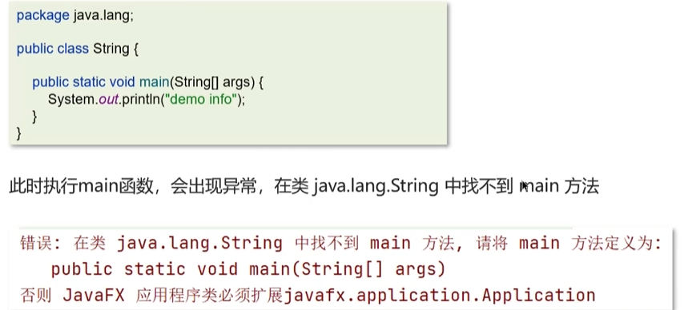

---

说一下类装载的执行过程？


**加载**：先把类的二进制数据流读入到运行时数据区，在元空间中存储类的信息，在堆中开辟空间存储类的class对象，方便后期创建对象去使用

**验证：**验证类是否符合JVM规范，安全性检查

**准备：**为类变量分配（`（static变量 && final修饰 && 基本类型）` ||` 字符串常量`）内存并设置类变量初始值

**解析：**把类中的符号引用转化为直接引用

* 方法中调用了其他方法，方法名可以理解为符号引用，而直接引用就是指针直接指向方法

**初始化：**对类的静态变量和静态代码块初始化操作

* 初始化一个类的时候，如果父类尚未初始化，则有限初始化父类
* 如果同时包含多个静态变量和静态代码块，则按照自上而下的顺序依次执行

**使用：**

* 调用静态类成员信息（比如：静态字段、静态方法）
* 使用new关键字为其创建对象实例

---

问：说一下类装载的执行过程？

* 加载：查找和导入class文件
* 验证：保证加载类的准确性和安全性
* 准备：为类变量分配内存，并设置变量初始值
* 解析：把类中的符号引用转化为直接引用
* 初始化：对类的静态变量，静态代码块执行初始化操作
* 使用：JVM开始从入口方法开始执行用户的程序代码
* 卸载：当用户程序代码执行完毕后，JVM便开始销毁创建的Class对象

---

# 垃圾回收

对象什么时候可以被垃圾回收器回收？

如果一个对象或多个对象没有任何引用指向它，那么这个对象现在就是垃圾。

定位什么是垃圾，有两种方式来确定，第一个是`引用计数法`，第二个是`可达性分析法`。

* 引用计数法：一个对象被引用了一次，在当前的对象头上递增一次引用计数，如果这个对象的引用次数为0，代表这个对象可回收

  缺点：当对象间出现了**循环引用**，就会失效

* 可达性分析算法：从GC Root出发往下搜索，没有被扫描到的对象表示可以回收

可以作为GC Root的对象：

* 虚拟机栈（栈帧中的本地变量）中引用的对象

  * ```java
    //Demo可以作为GCRoot
    public static void main(String[] args) {
        Demo demo = new Demo();
        demo = null;
    }
    ```

* 方法区中类静态属性引用的对象

  * ```java
    public static Demo a;
    public static void main(String[] args) {
        Demo b = new Demo();
        //a是某个静态变量，指向了内存中的某一块数据，因此a也可以作为GC Root
        b.a = new Demo();
        b = null;
    }
    ```

* 方法区中常量引用的对象

  * ```java
    public static final Demo a = new Demo();
    public static void main(String[] args) {
        Demo demo = new Demo();
        demo = null;
    }
    ```

* 本地方法栈中JNI（即Native方法）引用的对象

---

JVM垃圾回收算法有哪些？

* 标记清除算法
* 复制算法
* 标记整理算法

1、标记清除算法：将垃圾回收分为两个阶段，分别是标记和清除

​	1）根据可达性分析算法得出的垃圾进行标记

​	2）对这些标记为可回收的内容进行垃圾回收

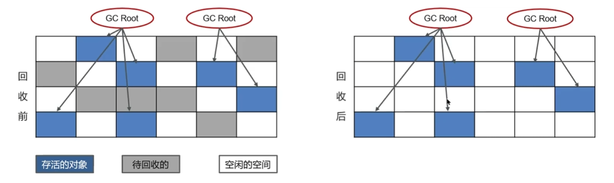

优点：标记和清除速度较快

缺点：碎片化严重，内存不连贯

2、标记整理算法：

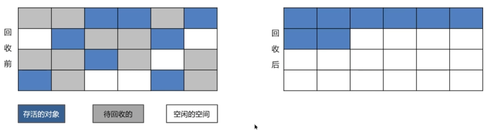

优点：解决了内存碎片化的问题

缺点：多了一步移动对象的位置，效率变低

3、复制算法

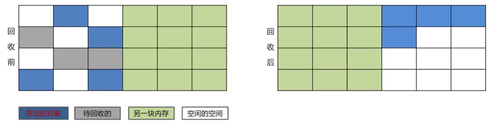

优点：

* 在垃圾对象多的情况下，效率较高
* 清理后，无内存碎片

缺点：需要分配2块内存空间，同一时刻只能使用一半

---

问：JVM垃圾回收算法有哪些

答：

* 标记清除：垃圾回收分为两个节点，分别是标记和清除，效率高，有磁盘碎片，内存不连续
* 标记整理：比清除多了一步整理
* 复制算法：将原有的内存空间一分为二，每次只用其中的一块，正在使用的对象复制到另一个内存空间中，然后将该内存空间清空。交换两个内存的角色。无碎片，但是内存使用率低

---

说一下jvm中的分代回收

 java8中的新生代和老年代：`新生代 : 老年代 = 1 : 3`

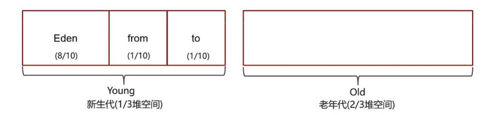

* 新生的对象都分配到Eden区
* 幸存者区分为from和to。`Eden : from : to = 8 : 1 : 1`

**工作机制**

* 新创建的对象都分配到eden区
* 当eden内存不足，标记eden与from的存活对象
* 将存活的对象采用复制算法复制到to中，to中对象年龄+1，复制完毕后，eden和from得到释放。当年龄超过15，进入老年代。
* survival区不足或者大对象会导致被提前晋升

**MinorGC、MixedGC、FullGC的区别**

* MinorGC也是young GC，发生在新生代的垃圾回收，STW时间短
* Mixed GC：新生代 + 老年代部分区分区域的垃圾回收，G1收集器特有
* Full GC：新生代 + 老年代完整垃圾回收，STW时间长

---

问：说说JVM中的分代回收

答：

1、堆的区域划分
	1）堆被分成了2份，新生代和老年代

​	2）对于新生代，内部又被分为了三个区域。Eden，幸存者的from和to（8 : 1 : 1）

2、对象分代回收的策略

新创建的对象会先分配到eden区，当eden不足时，标记eden和from的存活对象，将存活对象采用复制算法复制到to中，存活的对象年龄+1，复制完毕后，eden和from内存都得到释放。经过一段时间后，eden的内存又出现不足，标记eden和新的from区存活的对象，将其复制到to区，存活的对象年龄+1，当对象的年龄到达15，就会进入老年代。

---

问：MinorGC、MixedGC、FullGC的区别

* MinorGC也是young GC，发生在新生代的垃圾回收，STW时间短
* Mixed GC：新生代 + 老年代部分区分区域的垃圾回收，G1收集器特有
* Full GC：新生代 + 老年代完整垃圾回收，STW时间长

---

说一下JVM中有哪些垃圾回收期？

在jvm中实现了多种垃圾收集器，有：串行垃圾收集器、并行垃圾收集器、CMS（并发）垃圾收集器、G1垃圾收集器

**串行垃圾收集器**

Serial和Serial Old串行垃圾收集器，是指使用单线程进行垃圾回收，堆内存较小，适合个人电脑

* Serial 作用与新生代，采用复制算法
* Serial Old 作用于老年代，采用标记-整理算法

垃圾回收时，只有一个线程在工作，并且java应用中的所有线程都要STW，等待垃圾回收的完成

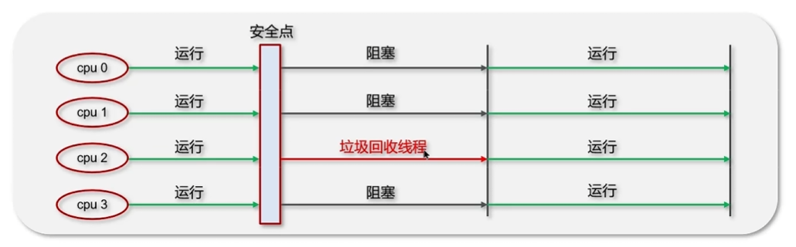

**并行垃圾收集器**

Parallel New 和 Parallel Old是一个**并行**垃圾回收器，JDK8默认使用此垃圾回收器

* Parallel New作用与新生代，采用复制算法
* Parallel Old作用与老年代，采用标记-整理算法

垃圾回收时，多个线程在工作，并且java应用中的所有线程都要STW，等待垃圾回收的完成

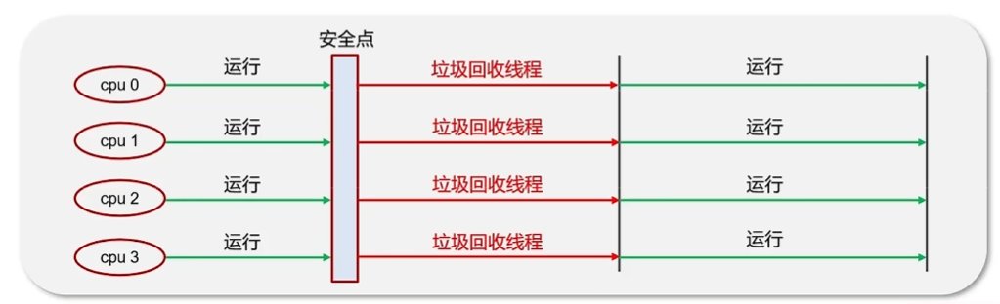

**CMS（并发）垃圾收集器**

CMS全称Concurrent Mark Sweep，是一款并发的，使用标记-清除算法的垃圾回收期，该回收器是针对老年代垃圾回收的，是一款以获取最短回收停顿时间为目标的收集器，停顿时间短，用户体验良好。其最大特点是在进行垃圾回收是，应用仍然能正常运行。


---

问：JVM有哪些垃圾回收器？

答：在jvm中，实现了多种垃圾收集器，包括

* 串行垃圾收集器：Serial GC、 Serial Old GC
* 并行垃圾收集器：Parallel Old GC、ParNew GC
* CMS（并发）垃圾收集器：CMS GC，作用在老年代
* G1垃圾收集器，作用在新生代和老年代

---

问：说说G1垃圾回收器

* 应用于新生代和老年代，在JDK8之后默认使用G1
* 划分成多个区域，每个区域都可以充当eden，survivor，old，humongous。其中humongous专为大对象准备
* 采用复制算法
* 响应时间与吞吐量兼顾
* 分成三个阶段：新生代回收(stw)、并发标记（重新stw）、混合收集
* 如果并发失败（回收速度赶不上创建新对象速度），会触发FullGC

---

强引用、软引用、弱引用、虚引用的区别

**1、强引用**

垃圾回收期不能回收被强引用的对象

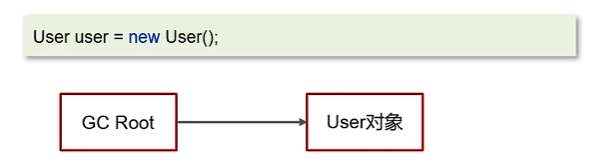

**2、软引用**

一个对象只被弱引用，在垃圾回收一开始不会回收，内存不足时再次触发垃圾回收，才会被回收

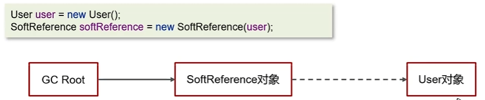

**3、弱引用**

一个对象只被弱引用时，只要触发垃圾回收了，就直接回收

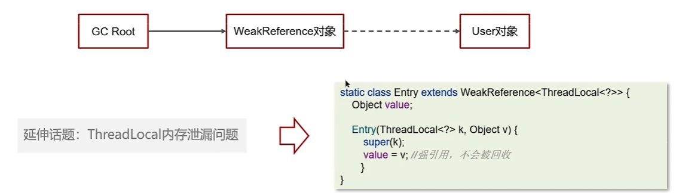

**4、虚引用**

必须配合引用队列使用，被引用对象回收时，会将虚引用入队，由`Reference Handler`线程调用虚引用相关的方法释放相关的**直接**内存

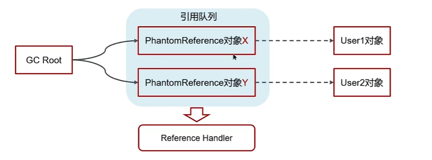

---

问：强引用、软引用、弱引用、虚引用的区别

* 强：只要沿着GC Roots能找到，就不会被回收
* 软：需要配合`SoftReference`使用，当垃圾多次回收，内存依然不够的时候会回收
* 弱：需要配合`WeakReference`使用，只要进行了垃圾回收，就会把弱引用对象回收
* 虚：必须配合引用队列使用，被引用对象回收时，会将虚引用入队，由`Reference Handler`线程调用虚引用相关方法释放直接内存
