# 基础篇

## 执行select语句发生了什么？

### **讲一讲执行select语句发生了什么？**


MySQl架构分成两层：

1、服务层

2、存储引擎层


Server层负责建立连接、分析和执行SQl。而存储引擎层负责数据的存储和提取。


**1、连接器**

不管什么操作，首先得连接上MySQL，使用的是TCP三次握手。建立连接后，MySQL就会要求你填写用户密码，成功了之后便能够连接上MySQL服务器了。


**2、查询缓存**

连接上MySQL服务器后，客户端就可以向 MySQL 服务发送 SQL 语句了，MySQL 服务收到 SQL 语句后，就会解析出 SQL 语句的第一个字段，看看是什么类型的语句。

如果是select语句，我就会先查询缓存，缓存的结构是key-value。key是SQL语句，value是查询结果。找到了就结束了！没找到就继续。

缓存在8.0后就删除了，因为缓存有缺点：

很多表都是会频繁更新的，每次更新就会刷掉缓存数据，因为更新后原来的数据就失效了。这样缓存就全是无用功。


**3、解析SQL**

3.1词法分析：

​	MySQl会识别语句中的关键字，关键字就是在IDE中会被高亮的字段

3.2语法分析：

​	语法解析器根据语法规则，判断输入的SQL是否满足MySQL语法。满足了就会构建语法树，方便后续工作。

总之，词法分析就是提取关键字，语法分析就是看语法对不对。

注意：表不存在或者字段不存在，并不是在解析器里做的。


**4、执行SQL**

每条select查询语句流程分为三个阶段：

预处理、优化、执行。


4.1、预处理：

检查语句中的表和字段是否存在

将select * 中的*扩展为表上的所有列


4.2、优化

优化器负责将SQL查询语句的执行方案确定下来，例如表中有多个索引时，优化器会基于查询成本的考虑来决定使用哪一个索引。


4.3、执行

先判断有没有执行查询的权限，没权限就报错了，有权限就打开表继续执行。在打开表的时候，执行器会根据表的引擎定义，去使用该引擎提供的接口。


例如

`select * from T where ID=10`

假设ID字段没有索引，那么执行器的执行流程如下：

​	1、调用innoDB引擎接口取该表第一行，判断是不是10，不是就跳过，是就放进记录集。

​	2、调用接口取下一行，重复相同的逻辑判断，直到最后一行。

​	3、执行器将所有满足条件的行组成的记录集作为结果集返回给客户端。


到这里，整个语句便执行完毕！


总结：

1、MySQL客户端与MySQl服务器建立连接，发送语句，先检查缓存，命中就返回结果，否则进行语句解析(MySQL 8.0已经取消了缓存)。

2、解析SQL：对SQL查询语句进行词法分析、语法分析、然后构建语法树，方便后续模块读取表明、字段、语句等类型。

3、执行SQL：

​	3.1 预处理：检查表和字段是否存在；将select * 中的* 扩展为表上所有列；

​	3.2 优化：基于成本的考虑，选择查询成本最小的执行计划；

​	3.3 执行：根据执行计划执行语句，从存储引擎读取记录，返回给客户端。


# 索引篇

## 索引基础

### 讲一讲索引是什么？

官方定义：索引是帮助MySQL高效获取数据的数据结构。

他的目的在于提高查询效率，类比字典中的目录。

本质看成是一种排序好的数据结构。 


### **讲一讲索引的优缺点**？

优点：

1、使用索引能大大加快数据的检索速度（减少检索的数据量），这是索引最重要的目的。


缺点：

1、索引也是表，所以也要占用内存 

2、创建和维护索引都需要时间，并且随着数据量增加而增加

3、索引降低了更新速度，因为更新表的同时要更新索引。


在大多数情况下，索引查询比全表扫描快，但是当数据量不大时，就没必要用索引了。


### **讲一讲什么时候需要或者不需要创建索引？**

适用索引的情况有：

**1）**针对数据量较大，且查询比较频繁的表建立索引。（单表超过10万数据）

**2）**针对常作为查询条件、排序、分组操作的字段建立索引

3）尽量使用联合索引，减少单列索引，查询时联合索引很多时候可以覆盖索引，节省存储空间，避免回表，提高查询效率。

**4）**控制索引的数量，索引并不是多多益善，索引越多，维护索引结构的代价越大


不适用索引情况有：

1.字段中存在大量重复数据，比如性别

2.表数据太少的时候，直接查也很快

3.经常更新的字段不用创建，因为B+树要维护有序性，频繁更新就会频繁排序，或影响到数据库的性能。


### 讲一讲什么情况下无法利用索引？

1、查询语句中使用like关键词查询并且第一个字符为"%"的时候，索引不会被使用。

2、查询语句中使用or关键字的时候，如果or前后两个条件的列都是索引，就会使用。只要有一个不是，就不使用索引。


### 如果一个表没有主键索引，那还会创建B+树吗？

会，InnoDB会为每一个表创建一个主键索引。如果一个表没有主键索引，InnoDB会自动生成一个主键来创建索引，叫做row-ID。


## 索引的分类

### **讲一讲索引的分类？**

在InnoDB中，有主键索引、单值索引、唯一索引、复合索引。

主键索引时表中有主键后，数据库自动建立的索引，他是聚簇索引，并且列值不能为空。

单值索引顾名思义，一个索引只包含单个列，所以一个表能够有多个单值索引

复合索引就是一个索引中包含多个列

唯一索引即索引值必须唯一，但是允许只存在一个null

按照数据结构来分类，分为B+树索引和Hash索引。

按照物理存储来分类，分为聚簇索引，即主键索引 和 非聚簇索引， 非聚簇索引与二级索引、 辅助索引是等价的。

按照字段特性来分类，分为主键索引、唯一索引、普通索引和前缀索引

按照字段个数来分类，分为单列索引和联合索引。


### 讲一讲主键索引和二级索引？

数据表的主键那一列用的就是主键索引，主键索引的B+树叶子结点存放实际数据。

而二级索引的B+树叶字结点存放的是主键的值，并不是实际数据，可以理解为指向表中主键的指针，所以通过二级索引，我们能找到定位主键的位置。所有的非主键索引都可以称为二 级索引。


### 为什么主键通常建议使用自增id？

索引相邻，那么对应的数据也是相邻存放在磁盘上，当某一页被读入内存后，根据空间局部性原理，访问其相邻的数据时就直接从内存读取，速度很快。


### 讲一讲聚簇索引和非聚簇索引 ？

聚簇索引是InnoDB的存储方式，非聚簇索引时MyISAM的存储方式。

聚簇索引就是索引的结构和数据一起存放的索引，是InnoDB的ibd文件。

非聚簇索引的叶字结点不存放数据，只存放指向数据行的指针，是MyISAM的MYI文件。然后数据单独使用一张表存储数据，是MyISAM的MYD文件。


### 讲一讲覆盖索引？

如果一个索引包含了**所有**需要查询的字段的值，就叫做覆盖索引。在InnoDB中，如果不是主键索引，叶字结点存储的就是主键+列值。需要进行回表，也就是要通过主键再找一次。覆盖索引就是需要查询的字段正好是索引的字段，那么根据这个索引直接就查到数据了，省去了回表操作。

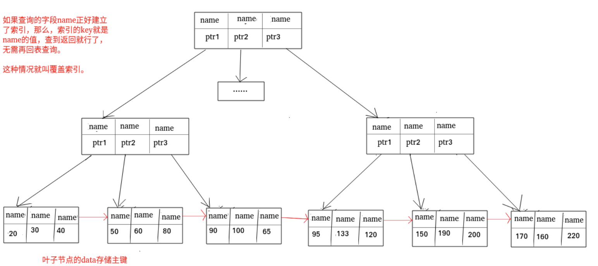

select ==id== from user where name = xxx;

查出来id直接就是我要的结果了，就不用回表了。

如果是

select ==age== from user where name =xxx,

那么通过name查询到的主键之后，还要根据主键再回表查询age。


### 说说你对联合索引的理解？

使用表的多个字段创建的索引，就是联合索引，也叫复合索引或者组合索引。

比如以年龄和姓名来建立联合索引，索引就是年龄、姓名，并且先按照年龄排序，再按照姓名排序。

```sql
ALTER TABLE cus_order ADD INDEX id_age_name(age, name);
```

联合索引中存在**最左匹配原则**这一重要性质。

关键的地方就是如果先按照年龄排序，那么name只有在相同的年龄下才有序，是局部有序的，全局是无序的。这样的话如果查找某一个年龄和姓名，就通过索引找到年龄符合要求的位置，再往后就有可能需要顺序遍历了，不能再用到姓名的索引。

**联合索引的最左匹配原则，在遇到范围查询比如>或者<的时候，就会停止匹配，也就是范围查询的字段可以用到联合索引，但是在范围查询字段后面的字段无法用到联合索引。但是对于  >=、<=、BETWEEN、like 前缀匹配的范围查询，并不会停止匹配。**


举例：

```sql
1、select * from t_table where a > 1 and b = 2
2、select * from t_table where a >= 1 and b = 2
```

1、只有a字段用到了联合索引，b没有用到。 查到a>1以后，联合索引就失效了。

2、a和b都用到了联合索引。当查到a=1的时候，在a=1的范围里，b是有序的，所以能够使用b的索引。


**联合索引的优势：**

1.减少开销：建立一个联合索引(a,b,c)相当于建立了(a),(a,b)和(a,b,c)单个索引。每多一个索引，就会增加写操作的开销。

2.更有利于覆盖索引，联合索引的字段多，更容易覆盖查询的字段，减少回表的次数。


## InnoDB为什么用B+树

### 讲一讲InnoDB为什么用B+树不用B树？


思路：IO ->空间局部性->key-data。

数据库索引存在外存中，而每一次去外存读取数据，都要进行磁盘IO，磁盘IO是很费时的操作。于是操作系统就会优化，根据空间局部性原理，也就是要使用一块数据的时候，往往短期内会使用到它附近的数据。根据这样的空间局部性原理，每一次IO都会读取一页数据。而我们想要一种数据结构，让计算机尽量减少IO次数。于是B+树就出现了。

**InnoDB 在把磁盘数据读入到磁盘时会以页为基本单位，在查询数据时如果一个页中的每条数据都能有助于定位数据记录的位置，这将会减少磁盘 I/O 次数，提高查询效率。**

数据是以键值对形式来存放的，B树的每个结点都存储有效数据，所以**中间节点**不仅有key还要有data，因此如果data较大，每一页存的中间结点就会变少了，这样IO次数就要增加，就会更费时。

B+树最主要的优点就是他的有效数据全部存储在叶字节点中，中间节点只存key不存data，于是能够大大的增多每个节点存储的key值数量，所以IO次数就会减少！并且MySQL还将其所有的叶字结点串成了一个双向循环链表，又能够加快检索数据的速度。

所以InnoDB使用B+树！


补充：

**B+ 树的非叶子节点不存放实际的记录数据，仅存放索引，因此数据量相同的情况下，相比存储即存索引又存记录的 B 树，B+树的非叶子节点可以存放更多的索引，因此 B+ 树可以比 B 树更「矮胖」，查询底层节点的磁盘 I/O次数会更少。**

B树有大量的冗余节点（所有非叶子节点都是冗余索引），这些冗余索引让 B+ 树在插入、删除的效率都更高，比如删除根节点的时候，不会像 B 树那样会发生复杂的树的变化；

B+ 树叶子节点之间用链表连接了起来，有利于范围查询，而 B 树要实现范围查询，因此只能通过树的遍历来完成范围查询，这会涉及多个节点的磁盘 I/O 操作，范围查询效率不如 B+ 树。


### InnoDB为什么用B+树不用Hash？

哈希在做等值查询的时候很快，是O(1)的时间复杂度，但是范围查询就不行了。


### InnoDB为什么用B+树不用二叉树？

因为B+树在实际应用中d >100，即便是千万级别的数据，高度也维持在3~4层，也就说一次数据查询只要做3~4次的IO，而二叉树就是logN级别了，根本没法比。


# 日志篇

1~4归属于mysql server，不管选择什么存储引擎，都会存在

1.slowlog:设置具体时间，把执行超时的sql记录在日志文件中，方便进行优化调整。

2.binlog：主要用来进行数据库之间的主从同步。

3.erroelog:记录数据库进程中的一些错误信息。

4.relaylog:在slaver机器中暂存同步过来的binlog数据。


5,6归属于InnoDB存储引擎，其他存储引擎不包含该日志信息

5.undolog:回滚日志，保证事务原子性。

6.redolog：前滚日志。


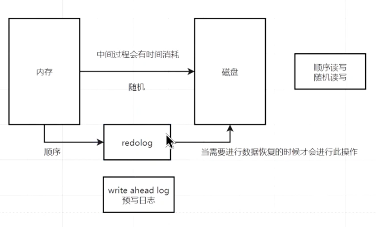


## redolog

### 什么是redolog？

redolog是物理日志，记录了某个数据页做了何种修改，每次执行一个事务就会产生这样的一条或多条物理日志。

在事务提交的时候，在脏页数据持久化到磁盘之前,，只要先将redolog持久化到磁盘即可。

系统崩溃的时候，虽然脏页数据没有持久化，但是redolog已经持久化，接着MySQL重启后，能够根据redolog的内容将所有数据恢复到最新的状态。


### 内存修改undo页面后，需要记录对应的redolog吗？

需要。开启事务后，InnoDB层更新记录**前**，首先要记录相应的undo log，如果是更新操作，需要把被更新的列的旧值记下来，即生成一条undolog， undolog会写入Buffer Pool中的Undo页面。在内存修改该Undo页面后，需要记录对应的redolog。


### 说说redolog和undolog的区别？

redolog记录了本次事务**完成后**的数据状态，记录的是更新**后**的值

undolog记录了本次事务**开始前**的数据状态，记录的是更新**前**的值

事务提交前发生了崩溃，重启后通过undolog回滚事务，事务提交后发生崩溃，重启后通过redolog恢复事务。

有了redolog，再通过WAL技术，InnoDB就可以保证即使数据库发生异常重启，之前已提交的记录都不会丢失。redolog保证了事务四大特性中的持久性。


### redolog要写到磁盘，数据也要写到磁盘，为什么要多此一举？

顺序写使用追加操作就行了，而随机写需要先找到要写入的位置，再写入磁盘。所以顺序写比随机写更高效。

写入redolog使用顺序写，写入数据使用随机写。

MySQL通过将redolog和数据文件分开，就可以更快地完成事务提交，因为事务提交时，只需要确保redolog写入完成，不需要等待数据文件写入完成，从而降低了事务的响应时间。


### 产生的redolog是直接写入磁盘的吗?

不是，是先写入到redolog buffer然后再由后台进程负责将redolog buffer 中的内容flush到磁盘的redo log文件中。

这样有一些优势：

1.提高性能：将redolog先写入内存缓冲区，可以大大提高写入的速度。

2.减少磁盘IO：MySQL将多个事务的redolog**记录合并**成一个较大的批次进行flush，可以减少磁盘IO的次数，提高磁盘利用率。

3.写入redolog buffer是原子操作，有助于确保事务的原子性，如果将redolog直接写入磁盘，可能会因为各种原因导致错误。


## binlog

binlog是MySQL数据库中的二进制文件，用于记录对数据库进行的修改操作。

提到binlog，就要想到**数据恢复和主从复制**。

数据恢复：理解成**备份**文件

主从复制：master服务器上的修改操作会被记录到binlog中，然后传送给slave，slave执行binlog**达到主从一致**的效果。

### binlog的格式有哪些？

1.Statement格式：记录SQL语句的执行过程（记录做了什么）

2.Row格式：记录每一行数据的变化（记录每次变化后的状态）

3.Mixed格式：结合了statement和Row的优点，根据执行的具体情况选择合适的格式。

​	判断SQL语句会不会引起数据不一致，会就用row，不会就用statement。


### binlog和redolog的区别？

思路：binlog是宏观的，类似于备份，本来就在磁盘上。redolog是微观的，记录内存中的数据页做了什么修改，用于降低事务响应时间和故障恢复。

* binlog用于备份恢复、主从复制，而redolog用于掉电等**故障**恢复。
* binlog追加写，写满一个文件就会创建新的文件，而redolog是循环写，写满文件就从头开始，保存没有被刷入磁盘的脏页。


### 如果不小心整个数据库的数据都被删除了，能用redolog文件恢复数据吗？

不能，只能用binlog恢复。因为redolog是循环写，会边写边擦，只记录未被刷入磁盘的数据的物理日志。

binlog保存的是全量的日志，也就是保存了所有数据变更的情况。


## 两阶段提交

### 讲一讲两阶段提交？

先写redolog还是先写binlog？

mater ——> slave只会把binlog带过去，所以如果先写redolog，后写binlog，如果在写binlog前断电了，mater的redolog对数据做了修改，但是slave的redolog没有变，这样主从就不一致了。

如果先写binlog后写redolog，同理，在写redolog之前断电了，master根据redolog恢复，slave根据binlog恢复。这个时候主从还是不一致。

因此先写谁都不行。

采用两阶段提交的方法：

先写redolog，写完redolog，立马进入prepare状态，然后再写binlog，写完binlog之后，redo会置为commit表示完成了。

通过redolog的**状态位**来保证master和slave的状态一致。


## undolog

### 讲讲Buffer Pool

Buffer Pool是内存和磁盘之间的缓存，主要用于缓存索引和数据。

他可以通过缓存常用的数据页，减少磁盘IO，大大降低查询和事务的响应时间。


### 为什么需要undolog？

在一个事务执行过程中，还没有提交事务之前，如果MySQL发生了崩溃，需要通过undolog回滚到事务之前的数据。

每当InnoDB引擎对一条记录进行增删改时，要把回滚时需要的信息都记录到undolog里

* 在插入一条记录时，要记录主键值，回滚即删除
* 在删除一条记录时，记录所有内容，回滚即插入
* 在更新一条记录时，记录旧值，回滚即更新

答案：

​	实现事务回滚，保障事务的原子性。

​	实现MVCC关键因素之一。


# 事务篇


### 讲一讲事务的隔离级别？


首先理解一下三种读（并发事务处理带来的问题）：

1.脏读：读到还没提交的事务。

```
sum = 0
事务A开始读取 sum...  
{
	事务B开始修改 sum...
	事务B修改完sum = 1
	事务A读取完sum = 1
}
事务A结束，返回sum = 1
事务B回滚了!sum重新变成0
```

此时A读取的sum是1，但是实际上sum = 0.

2.不可重复读：在一个事务中两次读取相同的数据，但是结果不一致。

```
sum = 0
事务A开始{
	读取sum = 0；
	事务B修改了这一行数据并且提交 sum = 1;
	再次读取这一行数据 -> sum = 1 ;
}
```

事务A读取两次sum不一致，这就是不可重复读

3.幻读：在同一事物的两次查询之间，其他事务插入了新的数据，导致两次查询结果不一致。

```
sum = 0, res = 0;
事务A开始 {
	读取sum和res = 0;
	事务B插入了一条数据并且提交 flag = 0;
	事务A再次查询这些数据，多了个flag！
}
```

事务A查询两次范围不一致，这就是幻读。


不可重复读与幻读很像，不可重复读是有人update，幻读是有人insert/delete。


**四种隔离级别：**

1.读未提交(Read Uncommit)

​	读取了别人还没提交的数据

2.读已提交(Read Commit)

​	只能读取到别的事务提交过的。还没提交的数据读不到。

3.可重复读(Repeatable Read)

​	在事务A开始读取了某些数据，即便别的事务修改并提交了，事务A再次读取，读到的依然是初始的值。

​	开启可重复读这个隔离级别后：

```	
sum = 0
事务A开始 
{
	A读取sum   ->  sum = 0;
	事务B修改并提交 sum = 1；
	A读取sum   ->  sum = 0;
}
事务A结束
```

4.串行化(Serializable)

​	直接加锁，我事务开启后，别人都别想开启事务。


**串行化** >  *幻读*  > **可重复读**  >  *不可重复读* > **读已提交**  > *脏读* > **读未提交** 


# 黑马课程

## 优化问题

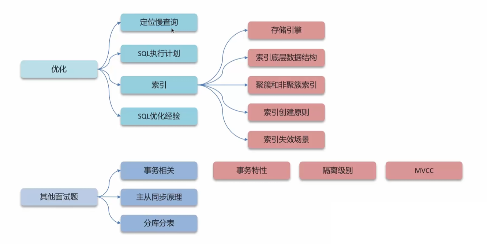


---

在MySQL中，如何定位慢查询？

方案一：开源工具

* 调试工具：Arthas
* 运维工具：Prometheus、Skywalking

方案二：MySQL自带的慢日志查询

`slow_query_log = 1`：开启慢查询日志开关

`lon_query_time = 2`：SQL语句执行时间超过2s，就会视为慢查询，日志记录


---

问：如何定位慢查询？

答：

1、介绍当时产生问题的场景

2、在mysql中开启了慢日志查询，设置的值是2秒，一旦sql执行超过2秒就会记录到日志中。

---

SQL语句执行很慢，如何分析？

可以采用`EXPLAIN`或者`DESC`命令获取MySQL如何执行SELECT语句的信息

`possible_key：`当前sql可能会用到的索引

`key：`实际命中的索引

`key_len`：索引占用的大小

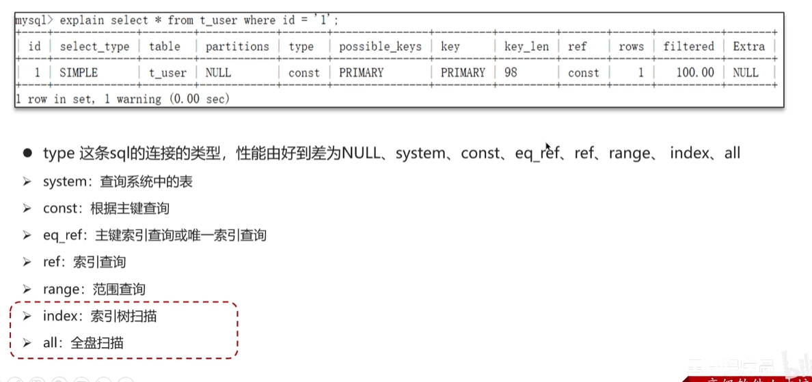

---

问：那这个SQL语句执行很慢，如何分析？

答：使用MySQL自带的分析工具`EXPLAIN`

* 通过key和key_len检查是否命中了索引（索引本身存在是否有失效的情况）
* 通过type字段查看sql是否有进一步的优化空间，是否存在全索引扫描或全盘扫描
* 通过extra建议判断，是否出现了回表情况，如果出现了，可以尝试添加索引或修改返回字段来修复


## 索引

问：了解过索引吗，什么是索引？

答：

* 索引是帮助MySQL高效获取数据的数据结构
* 索引能提高数据检索的效率，降低数据库的IO成本（不需要全表扫描）
* 通过索引列对数据进行排序 ，降低数据排序的成本，降低了CPU的消耗

---

问：索引的底层结构了解过吗

* 阶数更多，路径更短
* 磁盘读写代价B+树更低，非叶字节点只存储指针，叶字节点存储数据
* B+树便于扫库和区间查询，叶字节点是一个双向链表

---

什么是聚簇索引，什么是非聚簇索引（二级索引）？

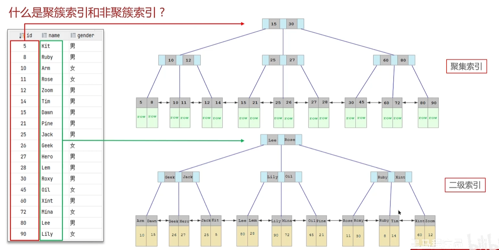

图中的row表示一整行数据

回表查询：比如我要找ARM，那么过程为找lee->Geek->Arm，拿到了10，然后15->10->10拿到row，也就是整行数据。根据10去上面的那个b+树搜索，就叫回表

---

问：什么是聚簇索引，什么是非聚簇索引（二级索引）？

* 聚簇索引（聚集索引）：数据与索引放到一起，B+树的叶字节点保存了整行数据，有且只有一个
* 非聚簇索引（二级索引）：数据与索引分开存储，B+树的叶字节点保存对应的主键，可以有多个

问：什么是回表查询？

答：通过二级索引查到的主键值，到聚集索引中查找整行数据，这个过程就是回表

---

关于**覆盖索引**：覆盖索引指查询使用了索引，并且需要返回的列在该索引中能全部找到。

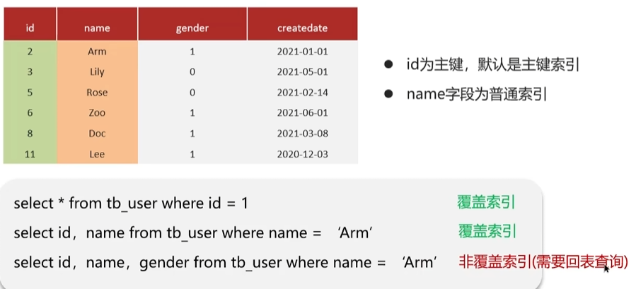

通俗理解就是`一次性命中索引`

---

问：知道什么是覆盖索引吗？

覆盖索引是指查询使用的索引，返回的列。必须在索引中全部能够找到

* 使用id查询，直接走聚集索引查询，一次索引扫描，直接返回数据，性能高
* 如果返回的列中没有创建索引，有可能会出发回表查询，尽量避免使用select *

---

问：MySQL超大分页怎么处理

在数据量比较大时，如果进行limit分页查询，在查询时，越往后分页的查询效率越低。

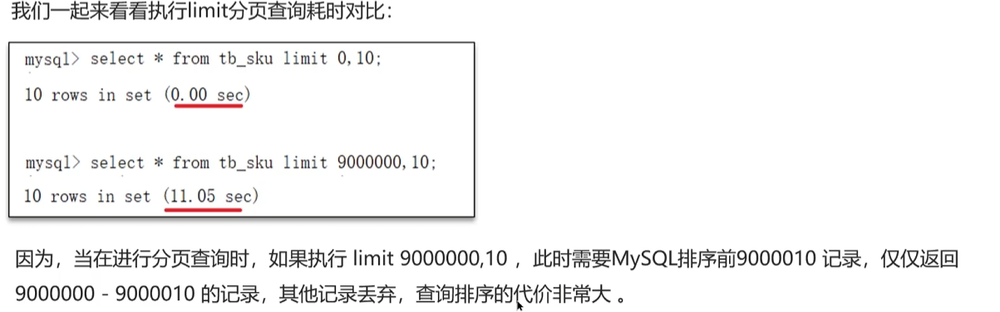

优化思路：一般分页查询时，通过创建**覆盖索引**能够提高性能，可以通过覆盖索引+子查询形式进行优化。

 答：采用空间换时间的方法，覆盖索引+子查询。先分页查询获取表中的id，对表的id进行排序，筛选出分页过后的id集合，因为id是覆盖索引，我们操作id的时候效率很高。最后通过id集合到原表中关联查询。

---

索引创建的原则有哪些？

**1）**针对数据量较大，且查询比较频繁的表建立索引。（单表超过10万数据）

**2）**针对常作为查询条件、排序、分组操作的字段建立索引

3）尽量选择区分度高的列作为索引，尽量建立唯一索引，区分度越高。使用索引的效率越高

4）字段的类型是字符串，字段长度较长，可以针对于字段的特点，建立前缀索引

**5）**尽量使用联合索引，减少单列索引，查询时联合索引很多时候可以覆盖索引，节省存储空间，避免回表，提高查询效率。

**6）**控制索引的数量，索引并不是多多益善，索引越多，维护索引结构的代价越大

7）如果索引列不能存储NULL值，创建就要使用NOT NULL约束。

---

什么情况下索引会失效？

**1）违反最左前缀法则**

如果索引了多列，要遵守最左前缀法则。指的是查询从索引的**最左前列开始，并不跳过中间的列**。匹配最左前缀法则，走索引：

**举例：**

假设建立先后顺序为`name、status、address`的索引

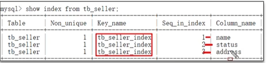

然后进行查询：`name `或者`name and status`或者`name and status and address`是可以正常执行的。符合最左前缀法则

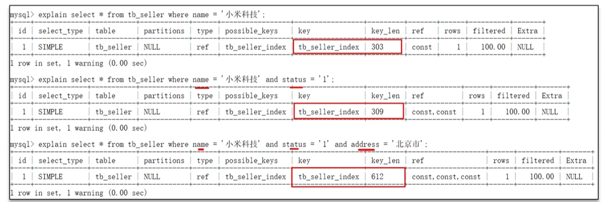

如果是下面这样，索引就失效了，因为不符合从最左前缀开始的法则

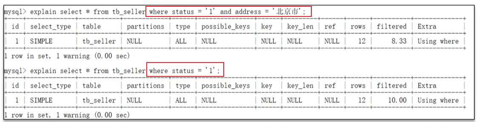

如果跳过中间的列，那么只有**跳过的列的左边的索引**生效，下面跳过了status，查询name和address。于是303可以证明只走了个name索引

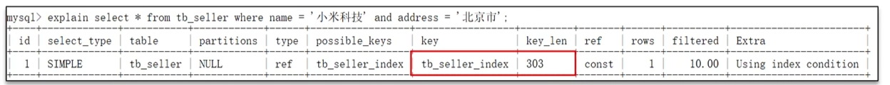

 

**2）范围查询右边的列，不能使用索引**

举例：

status采用范围，那么status右边的索引就不能生效了，也就是address无法生效

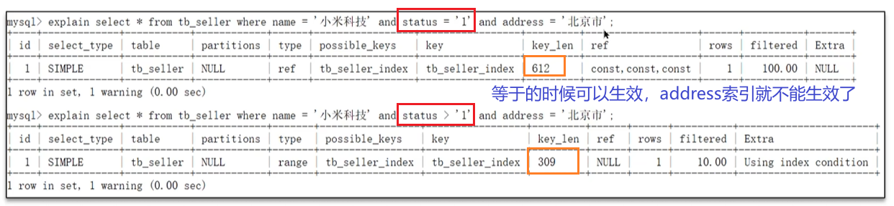


**3）在索引列上进行运算操作，索引会失效**

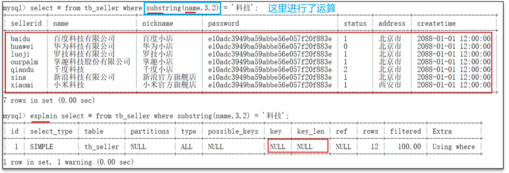


**4）字符串不加单引号**

在查询时，没有对字符串加单引号，MySQL的查询优化器会自动进行类型转换，造成索引失效

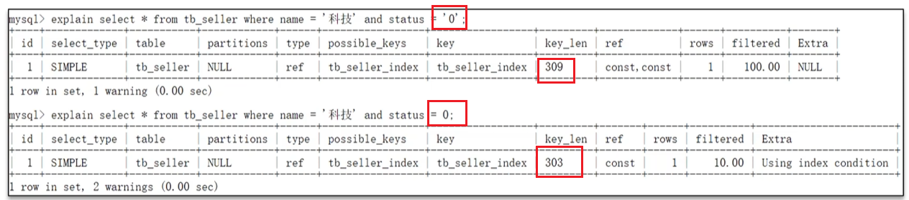


**5）以%开头的Like模糊查询，索引失效。如果仅仅是尾部模糊匹配，索引不会失效，头部会失效**

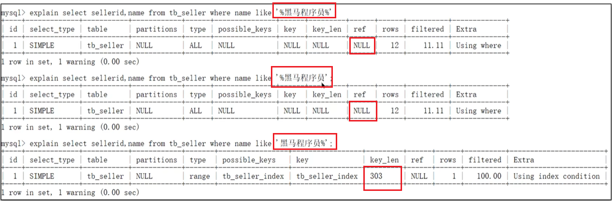

---

问：什么情况下索引会失效？

答：

* 违反最左前缀法则
* 范围查询右边的列不能使用索引
* 在索引列上进行运算操作，索引会失效
* 字符串不加单引号，索引失效（本质是类型转换）
* 以%开头的Like模糊查询，索引失效

---

谈谈你对sql的优化经验

* 表的设计优化
* 索引优化：参考创建原则和索引失效
* SQL语句优化
* 主从复制，读写分离
* 分库分表

1）表的设计优化：

* 设置合适的数值（tinyint  int  bigint），根据实际情况选择
* 设置合适的字符串类型(char、varchar)，char定长效率高，varchar可变长度，效率较低

2）SQL语句优化

* SELECT语句务必指明字段名称，避免使用select *（防止回表）

* SQL语句尽量避免造成索引失效的写法

* 尽量`union all `代替` union，union`会多次过滤，效率低

  * 

    `unionall`会把两次查询的结果叠加，而`union`会去重，所以效率更低

* 避免在where字句中对字段进行表达式操作（比如substring导致索引失效）

* Join优化，能用`inner join`就不用`left join right join`，如果必须使用，要以小表为驱动，内连接会对两个表进行优化，优先把小表放到外边，把大表放到里面。`left join`或`right join`，不会重新调整顺序

3）主从复制、读写分离

如果数据库使用场景读操作较多，为了避免写操作所造成的性能影响，可以采用读写分离的架构。读写分离解决的是，数据库的写入影响查询的效率

 

---

## 事务

问：事务的特性是什么？可以详细说一下嘛？

答：事务是一组操作的集合，是不可分割的工作单位。这些操作要么都成功，要么都失败。

* 原子性：事务是不可分割的最小操作单元，要么都成功，要么都失败。
* 一致性：事务完成后，必须索引的数据都保持一致状态
* 隔离性：数据库系统提供的隔离机制，保证事务在**不受外部并发操作影响**的独立环境下运行
* 持久性：事务一旦提交或回滚，对数据库中数据的改变就是永久的

---

并发事务带来哪些问题？要怎么解决这些问题？MySQL的默认隔离级别是？

并发事务的问题：脏读、不可重复读、幻读

隔离级别：读未提交、读已提交、可重复读、串行化

* 脏读：一个事务读到另一个事务没提交的数据
* 不可重复读：一个事务先后读取同一条记录，但是两次读取的数据不同
* 幻读：一个事务按照条件**查询**数据时，发现没有对应的数据行，但是插入数据时，又发现数据已经存在。

解决方案：对事务进行隔离

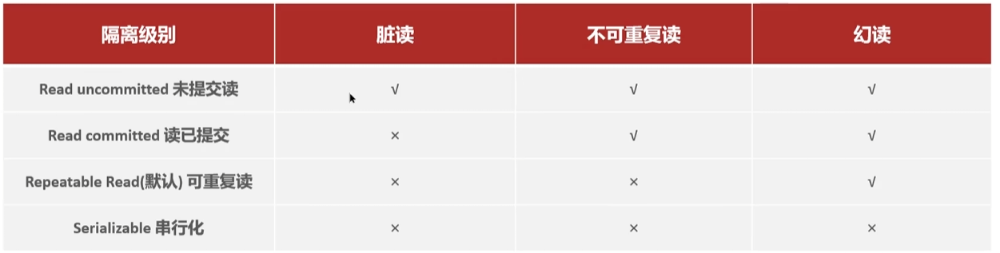

MySQL默认级别：可重复读，平衡了性能和安全性

---

undo log和redo log的区别

知识点：

* 缓冲池：主内存中的区域，里面可以缓存磁盘上经常操作的真是数据。
* 数据页：InnoDB存储引擎磁盘管理的最小单元，每个页大小默认为16KB。页中存储的是行数据。

数据库先操作缓冲池，再持久化到磁盘中。但是还没持久化就宕机了，会丢失数据。就违背了事务的持久性。

redolog：用来实现事务的持久性

redolog由`redolog buffer`和`redo log file`组成，前者在内存中，后者在磁盘中。当事务提交后，会把所有信息存储到该日志文件中，用于数据恢复

undolog:作用为`提供回滚`和`MVCC`（多版本并发控制）

* 当delete一条记录时，undo log会记录一条insert记录
* 当update一条记录时，他会记录一条相反的update记录。

因此undo log实现了事务的一致性和原子性

---

问：undo log 和 redo log的区别是什么？

* redo log:记录的是数据页的物理变化，服务宕机可以用来同步数据
* undo log：记录的是逻辑日志，当事务回滚时，通过逆操作恢复原来的数据
* redo log保证了事物的持久性，undo log保证了事务的原子性和一致性

技巧：redo log记录事务提交后的数据， undo log记录事务提交前的数据

---

事物的隔离性如何保证？

锁：排它锁（如果一个事务获取了一个数据行的排它锁，其他事务就不能再获取该行的其他锁）

mvcc：多版本并发控制

---

关于MVCC：

Multi-Version Concurrency Control，多版本并发控制，指维护一个数据的多个版本，使得读写操作没有冲突。MVCC的具体实现主要依赖于数据库记录中的**隐式字段、undo log日志、readView。**

* 记录中的隐藏字段

  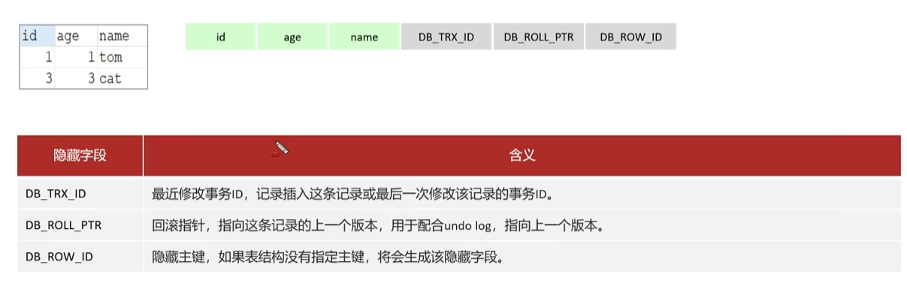

* undo log

  回滚日志：在insert、update、delete的时候产生的便于数据回滚的日志。

  当insert的时候，产生的undo log日志只在回滚时需要，在事务提交后，可以被立即删除。

  而update、delete的时候、产生的undo log日志不仅在回滚时需要，mvcc版本访问也需要，不会被立即删除 。

* undo log版本链

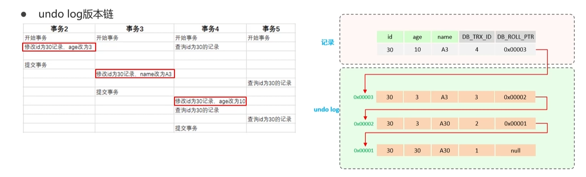

​		不同事务或者相同事务对同一条记录进行修改，会导致该记录的undolog生成一条记录版本链表，链表的头部是最新的旧记录，尾部是最早的旧记录。

事务5是两个查询语句，这就需要ReadView了


* readView

​		ReadView（读视图）是**快照读**SQL执行时MVCC提取数据的一句，记录并维护系统当前活跃的事务（未提交）id。

* 当前读

​		读取的是记录的最新版本，读取时还要保证其他事务不能修改当前记录，会对读取的记录进行加锁。对于我们日常的操作，如：`select...lock in share mode, select ... for update、update、insert、delete(排它锁)`都是一种当前读。 

* 快照读

​		简单的select（不加锁）就是快照读，快照读读取的是记录数据的可见版本，有可能是历史数据，不加锁，是非阻塞读。

---

问：MySQL主从同步原理

MySQL主从复制的核心是二进制日志（BINLOG），它记录了所有的DDL（数据定义语言）和DML（数据操纵语言）语句，但不包括数据查询（SELECT、SHOW）语句

答：MySQL主从复制的核心是BINLOG

* 主库在事务提交时，会把数据变更记录在Binlog中
* slave读取master的Binlog，写入到自己的中继日志Relay Log中
* slave完成Relay Log的事件，改变自己的数据

---

## 项目中排行榜分表内容

问：解决单表数据量大的问题有哪些解决方案？

答：首先是库内表分区或者分表，可以解决大多数问题。如果单个库压力太大，在考虑分库。水平分库结合分表，实现数据分片。进一步提高存储规模。

---

问：数据库读写压力较大，并发较高怎么办？

答：首先考虑垂直分表，看看能不能将写频繁的数据与其他数据分离，避免互相影响。如果不行则考虑主从集群，实现读写分离。

---

问：历史榜单数据量单表可能达到数千万，如何解决？

答：按照赛季对历史榜单分表，减少了单表存储量。而且根据赛季查询时只需要读一张表，提高了查询效率，另外在持久化时，我们可以按照榜单顺序持久化，采用递增id，这样榜单id就是用户排名。避免了查询时的排序处理，查询效率大大提高。

---

问：历史表如何创建？

答：在每个月月初通过定时任务调用，完成上一赛季的表的创建

---

引擎文件说明：


---

问：分区和分表是什么？

分区：有三种分区方法range、list、hash，分完区后物理磁盘上分为了多个ibd文件。在逻辑上是一个表，但在物理上是独立的。

分表：分表是一种将一个大表分割成多个较小的表（称为分片）的方法，这些表可以分布在不同的数据库服务器上。每个分片包含原始表的一部分数据，并且每个分片都是独立的。
