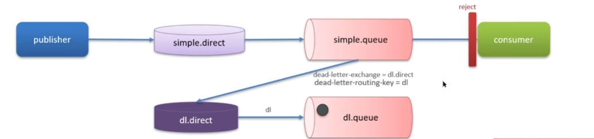

## 如何保证消息不丢失？

rabbitmq中消息的传递顺序：生产者 -> rabbitmq ->消费者

消息丢失有三种情况：

​	1、生产者弄丢了数据，没发送到rabbitmq中

​	2、消息在rabbitmq中然后rabbitmq挂了

​	3、消息到达了消费者，但是消费者挂了

解决情况1：**生产者确认机制**

rabbitMQ提供了publisher confirm机制来避免消息发送到MQ过程中丢失。mq收到消息后会返回结果给发送者表示消息是否处理成功。

解决情况2：**消息持久化**

持久化 交换机、队列、消息。

设置持久化有**两个步骤**：

1）创建 queue 的时候将其设置为持久化。这样就可以保证 RabbitMQ 持久化 queue 的元数据，但是它是不会持久化 queue 里的数据的。

2）发送消息的时候将消息的 `deliveryMode` 设置为 2。此时 RabbitMQ 就会将消息持久化到磁盘上去。

解决情况3：**消费者确认机制**

消费者处理消息后向mq发送ack确认消息，mq收到ack后才会删除该消息。

## 重复消费问题怎么解决

1）每条消息设置一个唯一的标识id

​	当消费者收到消息时去校验业务id是否存在，如果id已经存在，证明消费已经被消费过了

2）幂等方案：分布式锁、数据库锁

## 说说rabbitMQ中的死信交换机，延迟队列

* 延迟队列：进入队列的消息被延迟消费
  * 场景：超时订单、限时优惠、定时发布

延迟队列 = 死信队列 + ttl

当一个队列中的消息满足下列情况之一，成为**死信**：

1）消费者拒绝或消费失败，并且不会requeue

**2）消息是一个过期消息，超时无人消费**

3）要投递的队列消息堆积满了，新的消息可能成为死信

如果该队列配置了dead-letter-exchange属性，指定了一个交换机，那么队列中的死信就会投递到这个交换机中，这个交换机成为**死信交换机**

**TTL**

如果一个队列中的消息TTL结束仍未消费，则会变成死信，ttl超时分为两种情况：

1）消息所在的队列设置了存活时间

2）消息本身设置了存活时间

**回答**

在实现断点续播的功能中，使用到了延迟队列。而其中延迟队列就用到了死信交换机和ttl，超时未消费的消息会变成死信。死信交换机将死信放入死信队列，就能够再次消费了。这样就完成了延迟队列

## 队列中的消息堆积怎么解决

**解决方案**

1）增加更多消费者，提高消费速度

2）在消费者内开启线程池加快消息处理速度

3）扩大队列容积，提高堆积上线，比如采用**惰性队列：**该队列接受到消息后存入磁盘，消费者消费消息就从磁盘中读取

## 说说Rabbitmq中的高可用机制

普通集群、镜像集群

**普通集群：**会在集群的各个节点共享部分数据，包括：交换机、队列元信息。**不包含队列中的消息**，可以理解为只有一个队列有真正的消息，其他队列都是引用这个主队列。这种方式主队列宕机就寄了，所以达不到高可用的要求。

**镜像集群：**本质就是主从模式，主从的数据都是一致的

* 交换机、队列、队列中的消息会在各个mq的镜像结点之间同步备份
* **创建队列**的结点被称为该队列的**主节点**，备份到其他结点叫做该队列的**镜像节点**
* 一个队列的主节点可能是另一个队列的镜像节点
* 所有操作都是主节点完成，然后同步给镜像节点

主宕机后，镜像节点会替代成新的主，如果主从同步完成前  主就已经宕机，可能会出现数据丢失

为了解决数据丢失问题，采用**仲裁队列**

**仲裁队列**：与镜像队列一样，都是主从模式支持主从同步，只不过比普通集群多了个Raft协议保证了主从的强一致性。。
