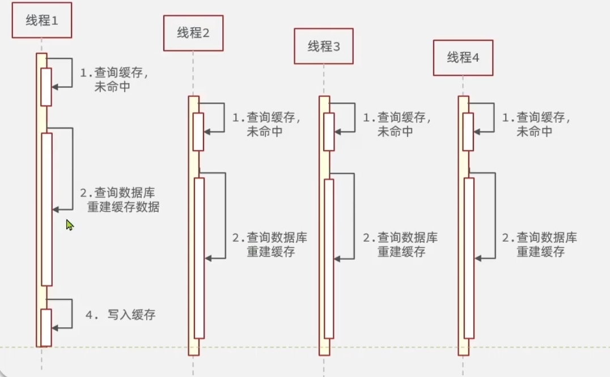
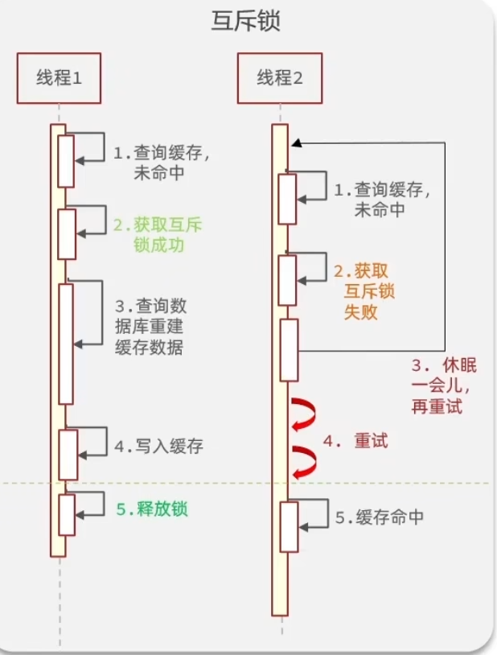
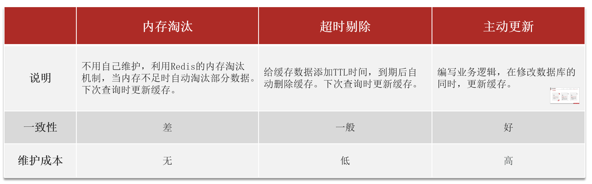
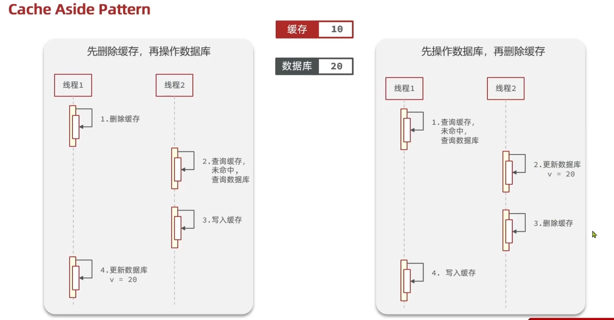
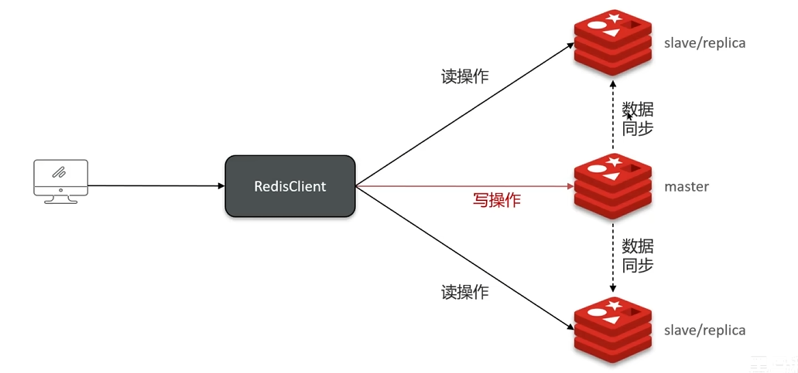
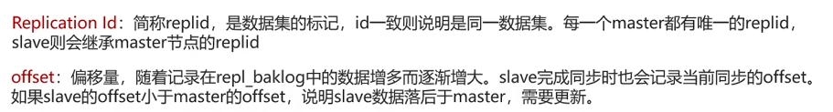
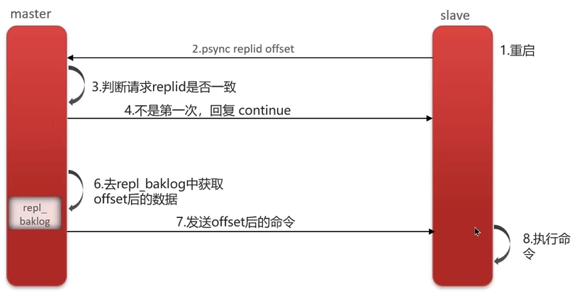
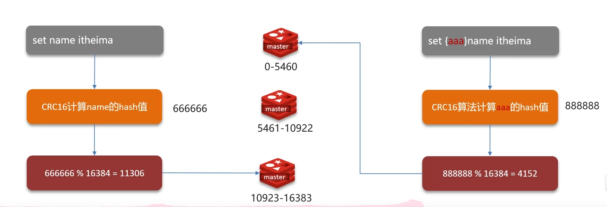

# 基础篇

### 什么是Redis？

Redis是一个基于c语言开发的NoSQL数据库，数据是保存在内存中的，因此读写非常快。

他还广泛应用于分布式方向，并且数据是以key-value的形式存储。

### 为什么要用Redis/缓存？

高性能：

从硬盘中读取数据相比于内存来说特别慢，所以把高频访问的数据放入缓存中，能大大提高效率。

高并发：

使用Redis缓存之后的QPS(每秒查询次数)远大于仅仅只用MySQL数据库。

直接操作缓存能够承受的数据库请求数 远远大于直接访问数据。所以将一部分数据放入缓存中，用户部分请求就不会经过数据库，能提高系统总体并发。

### Redis为什么这么快？

因为Redis内部做了很多性能优化。

1、Redis基于内存，访问速度比外存快太多了。

2、Redis基于Reactor模式设计了一套高效的事件处理模型，主要是**单线程事件循环和IO多路复用**。

3、Redis内置了很多优化后的数据结构，性能高。

### 分布式缓存常见的技术选型方案有哪些？

Memcached和Redis。

Memcached是分布式刚兴起时候较常用，后来因为Redis太强大、好用，大家逐渐都开始使用Redis了。

腾讯也开源了一款类似于Redis的高性能KV存储数据库，叫做Tendis。

但是Tendis开源版本已经没有维护更新了，所以不建议使用。

### 讲一讲Redis和Memcached的异同点？

**共同点：**

1.都基于内存，当做缓存使用。

2.都有过期策略。

3.两者性能都很高。

**区别：**

思路：从章节来回答：

数据类型 ->持久化 -> 集群 ->消息队列

1.Redis数据类型更加丰富，有list,set,zset,hash等，支持复杂的应用场景。而Memcached只有最简单的K-V(map)结构。

2.Redis支持数据持久化，可以将内存数据持久化到磁盘当中，而Memcached的数据全部在内存当中。

3.Redis有灾难恢复机制，因为他可以持久化、备份数据。

4.Redis在服务器内存要耗尽时，能够将不用的数据放入磁盘，缓解内存压力。Memcached在服务内存用完后直接报异常。

5.Redis支持集群，Memcached没有原生的集群。

6.Redis是单线程的，多路IO复用模型。Memcached是多线程，非阻塞IO复用的模型。

7.Redis支持发布订阅模式、Lua脚本、事务等功能，Memcached不支持。

通过以上区别可以发现，Redis强于Memcached。

### (待解决)常见的缓存读写策略有哪些？

https://javaguide.cn/database/redis/3-commonly-used-cache-read-and-write-strategies.html

# 应用篇

### Redis只能做缓存吗？

Redis还可做分布式锁、限流、消息队列、延时队列、分布式Session。

分布式锁：基于Redisson来实现分布式锁。

限流：一般通过Redis + Lua脚本来实现限流。

消息队列：Redis自带的List数据结构可以作为一个简单的队列使用。

分布式Session：利用String或者Hash类型保存Session数据，所有的服务器都可以访问。

### （待解决）如何使用Redis做分布式锁？

进入分布式锁那一章节

# 数据类型篇

### 列举一下Redis常用的数据类型？

5种基础类型：String, List, Set , Hash, Zset(有序集合)

3种特殊类型：HyperLogLog 、 BitMap、 Geospatial

## String

### String的应用场景有哪些？

String是Redis中最简单同时也是最常用的一个数据类型，他是二进制安全的，能够用来存储任何类型的数据，比如字符串、图片、序列化后的对象。

常见应用场景如下：

* String可以用来记录Session、Token、序列化后的对象、图片   的缓存
* String可以用来计数，比如用户单位时间的请求数、页面单位时间的访问数
* 分布式锁，利用setnx key value  命令能够实现一个最简单的分布式锁

### String底层实现是什么？

Redis是用C语言编写的，但是Redis的Sring类型不是C语言的字符串，而是自己编写了SDS来作为底层实现。

**SDS：**

1.SDS获取长度时间复杂度为O(1)。因为SDS结构中使用len属性记录了字符串长度。

2.SDS是二进制安全的。C语言字符串以\0结尾，而一些二进制文件中就可能包括这种空字符，所以C字符串无法正确保存。而SDS使用len属性来判断是否结束，所以不存在这个问题。

3.SDS可以避免缓冲区溢出。拼接字符串不会造成缓冲区溢出。因为SDS在拼接之前会检查空间够不够，不够就会扩容。

### 存储对象数据用String还是Hash？

String存放的是序列化后的对象数据，存放的是整个对象。Hash是对对象的每个字段单独存储。如果对象中某些字段要经常变动或者经常需要单独别字段，Hash更加适合。

String更节省内存，并且存储具有多层嵌套的对象也会方便很多。

绝大部分情况用String就行了。

### 存储购物车信息使用String还是Hash？

由于购物车中的商品会频繁修改和变更，所以应该使用Hash存储购物车信息。

我们记录用户id为key，商品id为field，数量为value。

则维护购物车信息就可以使用下面的操作：

* 用户添加商品就是往Hash里面增加新的field和value
* 查询购物车信息就是遍历对应的Hash
* 更改商品数量就是修改value
* 删除商品就是删除field
* 清空购物车直接删除对应的key

### 如何使用Redis实现一个排行榜？

使用Sorted Set数据类型。

## Set

### Set的应用场景是什么？

Redis中的set是无序集合，集合中的元素没有顺序但是是唯一的。

应用场景如下：

* 存放数据不能重复的场景，比如文章的点赞功能。
* 需要获取多个数据源交集并集差集的场景：如共同好友、共同粉丝、共同关注、推荐好友、推荐音乐、订阅号推荐等。
* 需要随机获取数据源中元素的场景：比如抽奖系统、随机点名等。

### 如何使用Set实现抽奖系统？

实现简单的抽奖系统，使用下面三个命令：

* `SADD key member1 member2`：向指定集合添加一个或多个元素
* `SPOP key count`：随机移除并获取指定集合中的一个或多个元素，适合不允许重复中奖的场景。
* `SRANDMEMBER key count`：随机获取指定集合中指定数量的元素，适合允许重复中奖的场景。

### 如何使用Bitmap统计活跃用户？

Bitmap存储的是连续的二进制数字，通过Bitmap，只需要一个比特位来表示某个元素的值和状态，key就是对应元素本身。

我们可以将Bitmap看成只存储1和0的数组，元素下标就叫做offset。

如果想使用Bitmap统计活跃用户，可以使用日期作为key，然后用户ID为offset，如果当天活跃过就置为1。

## 三大问题

### 什么缓存穿透？

缓存穿透是大量请求的key 都是不合理的，这些key根本不在缓存中，也不在数据库中。导致这些大量请求直接打到了数据库，可能导致数据库宕机。

### 缓存穿透的解决办法？

首先做好参数校验，让不合法的参数直接抛出异常信息给客户端。比如数据库表中id不能小于0、传入邮箱格式不对。

1）缓存无效的key

如果缓存和MySQL都查不到某个key，就将这个key写入Redis中并设置过期时间。应对请求变化不频繁的情况。

2）布隆过滤器

布隆过滤器是一种数据结构，可以判断一个给定的数据是否存在于海量的数据中。

做法：将所有可能存在的请求的值都放在布隆过滤器中，当用户请求过来的时候，先判断发生请求的值在不在布隆过滤器中。不在就直接报错。

布隆过滤器可能会误判。他说某个元素存在，有可能不存在。但是如果说某个元素不存在，就一定不存在。

因为原理是使用hashcode，如果两个字符串出现hash值一样的情况。a不在，b在，但是a和b的hashcode一致。查a的时候，会根据hashcode查，发现a在。所以他会说a存在，但是实际上a不存在。

布隆过滤器的更多原理去看guide。

### 什么是缓存击穿？

请求的key对应的是热点数据，这份数据存在数据库中，但是不在缓存中（通常因为缓存中的数据过期）。这就导致瞬间大量的key打到了数据库上，可能使数据库宕机。

场景：秒杀的时候，缓存中商品的key突然过期。于是大量请求直接打到了数据库。

### 缓存击穿的解决办法？

* 设置热点数据永不过期，或者过期时间较长
* 针对热点数据提前预热，确保存进缓存并且在秒杀结束前都不会过期。
* 请求数据库写数据到缓存之前要先获取互斥锁，保证只有一个请求打到数据库，减少数据库压力。
* 设置互斥锁，让线程查不到就等待一会，而不是立马去在数据库上重建缓存

### 击穿和穿透的区别？

击穿：key是热点数据，并且存在于数据库中，不存在与缓存中（通常因为缓存中的数据过期）

穿透：key既不存在与缓存，也不存在于数据库。

### 什么是缓存雪崩？

缓存在同一时间，大面积失效，导致大量的请求都直接落在数据库上，对数据库造成巨大压力。

缓存服务宕机也会导致缓存雪崩。

### 缓存雪崩的解决办法？

**针对Redis服务不可用的情况：**

* 采用Redis集群，避免单机出现故障导致整个缓存服务无法使用
* 限流，避免同时处理大量的请求

**针对热点缓存失效的情况：**

* 设置不同的失效时间，比如随机设置缓存的失效时间
* 设置二级缓存
* 设置缓存永远不失效（实用性太差）

### 雪崩和击穿的区别？

导致缓存雪崩的原因是缓存中的**大量数据**失效。

导师缓存击穿的原因是**某一个热点数据**不在缓存中（通常是因为缓存中的那份数据过期）。

小结：

Key不存在：穿透

少量热点key失效：击穿

大量key失效：雪崩

# 分布式篇

过期策略 ||  内存淘汰，一个是从时间的维度分析，一个是从空间的维度分析。

过期策略：定时、惰性、定期

内存淘汰策略：lru * 2, lfu * 2 ,  random * 2,  ttl(volatile),永不过期

## 说说缓存更新策略

缓存更新是用于解决Redis内存不足的问题：

使用**主动更新策略**最好。

而主动更新中，有三种模式：

Cache Aside Pattern 人工编码方式：缓存调用者在更新完数据库后再去更新缓存，也称之为双写方案

Read/Write Through Pattern : 由系统本身完成，数据库与缓存的问题交由系统本身去处理

Write Behind Caching Pattern ：调用者只操作缓存，其他线程去异步处理数据库，实现最终一致

**综合考虑使用方案一**，但是方案一调用者如何处理呢？这里有几个问题

操作缓存和数据库时有三个问题需要考虑：

1、删除缓存还是更新缓存？

 *	更新缓存，每次更新数据库都更新缓存，无效写操作太多。
 *	删除缓存：更新数据库时让缓存失效，查询时再更新缓存。

2、如何保证缓存与数据库的操作的同时成功或失败？

* 单体系统，将缓存与数据库操作放在一个事务
* 分布式系统，利用TTC等分布式事务方案

3、先操作缓存还是先删数据库：

前置知识：更新数据库操作速度慢，操作缓存速度快。

先删除缓存，再操作数据库：更新数据库慢，所以容易被别的线程见缝插针

先操作数据库，再删除缓存：写入缓存快，并且更新数据库满。别的线程难以插入操作缓存的方法之间。

因此先操作数据库比先删除缓存更好！

总结：

## redis作为缓存，mysql的数据如何与redis进行同步？

1）强一致性：用redisson的读写锁。（共享锁和排他锁）持有共享锁别人可以读不能写，持有排它锁别人不能读不能写

2）非强一致性：异步通知，使用MQ中间件，更新数据之后，通知缓存删除。

## redis持久化怎么做的？

RDB：客户端执行`save`，主进程进行持久化，阻塞所有线程。执行`bgsave`，主进程fork一个子进程进行持久化。

RDB执行原理：

​	bgsave开始时主进程fork一个子进程**共享内存数据**。完成fork后读取内存数据并写入RDB文件。

主进程通过修改页表去写物理内存。子进程和主进程共享内存，也能拿到主进程的页表。copy-on-write。有一部分数据是read-only。这部分数据是只读的，如果要写，就会拷贝一份然后去写拷贝后的。这就是copy-on-write。

AOF：append only file，追加文件。redis的每一个写命令都会记录在AOF中。

在redis中有一个配置`appendonly`默认是no，改成`appendonly yes`就开启了AOF

**AOF的刷盘策略**：

​	1）Always：同步刷盘。重

​	2）everysec：每秒刷盘。中

​	3）no：操作系统控制。轻

因为是记录命令，所以AOF文件比RDB大得多，而且AOF会记录多次写，但是多次写只有最后一次是有效的。通过执行`bgrewriteaof`命令，可以让AOF文件执行重写功能。用最少的命令达到相同的效果。

对比：RDB轻，AOF重

---

RDB和AOF混合方式（4.0版本)

> Redis 4.0 中提出了一个**混合使用 AOF 日志和内存快照**的方法。简单来说，内存快照以一定的频率执行，在两次快照之间，使用 AOF 日志记录这期间的所有命令操作。

这样一来，快照不用很频繁地执行，这就避免了频繁 fork 对主线程的影响。而且，AOF 日志也只用记录两次快照间的操作，也就是说，不需要记录所有操作了，因此，就不会出现文件过大的情况了，也可以避免重写开销。

------

## Redis的数据过期策略

问：加入redis的key过期了，会立即删除吗

redis的过期策略有

1、惰性删除：设置key的过期时间后，就不管了。当需要key的时候，检查是不是过期，过期了就删除。

优点：对cpu友好，只有使用key的时候才进行过期检查，用不到的key就不会浪费时间去检查了

缺点：对内存不友好，如果key过期了但是一直没被使用，内存永远不会释放

2、定期删除：每隔一段时间对一些key进行检查，然后删除过期的key。

有两种模式：

​	1）SLOW：定时任务，频率10hz，每次不超过25ms。

​	2）FAST：频率不固定，两次间隔不低于2ms，耗时不超过1ms

redis过期删除策略：惰性+定期配合使用

## 数据淘汰策略

问：假入缓存过多，内存被占满了怎么办？

一共有8种策略：

* noeviction：不淘汰任何key，内存满了不允许写入新数据
* volatile-ttl：对设置了TTLkey，比较key的剩余TTL，TTL小的淘汰
* allkeys-random：全体key随机淘汰
* volatile-dandoim:对设置了TTL的key，随机进行淘汰
* allkeys-lru：全体key，采用LRU算法进行淘汰
* volatile-lru：对设置了key的进行lru
* allkeys-lfu:对全体key，基于LFU进行淘汰
* volatile-lfu：设置了ttl的key，基于LFU进行淘汰（LFU是统计每个key的使用频率）

优先使用allkeys-lru 

问：redis内存用完了发生什么？

如果是noeviction，占满了直接报错

## 分布式锁

setnx

1、watchdog为锁续期

2、抢不到锁的线程会重试

3、redis命令加锁、设置时间等操作都是基于lua脚本的

redisson是否是可重入的？

 

重入后value++，释放锁value--，value为0释放锁

redis集群带来的问题：redis不是单个的了，那么就要保证每个结点的锁是一样的

红锁：在多个redis实例上创建锁(n/2 + 1)，避免在一个redis实例上加锁。

​	缺点：实现复杂，性能差，运维繁琐

问：redis分布式锁如何实现？

答：在使用抢券的时候用到了redis分布式锁，使用的是redisson实现的分布式锁。底层是setnx和lua脚本（保证原子性）。

问：redissson实现分布式锁如何合理的控制锁的有效时长？

答：在redisson中，提供了看门狗机制，一个线程获取锁成功后，watchdog会给持有锁的线程续期。

问：redisson可以重入吗？

可以重入，多个锁重复需要判断是不是当前线程，在redis中进行存储的时候使用的hash结构。来存储线程信息和重入的次数

问：Redisson锁能解决主从数据一致的问题吗？

不能解决，但是能使用redisson提供的红锁来解决，但是这样性能太低了。如果业务中一定要保证数据的强一致性，建议采用zookeeper实现的分布式锁。

## 其他

问：Redis集群有哪些方案？

redis中提供了三种集群方式：主从复制、哨兵模式、分片模型

主从复制：

​	单节点Redis的并发能力是有限的，要提高并发能力，就要搭建主从集群，实现读写分离

​	

主从数据同步原理：

主从**全量同步**： 

1、master如何判断slave是不是第一次请求

2、后期同步都是从日志文件记录命令然后发送给从结点执行，如何确保主从同步的时候正好不多不少，正式从节点需要的那部分数据。

step1：slave发起请求给master，想要同步数据，master判断是不是第一次请求。是就全量同步

step2：master执行bgsave生成RDB文件发送给slave

step3：master在记录RDB期间，接受的其他命令会记录到repl_baklog日志文件中，然后把日志发送给从节点执行

**增量同步**：

问：介绍一下redis的主从同步

答：单节点Redis的并发能力是有上限的，要进一步提高Redis的并发能力，就要搭建主从集群，实现读写分离。一般都是一主多从，master负责写，slave负责读。

 问：说一下同步数据的流程

全量同步：

1）从节点请求主节点同步数据（replication id， offset）

2）主节点判断是不是第一次，是第一次就和从节点同步版本信息

3）主节点执行bgsava，生成rdb文件后发给slave去执行

4）在rdb生成期间，mater以命令的方式记录到缓冲区（一个日志文件）

5）把生成之后的命令日志文件发送给结点进行同步

增量同步：

1）从节点请求主节点同步数据，主节点判断是不是第一次请求，不是就获取从节点offset值

2）主节点从命令日志中获取到offset值之后的数据，发送给从节点进行同步

## 哨兵

Redis提供了哨兵机制来实现主从集群的自动故障恢复。哨兵的结构和作用：

* 监控：Sentinel会不断检查master和slave是否按预期工作
* 自动故障恢复：如果master故障，Sentinel会将一个slave提升为master
* Sentinel充当Redis客户端的服务发现来源，当集群发生故障转移时，会将最新信息推送给Redis的客户端

保证了主从模式的高可用。

master宕机，sentinel是如何选择新的mater的？

Sentinel基于心跳机制检测服务状态，每隔1秒向集群的每个实例发送ping命令：

* 主观下线：如果sentinel结点发现某实例未在规定时间响应，则认为该实例`主观下线`
* 客观下线：超过指定数量的sentinel都认为该实例主观下线，则该实例客观下线。数量值最好超过Sentinel实例数量的一半。

**选主规则：**

* 判断主与从结点断开时间的长短，超过指定值就排该从节点
* 判断从结点的slave-priority值，越小优先级越高
* slave-priority一样的话，判断slave结点的offset值，越大优先级越高
* 最后判断slave结点的运行id，越小优先级越高

**脑裂：**

脑裂现象：原master网络不稳定，但是还没挂，客户端能正常连接。而Sentinel和master网络处于不同分区，又因为master网络不稳定，所以监测不到master了，于是选了一个新的master。但是客户端还认原来的，于是往原master写数据。网络恢复正常，原master成为了slave，向新master同步数据。那么就会丢失一部分数据了。

解决：修改redis的配置，设置最少的从节点数量以及缩短主从数据同步的延迟时间，达不到要求就拒绝请求，可以避免大量的数据丢失

---

问：怎么保证redis的高并发可用

答：采用哨兵模式，实现主从集群的自动故障恢复（监控、自动故障恢复、通知）

问：使用的redis是单点还是集群，哪种集群

答：一主一从+哨兵就可以了。单节点不超过10G内存，如果redis内存不足可以给不同服务分配独立的Redis主从节点。

问：redis集群脑裂是什么，怎么解决？

脑裂现象：看上面

解决：修改redis的配置，设置最少的从节点数量以及缩短主从数据同步的延迟时间，达不到要求就拒绝请求，就可以避免大量的数据丢失。

## 分片集群

主从和哨兵能解决高可用、高并发问题。但是还有两个问题没解决。

* 海量数据存储问题
* 高并发写的问题

分片集群的特征：

* 集群中有多个master，每个master保存不同的数据
* 每个master可以有多个slave
* master之间通过ping监测彼此健康状态
* 客户端请求可以访问集群任意结点，最终都会被转发到正确节点

---

问：redis分片集群数据是怎么存储和读取的？

答：Redis分片集群引入了哈希槽的概念，Redis集群有16384个哈希槽，每个key通过CRC16校验后对16384取模来决定放置哪个槽，集群的每个结点负责一部分hash槽。

* redis分片集群引入了哈希槽的概念，redis集群有16384个哈希槽
* 将16384个插槽分配到不同的实例
* 读写数据：根据key的**有效部分**（如果key前面有大括号，大括号内容就是有效部分，如果没有，key本身就是有效部分）计算哈希值，对16384取余，余数作为插槽，寻找插槽所在的实例。

## 其他

问：Redis是单线程的，为什么这么快

答：

* redis是基于内存的，执行速度快
* 采用单线程，避免不必要的上下文切换可竞争条件，多线程还要考虑线程安全问题
* 使用IO多路复用模型，是非阻塞IO

---

问：解释一下IO多路复用模型

**知识点：**

1、用户空间和内核空间

Linux系统为了提高IO效率，会在用户空间和内核空间都加入缓冲区：

* 写数据时，要把用户缓冲数据拷贝到内核缓冲区然后写入设备
* 读数据时，要从设备读取数据到内核缓冲区，然后拷贝到用户缓冲区

2、阻塞IO

用户进程尝试读取数据，如果没数据，就要等待，是处于阻塞状态的。  

3、非阻塞IO

用户进程尝试读取数据，如果没数据，内核区返回error。用户拿到error再次尝试获取。

优点就是内核区返回了error后，可以为别的用户进程服务了。

答：Redis基于内存，速度很快。性能瓶颈是`网络延迟`而不是执行速度，IO多路复用模型主要实现了高效的网络请求。

答：Redis基于内存，速度很快。性能瓶颈是`网络延迟`而不是执行速度，IO多路复用模型主要实现了高效的网络请求。他利用单个线程同时监听多个socket，并在某个socket可读、可写时得到通知，从而避免无效的等待，充分利用CPU资源。目前IO多路复用采用`epoll`模式实现，会通知用户进程Socket就绪的同时，把已就绪的Socket写入用户空间，不需要遍历Socket开判断是否就绪，提升了性能

  
