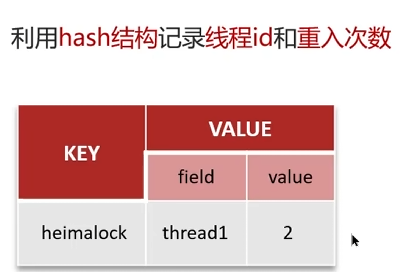

[TOC]


# 基础篇

### 什么是Redis？

Redis是一个基于c语言开发的NoSQL数据库，数据是保存在内存中的，因此读写非常快。

他还广泛应用于分布式方向，并且数据是以key-value的形式存储。


### 为什么要用Redis/缓存？

高性能：

从硬盘中读取数据相比于内存来说特别慢，所以把高频访问的数据放入缓存中，能大大提高效率。

高并发：

使用Redis缓存之后的QPS(每秒查询次数)远大于仅仅只用MySQL数据库。

直接操作缓存能够承受的数据库请求数 远远大于直接访问数据。所以将一部分数据放入缓存中，用户部分请求就不会经过数据库，能提高系统总体并发。

### Redis为什么这么快？

因为Redis内部做了很多性能优化。

1、Redis基于内存，访问速度比外存快太多了。

2、Redis基于Reactor模式设计了一套高效的事件处理模型，主要是**单线程事件循环和IO多路复用**。

3、Redis由C语⾔实现，内置了很多优化后的数据结构，性能极高。

---

#### 问：Redis是单线程的，为什么这么快

答：

* redis是基于内存的，执行速度快
* 采用单线程，避免不必要的上下文切换可竞争条件，多线程还要考虑线程安全问题
* 使用IO多路复用模型，是非阻塞IO

---

#### 问：解释一下IO多路复用模型

IO多路复用指的是一个进程/线程可以同时监视多个文件描i述符(含socket连接)，一旦其中的一个或者多个文件描述符可读或者可写，该监听进程/线程能够进行IO事件的查询。

Redis 采用网络 IO 多路复用技术，来保证在多连接的时候系统的高吞吐量。 多路-指的是多个 socket网络连接，复用-指的是复用一个线程。多路复用主要有三种技术：select，poll，epoll。epoll 是最新的、也是目前最好的多路复用技术。 采用多路 I/O 复用技术,可以让单个线程高效处理多个连接请求（尽量减少网络 IO 的时间消耗）。并且 Redis 在内存中操作数据的速度非常快（因为 Redis 是基于内存的操作，CPU 不是 Redis 的瓶颈）。主要以上两点造就了 Redis 具有很高的吞吐量。 采用多路 I/O复用技术可以让单个线程高效的处理多个连接请求。

**知识点：**

1、用户空间和内核空间

Linux系统为了提高IO效率，会在用户空间和内核空间都加入缓冲区：

* 写数据时，要把用户缓冲数据拷贝到内核缓冲区然后写入设备
* 读数据时，要从设备读取数据到内核缓冲区，然后拷贝到用户缓冲区

2、阻塞IO

用户进程尝试读取数据，如果没数据，就要等待，是处于阻塞状态的。  

3、非阻塞IO

用户进程尝试读取数据，如果没数据，内核区返回error。用户拿到error再次尝试获取。

优点就是内核区返回了error后，可以为别的用户进程服务了。

答：Redis基于内存，速度很快。性能瓶颈是`网络延迟`而不是执行速度，IO多路复用模型主要实现了高效的网络请求。他利用单个线程同时监听多个socket，并在某个socket可读、可写时得到通知，从而避免无效的等待，充分利用CPU资源。目前IO多路复用采用`epoll`模式实现，会通知用户进程Socket就绪的同时，把已就绪的Socket写入用户空间，不需要遍历Socket开判断是否就绪，提升了性能

  

IO多路复用的三种实现方式总结：


## Redis为什么最开始被设计成单线程的？

Redis作为一个成熟的分布式缓存框架，

它由很多个模块组成，如网络请求模块、索引模块、存储模块、高可用集群支撑模块、数据操作模块

等。

**Redis中只有网络请求模块和数据操作模块是单线程的**，而其他的如持久化存储模块、集群支撑模块等是多线程的。

单线程指的是网络请求模块使用了一个线程（所以不需考虑并发安全性），即一个线程处理所有网络请求，其他模块仍用了多个线程。

那么，**为什么网络操作模块和数据存储模块最初并没有使用多线程呢**？因为没必要

为什么没必要呢？我们先来说一下，什么情况下要使用多线程？

一个计算机程序在执行的过程中，主要需要进行两种操作分别是**读写操作**和**计算操作**。其中读写操作主要是涉及到的就是I/O操作，其中包括网络I/O和磁盘I/O。

计算操作主要涉及到CPU。

而多线程的目的：就是通过并发的方式来提升I/O的利用率和CPU的利用率。

Redis不需要提升CPU利用率，因为Redis的操作基本都是基于内存的，CPU资源根本就不是Redis的性能瓶颈。

所以，通过多线程技术来提升Redis的CPU利用率这一点是完全没必要的；采用多线程可以帮助我们提升I/O的利用率，但是多线程带来的并发问题也给这些语言和框架带来了更多的复杂性。

而且，多个线程的互相切换也会带来一定的性能开销。所以，在提升I/O利用率这个方面上，Redis并没有采用多线程技术，而是选择了多路复用 I/O技术。

**官方FAQ表示**，因为Redis是基于内存的操作，CPU成为Redis的瓶颈的情况很少见，Redis的瓶颈最有可能是内存的大小或者网络限制。

如果想要最大程度利用CPU，可以在一台机器上启动多个Redis实例。

同时FAQ里还提到了， **Redis 6.0 之后开始变成多线程**，除了主线程外，它也有后台线程在处理一些较为缓慢的操作，例如清理脏数据、无用连接的释放、大 Key 的删除等等。

## 为什么Redis 6.0引入多线程

Redis 6.0中的多线程，也只是针对处理**网络请求过程采用了多线程，而数据的读写命令，仍然是单线程处理的**。

经过分析，限制Redis的**性能的主要瓶颈出现在网络IO**的处理上，虽然之前采用了多路复用技术。多路复用的IO模型本质上仍然是同步阻塞型IO模型。

在多路复用的IO模型中，在处理网络请求时，调用 select （其他函数同理）的过程是阻塞的，也就是说这个过程会阻塞线程，如果并发量很高，此处可能会成为瓶颈。

虽然现在很多服务器都是多个CPU核的，但是对于Redis来说，因为使用了单线程，在一次数据操作的过程中，有大量的CPU时间片是耗费在了网络IO的同步处理上的，并没有充分的发挥出多核的优势。

如果能采用多线程，使得网络处理的请求并发进行，就可以大大的提升性能。多线程除了可以减少由于网络 I/O 等待造成的影响，还可以充分利用 CPU 的多核优势。

**Redis 6.0 只有在网络请求的接收和解析，以及请求后的数据通过网络返回给时，使用了多线程。**

而数据读写操作还是由单线程来完成的，所以，这样就不会出现并发问题了。

Redis6.0的多线程是用多线程来处理数据的**读写和协议解析**，但是Redis**执行命令**还是单线程的。


这样做的⽬的是因为Redis的**性能瓶颈在于⽹络IO⽽⾮CPU**，使⽤多线程能提升IO读写的效率，从⽽整体提⾼Redis的性能。

### 分布式缓存常见的技术选型方案有哪些？

Memcached和Redis。

Memcached是分布式刚兴起时候较常用，后来因为Redis太强大、好用，大家逐渐都开始使用Redis了。

腾讯也开源了一款类似于Redis的高性能KV存储数据库，叫做Tendis。

但是Tendis开源版本已经没有维护更新了，所以不建议使用。


### 讲一讲Redis和Memcached的异同点？

**共同点：**

1.都基于内存，当做缓存使用。

2.都有过期策略。

3.两者性能都很高。


**区别：**

思路：从章节来回答：

数据类型 ->持久化 -> 集群 ->消息队列

1.Redis数据类型更加丰富，有list,set,zset,hash等，支持复杂的应用场景。而Memcached只有最简单的K-V(map)结构。

2.Redis支持数据持久化，可以将内存数据持久化到磁盘当中，而Memcached的数据全部在内存当中。

3.Redis有灾难恢复机制，因为他可以持久化、备份数据。

4.Redis在服务器内存要耗尽时，能够将不用的数据放入磁盘，缓解内存压力。Memcached在服务内存用完后直接报异常。

5.Redis支持集群，Memcached没有原生的集群。

6.Redis是单线程的，多路IO复用模型。Memcached是多线程，非阻塞IO复用的模型。

7.Redis支持发布订阅模式、Lua脚本、事务等功能，Memcached不支持。

通过以上区别可以发现，Redis强于Memcached。

# 应用篇

### Redis只能做缓存吗？

Redis还可做分布式锁、限流、消息队列、延时队列、分布式Session。

分布式锁：基于Redisson来实现分布式锁。

限流：一般通过Redis + Lua脚本来实现限流。

消息队列：Redis自带的List数据结构可以作为一个简单的队列使用。

分布式Session：利用String或者Hash类型保存Session数据，所有的服务器都可以访问。

### 如何使用Redis做分布式锁？

先拿setnx来争抢锁，抢到之后，再用expire给锁加一个过期时间防止锁忘记了释放。

这时候对方会告诉你说你回答得不错，然后接着问如果在**setnx之后执行expire之前进程意外crash或者要重启维护了**，那会怎么样？

这时候你要给予惊讶的反馈：唉，是喔，这个锁就永远得不到释放了。

紧接着你需要抓一抓自己得脑袋，故作思考片刻，好像接下来的结果是你主动思考出来的，

然后回答：我记得set指令有非常复杂的参数，这个应该是可以同时**把setnx和expire合成一条指令来用的！**

对方这时会显露笑容，心里开始默念：嗯，这小子还不错

# 事务篇

### Redis 支持事务吗？

Redis提供了简单的事务，但它对事务ACID的支持并不完备。

multi命令代表事务开始，exec命令代表事务结束，它们之间的命令是原子顺序执行的：

```
127.0.0.1:6379> multi
OK
127.0.0.1:6379> sadd user:a:follow user:b
QUEUED
127.0.0.1:6379> sadd user:b:fans user:a
QUEUED
127.0.0.1:6379> sismember user:a:follow user:b
(integer) 0
127.0.0.1:6379> exec 1) (integer) 1
2) (integer) 1
```

Redis事务的原理，是所有的指令在 exec **之前 不执行**，而是缓存在 服务器的一个事务队列中，

服务器一旦收到 exec 指令，才开执行整个事务队列，执行完毕后一次性返回所有指令的运行结果。

因为Redis执行命令是单线程的，所以这组命令顺序执行，而且不会被其它线程打断。

### Redis事务的注意点有哪些？

需要注意的点有：

Redis 事务是不支持回滚的，不像 MySQL 的事务一样，要么都执行要么都不执行；

Redis 服务端在执行事务的过程中，不会被其他客户端发送来的命令请求打断。直到事务命令全部

执行完毕才会执行其他客户端的命令。

### Redis事务为什么不支持回滚？

Redis 的事务不支持回滚。

如果执行的命令有语法错误，Redis 会执行失败，这些问题可以从程序层面捕获并解决。但是如果出现

其他问题，则依然会继续执行余下的命令。

这样做的原因是因为回滚需要增加很多工作，而不支持回滚则可以**保持简单、快速的特性**。

### 了解Redis事务机制吗？

Redis通过MULTI、EXEC、WATCH等命令来实现事务机制，

Redis事务执行过程将一系列多个命令按照顺序一次性执行，并且在执行期间，事务不会被中断，也不会去执行客户端的其他请求，直到所有命令执行完毕。

事务的执行过程如下：

1. 服务端收到客户端请求，事务以MULTI开始
2. 如果客户端正处于事务状态，则会把事务放入队列同时返回给客户端 QUEUED，反之则直接执行这个命令

3. 当收到客户端EXEC命令时，WATCH命令监视真个事务中的key是否被修改，如果有，则返回空回复到客户端表示失败，否则Redis会遍历真个事务队列，执行队列中保存的所有命令，最后返回结果给客户端

WATCH的机制本身是一个CAS的机制，被监视的key会被保存到一个链表中，如果某一个key被修改，那么REDIS_DIRTY_CAS 标 志 将会被打开，这时服务器会拒绝执行事务


# 数据类型篇

### 列举一下Redis常用的数据类型？

5种基础类型：String, Hash，List, Set , Zset(有序集合)

3种特殊类型：HyperLogLog 、 BitMap、 Geospatial、stream

## String

### String的应用场景有哪些？

String是Redis中最简单同时也是最常用的一个数据类型，他是二进制安全的，能够用来存储任何类型的数据，比如字符串、图片、序列化后的对象。

常见应用场景如下：

* String可以用来记录Session、Token、序列化后的对象、图片   的缓存
* String可以用来计数，比如用户单位时间的请求数、页面单位时间的访问数
* 分布式锁，利用setnx key value  命令能够实现一个最简单的分布式锁

### String底层实现是什么？

Redis是用C语言编写的，但是Redis的Sring类型不是C语言的字符串，而是自己编写了SDS来作为底层实现。

**SDS：**

1.SDS获取长度时间复杂度为O(1)。因为SDS结构中使用len属性记录了字符串长度。

2.SDS是二进制安全的。C语言字符串以\0结尾，而一些二进制文件中就可能包括这种空字符，所以C字符串无法正确保存。而SDS使用len属性来判断是否结束，所以不存在这个问题。

3.SDS可以避免缓冲区溢出。拼接字符串不会造成缓冲区溢出。因为SDS在拼接之前会检查空间够不够，不够就会扩容。

### 存储对象数据用String还是Hash？

String存放的是序列化后的对象数据，存放的是整个对象。Hash是对对象的每个字段单独存储。如果对象中某些字段要经常变动或者经常需要单独别字段，Hash更加适合。

String更节省内存，并且存储具有多层嵌套的对象也会方便很多。

绝大部分情况用String就行了。

### 存储购物车信息使用String还是Hash？

由于购物车中的商品会频繁修改和变更，所以应该使用Hash存储购物车信息。

我们记录用户id为key，商品id为field，数量为value。

则维护购物车信息就可以使用下面的操作：

* 用户添加商品就是往Hash里面增加新的field和value
* 查询购物车信息就是遍历对应的Hash
* 更改商品数量就是修改value
* 删除商品就是删除field
* 清空购物车直接删除对应的key

### 如何使用Redis实现一个排行榜？

使用Sorted Set数据类型。

## Set

### Set的应用场景是什么？

Redis中的set是无序集合，集合中的元素没有顺序但是是唯一的。

应用场景如下：

* 存放数据不能重复的场景，比如文章的点赞功能。
* 需要获取多个数据源交集并集差集的场景：如共同好友、共同粉丝、共同关注、推荐好友、推荐音乐、订阅号推荐等。
* 需要随机获取数据源中元素的场景：比如抽奖系统、随机点名等。

### 如何使用Set实现抽奖系统？

实现简单的抽奖系统，使用下面三个命令：

* `SADD key member1 member2`：向指定集合添加一个或多个元素
* `SPOP key count`：随机移除并获取指定集合中的一个或多个元素，适合不允许重复中奖的场景。
* `SRANDMEMBER key count`：随机获取指定集合中指定数量的元素，适合允许重复中奖的场景。

### 如何使用Bitmap统计活跃用户？

Bitmap存储的是连续的二进制数字，通过Bitmap，只需要一个比特位来表示某个元素的值和状态，key就是对应元素本身。

我们可以将Bitmap看成只存储1和0的数组，元素下标就叫做offset。

如果想使用Bitmap统计活跃用户，可以使用日期作为key，然后用户ID为offset，如果当天活跃过就置为1。

# 持久化篇

## redis持久化怎么做的？

RDB：客户端执行`save`，主进程进行持久化，阻塞所有线程。执行`bgsave`，主进程fork一个子进程进行持久化。

注意：主进程一直fork也会影响主进程本身的效率

**RDB执行原理：**

​	bgsave开始时主进程fork一个子进程**共享内存数据**。完成fork后读取内存数据并写入RDB文件。

​	主进程通过修改页表去写物理内存。子进程和主进程共享内存，也能拿到主进程的页表。copy-on-write。有一部分数据是read-only。这部分数据是只读的，如果要写，就会拷贝一份然后去写拷贝后的。这就是copy-on-write。

**AOF：**append only file，追加文件。redis的每一个写命令都会记录在AOF中。

在redis中有一个配置`appendonly`默认是no，改成`appendonly yes`就开启了AOF

**AOF的刷盘策略**：

​	1）Always：同步刷盘。重

​	2）everysec：每秒刷盘。中

​	3）no：操作系统控制。轻

因为是记录命令，所以AOF文件比RDB大得多，而且AOF会记录多次写，但是多次写只有最后一次是有效的。通过执行`bgrewriteaof`命令，可以让AOF文件执行重写功能。用最少的命令达到相同的效果。

**对比：**RDB轻，AOF重

------

## RDB和AOF如何选择？

一般来说， 如果想达到足以媲美数据库的 **数据安全性**，应该 **同时使用两种持久化功能**。

在这种情况下，当 Redis 重启的时候会优先载入 AOF 文件来恢复原始的数据，因为在通常情况下 AOF文件保存的数据集要比 RDB 文件保存的数据集要完整。

如果 **可以接受数分钟以内的数据丢失**，那么可以 **只使用** **RDB** **持久化**。

有很多用户都只使用 AOF 持久化，但并不推荐这种方式，因为定时生成 RDB 快照（snapshot）非常便于进行数据备份，并且 RDB 恢复数据集的速度也要比 AOF 恢复的速度要快。

Redis 4.0 中提出了一个**混合使用 AOF 日志和内存快照**的方法。简单来说，**内存快照以一定的频率执行，在两次快照之间，使用 AOF 日志记录这期间的所有命令操作**。

这样一来，快照不用很频繁地执行，这就避免了频繁 fork 对主线程的影响。而且，**AOF 日志也只用记录两次快照间的操作**，也就是说，不需要记录所有操作了，因此，就不会出现文件过大的情况了，也可以避免重写开销。

## RDB和AOF各自有什么优缺点？

**RDB** **优点：**

1. 只有一个紧凑的二进制文件 dump.rdb ，非常适合备份、全量复制的场景。
2. **容灾性好**，可以把RDB文件拷贝道远程机器或者文件系统张，用于容灾恢复。
3. **恢复速度快**，RDB恢复数据的速度远远快于AOF的方式

**RDB缺点：**

1. **实时性低**，RDB 是间隔一段时间进行持久化，没法做到实时持久化/秒级持久化。如果在这一间隔

事件发生故障，数据会丢失。

2. **存在兼容问题**，Redis演进过程存在多个格式的RDB版本，存在老版本Redis无法兼容新版本RDB

的问题。

**AOF 优点：**

1. **实时性好**，aof 持久化可以配置 appendfsync 属性，有 always ，每进行一次命令操作就记录到

aof 文件中一次。

2. 通过 append 模式写文件，即使中途服务器宕机，可以通过 redis-check-aof 工具解决数据一致性

问题。

**AOF 缺点：**

1. AOF 文件比 RDB **文件大**，且 **恢复速度慢**。
2. **数据集大** 的时候，比 RDB **启动效率低**。


## 为什么恢复的时候RDB比AOF快？

AOF，存放的指令日志，做数据恢复的时候，其实是要回放和执行所有的指令日志，来恢复出来内存中的所有数据的；

RDB，就是一份数据文件，恢复的时候，直接加载到内存中即可；

RDB持久化的时候，Redis主进程只需要fork一个子进程，让子进程执行磁盘IO操作来进行RDB持久化即可；

（1）RDB对Redis对外提供的读写服务，影响非常小，可以让Redis保持高性能，因为Redis主进程只需要fork一个子进程，让子进程执行磁盘IO操作来进行RDB持久化即可;

RDB每次写，都是直接写Redis内存，只是在一定的时候，才会将数据写入磁盘中；

AOF，每次都是要写文件的，虽然可以快速写入os cache中，但是还是有一定的时间开销的，速度肯定比RDB略慢一些;

（2）RDB使用单独子进程来进行持久化，主进程不会进行任何IO操作，保证了Redis的高性能 ；

## AOF重写的流程

Redis通过fork一个子进程，重新写一个新的AOF文件，该次重写不是读取旧的AOF文件进行复制，而是读取内存中的Redis数据库，重写一份AOF文件，有点类似于RDB的快照方式。

在子进程进行AOF重写期间，Redis主进程执行的命令会被保存在AOF重写缓冲区里面，这个缓冲区在

服务器创建子进程之后开始使用，当Redis执行完一个写命令之后，它会同时将这个写命令发送给 AOF缓冲区和AOF重写缓冲区。如下图


具体的步骤如下：

1.无论是执行bgrewriteaof命令手动开启重写，还是自动进行AOF重写，实际上都是执行

BGREWRITEAOF命令

2.执行bgrewriteaof命令,Redis会fork一个子进程，

3.子进程对内存中的Redis数据进行回溯，生成新的AOF文件

4.Redis主进程会处理正常的命令操作

5.同时Redis把会新的命令写入到aof_rewrite_buf当中，当bgrewriteaof命令执行完成，新的AOF文件生成完毕，Redis主进程会把aof_rewrite_buf中的命令追加到新的AOF文件中

6.用新生成的AOF文件替换旧的AOF文件

# 三大问题

### 什么缓存穿透？

缓存穿透是大量请求的key 都是不合理的，这些key根本不在缓存中，也不在数据库中。导致这些大量请求直接打到了数据库，可能导致数据库宕机。

### 缓存穿透的解决办法？

首先做好参数校验，让不合法的参数直接抛出异常信息给客户端。比如数据库表中id不能小于0、传入邮箱格式不对。

1）缓存无效的key

如果缓存和MySQL都查不到某个key，就将这个key写入Redis中并设置过期时间。应对请求变化不频繁的情况。

2）布隆过滤器

 

布隆过滤器是一种数据结构，可以判断一个给定的数据是否存在于海量的数据中。

做法：将所有可能存在的请求的值都放在布隆过滤器中，当用户请求过来的时候，先判断发生请求的值在不在布隆过滤器中。不在就直接报错。

布隆过滤器可能会误判。他说某个元素存在，有可能不存在。但是如果说某个元素不存在，就一定不存在。

因为原理是使用hashcode，如果两个字符串出现hash值一样的情况。a不在，b在，但是a和b的hashcode一致。查a的时候，会根据hashcode查，发现a在。所以他会说a存在，但是实际上a不存在。

布隆过滤器的更多原理去看guide。

### 什么是缓存击穿？

请求的key对应的是热点数据，这份数据存在数据库中，但是不在缓存中（通常因为缓存中的数据过期）。这就导致瞬间大量的key打到了数据库上，可能使数据库宕机。

场景：秒杀的时候，缓存中商品的key突然过期。于是大量请求直接打到了数据库。


### 缓存击穿的解决办法？

* 设置热点数据永不过期，或者过期时间较长
* 针对热点数据提前预热，确保存进缓存并且在秒杀结束前都不会过期。
* 请求数据库写数据到缓存之前要先获取互斥锁，保证只有一个请求打到数据库，减少数据库压力。
* 逻辑过期，过期了则**逻辑删除**，返回旧数据。第一个发现过期的线程会开启另一个线程去重建数据。重建完成之前，别的线程获取到的都是旧数据。
* 设置互斥锁，让线程查不到就等待一会，而不是立马去在数据库上重建缓存

### 击穿和穿透的区别？

击穿：key是热点数据，并且存在于数据库中，不存在与缓存中（通常因为缓存中的数据过期）

穿透：key既不存在与缓存，也不存在于数据库。

### 什么是缓存雪崩？

缓存在同一时间，大面积失效，导致大量的请求都直接落在数据库上，对数据库造成巨大压力。

缓存服务宕机也会导致缓存雪崩。

### 缓存雪崩的解决办法？

**针对Redis服务不可用的情况：**

* 采用Redis集群，避免单机出现故障导致整个缓存服务无法使用
* 限流，避免同时处理大量的请求

**针对热点缓存失效的情况：**

* 设置不同的失效时间，比如随机设置缓存的失效时间
* 设置二级缓存
* 设置缓存永远不失效（实用性太差）

### 雪崩和击穿的区别？

导致缓存雪崩的原因是缓存中的**大量数据**失效。

导师缓存击穿的原因是**某一个热点数据**不在缓存中（通常是因为缓存中的那份数据过期）。

小结：

Key不存在：穿透

少量热点key失效：击穿

大量key失效：雪崩

# 分布式篇

过期策略 ||  内存淘汰，一个是从时间的维度分析，一个是从空间的维度分析。

**过期策略：**

1. 定时：
2. 惰性：用到key的时候检查是否过期，过期就删除
3. 定期：指的是 redis 默认是每隔 100ms 就随机抽取一些设置了过期时间的 key，检查其是否过期，如果过期就删除。

​	**redis采用惰性  + 定期。**

​	定期删除可能会导致很多过期 key 到了时间并没有被删除掉，那咋整呢？所以就是惰性删除了。但是实际上这还是有问题的，如果定期删除漏掉了很多过期 key，然后你也没及时去查，也就没走惰性删除，此时会怎么样？如果大量过期 key 堆积在内存里，导致 redis 内存块耗尽了，咋整？
 答案是：走内存淘汰机制。

**内存淘汰策略：lru * 2, lfu * 2 ,  random * 2,  ttl(volatile),  永不过期**

volatile-lru：针对设置了过期时间的key，使用LRU算法进行淘汰
allkeys-lru：针对所有key使用LRU算法进行淘汰
volatile-lfu：针对设置了过期时间的key，使用LFU算法进行淘汰
allkeys-lfu：针对所有key使用LFU算法进行淘汰
volatile-random: 从设置了过期时间的key中随机删除
allkeys-random: 从所有key中随机删除
volatile-ttl：删除生存时间最近的一个键
noeviction（默认策略）：不删除键，返回错误OOM，只能读取不能写入

## 常见的缓存读写策略有哪些？

**1. Cache Aside Pattern（旁路缓存）**

**写：**更新db， 删除缓存    

**读：**读缓存。 如果缓存没有，读取db数据返回，最后写入缓存

**策略：**

1）先删除缓存，再更新db：A写，删除缓存，B读，读缓存，A更新DB，B写入缓存（旧值）。

2）先更新db，再删除缓存：A读缓存，发现没有，读DB。 B更新DB，删除缓存。A写入缓存（旧值）

方式2被插队的概率比方式1小的多，因为方式1更新db是很慢的操作，容易被插队。

**2. Read/Write Through Pattern（读写穿透）**

**写：**查缓存，缓存不存在直接更新db。  缓存存在先更新缓存，再更新db

**读：**读缓存，读到就返回。没读到就读db，写入缓存后返回。

**3. Write Behind Pattern（异步缓存写入）**

Write Behind Pattern 和 Read/Write Through Pattern 很相似，两者都是由 cache 服务来负责 cache 和 db 的读写。

但是，两个又有很大的不同：**Read/Write Through 是同步更新 cache 和 db，而 Write Behind 则是只更新缓存，不直接更新 db，而是改为异步批量的方式来更新 db。**

很明显，这种方式对数据一致性带来了更大的挑战，比如 cache 数据可能还没异步更新 db 的话，cache 服务可能就就挂掉了。

这种策略在我们平时开发过程中也非常非常少见，但是不代表它的应用场景少，比如消息队列中消息的异步写入磁盘、MySQL 的 Innodb Buffer Pool 机制都用到了这种策略。

Write Behind Pattern 下 db 的写性能非常高，非常适合一些数据经常变化又对数据一致性要求没那么高的场景，比如浏览量、点赞量。

## 说说缓存更新策略

缓存更新是用于解决Redis内存不足的问题：


使用**主动更新策略**最好。

而主动更新中，有三种模式：**（见上一题）**

Cache Aside Pattern 人工编码方式：缓存调用者在更新完数据库后再去更新缓存，也称之为双写方案

Read/Write Through Pattern : 由系统本身完成，数据库与缓存的问题交由系统本身去处理

Write Behind Caching Pattern ：调用者只操作缓存，其他线程去异步处理数据库，实现最终一致

**综合考虑使用方案一**，但是方案一调用者如何处理呢？这里有几个问题


操作缓存和数据库时有三个问题需要考虑：

1、删除缓存还是更新缓存？

 *	更新缓存，每次更新数据库都更新缓存，无效写操作太多。
 *	删除缓存：更新数据库时让缓存失效，查询时再更新缓存。

2、如何保证缓存与数据库的操作的同时成功或失败？

* 单体系统，将缓存与数据库操作放在一个事务
* 分布式系统，利用TTC等分布式事务方案


3、先操作缓存还是先删数据库：


前置知识：更新数据库操作速度慢，操作缓存速度快。

先删除缓存，再操作数据库：更新数据库慢，所以容易被别的线程见缝插针

先更新数据库，再删除缓存：写入缓存快，并且更新数据库慢。别的线程难以插入操作缓存的方法之间。

因此先更新数据库比先删除缓存更好！

总结：


## redis作为缓存，mysql的数据如何与redis进行同步？

1）强一致性：用redisson的读写锁。（共享锁和排他锁）持有共享锁别人可以读不能写，持有排它锁别人不能读不能写

2）非强一致性：异步通知，使用MQ中间件，更新数据之后，通知缓存删除。


<<<<<<< HEAD
## Redis的数据过期策略
=======
## redis持久化怎么做的？

RDB：客户端执行`save`，主进程进行持久化，阻塞所有线程。执行`bgsave`，主进程fork一个子进程进行持久化。

注意：主进程一直fork也会影响主进程本身的效率

**RDB执行原理：**

​	bgsave开始时主进程fork一个子进程**共享内存数据**。完成fork后读取内存数据并写入RDB文件。

​	主进程通过修改页表去写物理内存。子进程和主进程共享内存，也能拿到主进程的页表。copy-on-write。有一部分数据是read-only。这部分数据是只读的，如果要写，就会拷贝一份然后去写拷贝后的。这就是copy-on-write。

**AOF：**append only file，追加文件。redis的每一个写命令都会记录在AOF中。

在redis中有一个配置`appendonly`默认是no，改成`appendonly yes`就开启了AOF

**AOF的刷盘策略**：

​	1）Always：同步刷盘。重

​	2）everysec：每秒刷盘。中

​	3）no：操作系统控制。轻

因为是记录命令，所以AOF文件比RDB大得多，而且AOF会记录多次写，但是多次写只有最后一次是有效的。通过执行`bgrewriteaof`命令，可以让AOF文件执行重写功能。用最少的命令达到相同的效果。

**对比：**RDB轻，AOF重

---

RDB和AOF混合方式（4.0版本)

> Redis 4.0 中提出了一个**混合使用 AOF 日志和内存快照**的方法。简单来说，内存快照以一定的频率执行，在两次快照之间，使用 AOF 日志记录这期间的所有命令操作。

这样一来，快照不用很频繁地执行，这就避免了频繁 fork 对主线程的影响。而且，AOF 日志也只用记录两次快照间的操作，也就是说，不需要记录所有操作了，因此，就不会出现文件过大的情况了，也可以避免重写开销。

------


## 数据过期策略
>>>>>>> 87ada104eba0590a09e4b1e3434cf78273f85215

问：加入redis的key过期了，会立即删除吗

redis的过期策略有

1、惰性删除：**不主动删除过期键，每次从数据库访问 key 时，都检测 key 是否过期，如果过期则删除该 key。**

优点：对cpu友好，只有使用key的时候才进行过期检查，用不到的key就不会浪费时间去检查了

缺点：对内存不友好，如果key过期了但是一直没被使用，内存永远不会释放

2、定期删除：**每隔一段时间「随机」从数据库中取出一定数量的 key 进行检查，并删除其中的过期key。**

​	**优点**：通过限制删除操作执行的时长和频率，来减少删除操作对 CPU 的影响，同时也能删除一部分过期的数据减少了过期键对空间的无效占用。

​	**缺点**：难以确定删除操作执行的时长和频率。如果执行的太频繁，就会对 CPU 不友好；如果执行的太少，那又和惰性删除一样了，过期 key 占用的内存不会及时得到释放。

redis过期删除策略：惰性+定期配合使用

## 内存淘汰策略

问：假入缓存过多，**内存被占满**了怎么办？

一共有8种策略：

* noeviction：不淘汰任何key，内存满了不允许写入新数据
* volatile-ttl：对设置了TTLkey，比较key的剩余TTL，TTL小的淘汰
* allkeys-random：全体key随机淘汰
* volatile-dandom:对设置了TTL的key，随机进行淘汰
* allkeys-lru：全体key，采用LRU算法进行淘汰
* volatile-lru：对设置了key的进行lru
* allkeys-lfu:对全体key，基于LFU进行淘汰
* volatile-lfu：设置了ttl的key，基于LFU进行淘汰（LFU是统计每个key的使用频率）

优先使用allkeys-lru 


问：redis内存用完了发生什么？

如果是noeviction，占满了直接报错


## 分布式锁

**redisson**


1、watchdog为锁续期

2、抢不到锁的线程会重试

3、redis命令加锁、设置时间等操作都是基于lua脚本的


redisson是否是可重入的？

 

重入后value++，释放锁value--，value为0释放锁


**redis集群带来的问题：**redis不是单个的了，那么就要保证每个结点的锁是一样的

红锁：在多个redis实例上创建锁(n/2 + 1)，避免在一个redis实例上加锁。

缺点：实现复杂，性能差，运维繁琐

**问：redis分布式锁如何实现？**

答：在使用抢券的时候用到了redis分布式锁，使用的是redisson实现的分布式锁。底层是setnx和lua脚本（保证原子性）。

**问：redissson实现分布式锁如何合理的控制锁的有效时长？**

答：在redisson中，提供了看门狗机制，一个线程获取锁成功后，watchdog会给持有锁的线程续期。

**问：redisson可以重入吗？**

可以重入，多个锁重复需要判断是不是当前线程，在redis中进行存储的时候使用的hash结构。来存储线程信息和重入的次数

**问：Redisson锁能解决主从数据一致的问题吗？**

不能解决，但是能使用redisson提供的红锁来解决，但是这样性能太低了。如果业务中一定要保证数据的强一致性，建议采用zookeeper实现的分布式锁。Redlock 算法的思想是让客户端向 Redis 集群中的多个独立的 Redis 实例依次请求申请加锁，如果客户端能够和半数以上的实例成功地完成加锁操作，那么我们就认为，客户端成功地获得分布式锁，否则加锁失败。

即使部分 Redis 节点出现问题，只要保证 Redis 集群中有半数以上的 Redis 节点可用，分布式锁服务就是正常的。

## 主从同步

问：Redis集群有哪些方案？

redis中提供了三种集群方式：主从复制、哨兵模式、分片模型

主从复制：

​	单节点Redis的并发能力是有限的，要提高并发能力，就要搭建主从集群，实现读写分离

​	

主从数据同步原理：

主从**全量同步**： 


1、master如何判断slave是不是第一次请求

2、后期同步都是从日志文件记录命令然后发送给从结点执行，如何确保主从同步的时候正好不多不少，正式从节点需要的那部分数据。


step1：slave发起请求给master，想要同步数据，master判断是不是第一次请求。是就全量同步

step2：master执行bgsave生成RDB文件发送给slave

step3：master在记录RDB期间，接受的其他命令会记录到repl_baklog日志文件中，然后把日志发送给从节点执行


**增量同步**：


问：介绍一下redis的主从同步

答：单节点Redis的并发能力是有上限的，要进一步提高Redis的并发能力，就要搭建主从集群，实现读写分离。一般都是一主多从，master负责写，slave负责读。

 问：说一下同步数据的流程


全量同步：

replicationID：每一个master结点都有自己唯一的id，简称replid。从节点的replid就是主的replid，类似并查集的思想。

1）从节点请求主节点同步数据，尝试psync，并带上replid和offset。

2）主节点判断是不是第一次：

* 查看replid**是否和主节点的一致**，如果不一致，说明是第一次。是第一次就和从节点同步版本信息
* 查看offset是否被覆盖，如果被覆盖了，说明断开太久了，也只能采用全量。

3）主节点执行bgsave，生成rdb文件（保存的是master的数据）后发给slave去执行

4）在rdb生成期间，mater以命令的方式记录到缓冲区（一个日志文件）

5）把生成之后的命令日志文件发送给结点进行同步

增量同步：

**环形**内存缓冲区：repl_backlog，记录master执行过的命令。在第一次建立主从同步后，开始记录所有写操作命令。

offset：repl_backlog中写入过的数据长度，写操作越多，offset值越大，主从的offset一致代表数据一致。

1）从节点请求主节点同步数据,尝试psync，主节点判断是不是第一次请求，不是就获取从节点offset值

2）主节点从命令日志中获取到offset值之后的数据，发送给从节点进行同步

同步完成后：每当master写数据时，都会讲命令传播给slave，保持实时同步。


**优化方法：**

1）在master中配置repl-diskless-sync yes启用无磁盘复制，避免全量同步时的磁盘IO

2）Redis单节点内存占用不要太大，减少RDB导致的过多磁盘IO

3）适当提高repl_baklog的大小，发现slave宕机时尽快实现故障恢复，尽可能避免全量同步

4）限制一个master上的slave节点数量，如果实在太多slave，可以用主-从-从链式结构，减少master压力。

**总结：**


## 主从同步的作用

1. 数据冗余：主从复制实现了数据的热备份，是持久化之外的一种数据冗余方式。
2. 故障恢复：当主节点出现问题时，可以由从节点提供服务，实现快速的故障恢复；实际上是一种服务的冗余。

3. 负载均衡：在主从复制的基础上，配合读写分离，可以由主节点提供写服务，由从节点提供读服务（即写Redis数据时应用连接主节点，读Redis数据时应用连接从节点），分担服务器负载；尤其是在读多写少的场景下，通过多个从节点分担读负载，可以大大提高Redis服务器的并发量。

4. 高可用、高并发基石：主从复制还是哨兵和集群能够实施的基础，因此说主从复制是Redis高可用的基础

## 哨兵

Redis提供了哨兵机制来实现主从集群的自动故障恢复。哨兵的结构和作用：**监控、选主、通知**

* 监控：Sentinel会不断检查master和slave是否按预期工作
* 自动故障恢复（选主）：如果master故障，Sentinel会将一个slave提升为master
* 通知：Sentinel充当Redis客户端的服务发现来源，当集群发生故障转移时，会将最新信息推送给Redis的客户端

保证了主从模式的高可用。

master宕机，sentinel是如何选择新的mater的？

Sentinel基于心跳机制检测服务状态，每隔1秒向集群的每个实例发送ping命令：

* 主观下线：如果sentinel结点发现某实例未在规定时间响应，则认为该实例`主观下线`
* 客观下线：超过指定数量的sentinel都认为该实例主观下线，则该实例客观下线。数量值最好超过Sentinel实例数量的一半。

**选主规则：**

* 判断主与从结点断开时间的长短，超过指定值就排该从节点
* 判断从结点的slave-priority值，越小优先级越高
* slave-priority一样的话，判断slave结点的offset值，越大优先级越高
* 最后判断slave结点的运行id，越小优先级越高

**故障转移：**

* sentinel给备选的slave1节点发送slaveof no one命令，让该节点成为master。
* sentinel给其他slave发送slaveof 192.168.150.101 7002命令，让这些slave成为新master的从节点，开始从新的master上同步数据。
* 最后，sentinel将故障节点标记为slave，当故障节点恢复后会自动成为新的master的slave节点。

**脑裂：**

脑裂现象：原master网络不稳定，但是还没挂，客户端能正常连接。而Sentinel和master网络处于不同分区，又因为master网络不稳定，所以监测不到master了，于是选了一个新的master。但是客户端还认原来的，于是往原master写数据。网络恢复正常，原master成为了slave，向新master同步数据。那么就会丢失一部分数据了。

解决：修改redis的配置，设置最少的从节点数量以及缩短主从数据同步的延迟时间，达不到要求就拒绝请求，可以避免大量的数据丢失

**小结：**


---

问：怎么保证redis的高并发可用

答：采用哨兵模式，实现主从集群的自动故障恢复（监控、自动故障恢复、通知）

问：使用的redis是单点还是集群，哪种集群

答：一主一从+哨兵就可以了。单节点不超过10G内存，如果redis内存不足可以给不同服务分配独立的Redis主从节点。

问：redis集群脑裂是什么，怎么解决？

脑裂现象：看上面

解决：修改redis的配置，设置最少的从节点数量以及缩短主从数据同步的延迟时间，达不到要求就拒绝请求，就可以避免大量的数据丢失。


## 分片集群

主从和哨兵能解决高可用、高并发问题。但是还有两个问题没解决。

* 海量数据存储问题
* 高并发写的问题

分片集群的特征：

* 集群中有多个master，每个master保存不同的数据
* 每个master可以有多个slave
* master之间通过ping监测彼此健康状态
* 客户端请求可以访问集群任意结点，最终都会被转发到正确节点

---

问：redis分片集群数据是怎么存储和读取的？

答：Redis分片集群引入了哈希槽的概念，Redis集群有16384个哈希槽，每个key通过CRC16校验后对16384取模来决定放置哪个槽，集群的每个结点负责一部分hash槽。

* redis分片集群引入了哈希槽的概念，redis集群有16384个哈希槽
* 将16384个插槽分配到不同的实例
* 读写数据：根据key的**有效部分**（如果key前面有大括号，大括号内容就是有效部分，如果没有，key本身就是有效部分）计算哈希值，对16384取余，余数作为插槽，寻找插槽所在的实例。


<<<<<<< HEAD


# 场景

## Redis里面有1亿个key，其中有10w个key是以某个固定的已知的前缀开头的，如何将它们全部找出来？

使用keys指令可以扫出指定模式的key列表。

对方接着追问：

如果这个redis正在给线上的业务提供服务，那使用keys指令会有什么问题？

这个时候你要回答redis关键的一个特性：

redis的单线程的。

keys指令会导致线程阻塞一段时间，线上服务会停顿，直到指令执行完毕，服务才能恢复。

这个时候可以使用scan指令，scan指令可以无阻塞的提取出指定模式的key列表，但是会有一定的重复概率，在客户端做一次去重就可以了，但是整体所花费的时间会比直接用keys指令长。

## 如果有大量的key需要设置同一时间过期，一般需要注意什么？

如果大量的key过期时间设置的过于集中，到过期的那个时间点，redis可能会出现短暂的卡顿现象。

一般需要在时间上加一个随机值，使得过期时间分散一些。

## 如果突然机器掉电会怎样？

取决于aof日志sync属性的配置，如果不要求性能，在每条写指令时都sync一下磁盘，就不会丢失数

据。

但是在高性能的要求下每次都sync是不现实的，一般都使用定时sync，比如1s1次，这个时候最多就会丢失1s的数据。

## Redis的数据恢复？

当Redis发生了故障，可以从RDB或者AOF中恢复数据。

恢复的过程也很简单，把RDB或者AOF文件拷贝到Redis的数据目录下，如果使用AOF恢复，配置文件

开启AOF，然后启动redis-server即可。

**Redis的数据恢复优先级**

1. 如果只配置 AOF ，重启时加载 AOF 文件恢复数据；
2. 如果同时配置了 RDB 和 AOF ，启动只加载 AOF 文件恢复数据；
3. 如果只配置 RDB，启动将加载 dump文件恢复数据。

**Redis** 启动时加载数据的流程：

1. AOF持久化开启且存在AOF文件时，优先加载AOF文件。
2. AOF关闭或者AOF文件不存在时，加载RDB文件。
3. 加载AOF/RDB文件成功后，Redis启动成功。
4. AOF/RDB文件存在错误时，Redis启动失败并打印错误信息

## 如何进行Redis优化？

谈优化前我们首先要对Redis要有一个全局的认识，

Redis是单线程，Redis作为KV数据库包括访问框架，操作模块，索引模块，存储模块；

Redis的访问方式包括UNIX套接字和TCP；

操作模块和数据结构相关,包括string，list，set，Hash，Sorted Set;

索引模块是为了更迅速的通过key定位到value，Redis采用的索引方式是哈希表（其它常用的索引方式，还包括B+树，字典树，跳表等)；

存储模块主要是负责分配及持久化，Redis支持的持久化方式包括RDB(快照)以及AOF(日志)；

**1. 尽量使用短的key**

降低内存，减少哈希表的算法执行时间;当然在精简的同时，不要完了key的“见名知意”。对于value有些也可精简，比如性别使用0、1。

**2. 不要存过大的数据**

过大的数据存取和删除都会更为耗时；

**3. 避免使用keys ***

keys会导致查找的时间复杂度为0(n)；

其它复杂度命令也要少用；[Redis命令参考-Redis命令参考][http://doc.redisfans.com/index.html]有给出每个命令的时间复杂度；

keys *，这个命令是阻塞的，即操作执行期间，其它任何命令在你的实例中都无法执行。

当redis中key数据量小时到无所谓，数据量大就很糟糕了。所以我们应该避免去使用这个命令。可以去使用SCAN，来代替。

**4. 设置key有效期**

我们应该尽可能的利用key有效期。比如一些临时数据(短信校验码)，过了有效期Redis就会自动为你清除！

设置过期时间，减少redis中的数据量，但要注意避免大量数据居同时失效；

**5. 选择回收策略(maxmemory-policy)** 

当Redis的实例空间被填满了之后，将会尝试回收一部分key。

根据你的使用方式，强烈建议使用volatile-Iru (默认)策略---前提是你对key已经设置了超时。

但如果你运行的是一些类似于cache的东西，并且没有对key设置超时机制，可以考虑使用allkeys Iru回收机制。

maxmemory-samples 3是说每次进行淘汰的时候会随机抽取3个key 从里面淘汰最不经常使用的 (默认选项)

**6. 减少不必要的连接**

能用连接池的情况下使用连接池；

**7. 使用pipline批量操作数据，进行性能优化**

## 如何保证本地缓存和分布式缓存的一致？

在日常的开发中，我们常常采用两级缓存：本地缓存+分布式缓存。

所谓本地缓存，就是对应服务器的内存缓存，比如guava，分布式缓存基本就是采用Redis。

那么问题来了，本地缓存和分布式缓存怎么保持数据一致？


Redis缓存，数据库发生更新，直接删除缓存的key即可，因为对于应用系统而言，它是一种中心化的缓存。

但是本地缓存，它是非中心化的，散落在分布式服务的各个节点上，没法通过客户端的请求删除本地缓存的key，所以得想办法通知集群所有节点，删除对应的本地缓存key。


可以采用消息队列的方式：

1. 采用Redis本身的Pub/Sub机制，分布式集群的所有节点订阅删除本地缓存频道，删除Redis缓存的节点，同时发布删除本地缓存消息，订阅者们订阅到消息后，删除对应的本地key。但是Redis的发布订阅不是可靠的，不能保证一定删除成功。

2. 引入专业的消息队列，比如RocketMQ，保证消息的可靠性，但是增加了系统的复杂度。
3. 设置适当的过期时间兜底，本地缓存可以设置相对短一些的过期时间。

## 大key问题了解吗？

Redis使用过程中，有时候会出现大key的情况， 比如：

- 单个简单的key存储的value很大，size超过10KB

- hash， set，zset，list 中存储过多的元素（以万为单位）

**大key会造成什么问题呢？**

- 内存占用变多

- 操作耗时长，主动删除、被动删等，可能会导致阻塞对

- 影响主从同步、持久化

- 大key进行IO操作时，会严重占用带宽和CPU 

**如何找到大key？**

* bigkeys命令：使用bigkeys命令以遍历的方式分析Redis实例中的所有Key，并返回整体统计信息与每个数据类型中Top1的大Key

- redis-rdb-tools：redis-rdb-tools是由Python写的用来分析Redis的rdb快照文件用的工具，它可以把rdb快照文件生成json文件或者生成报表用来分析Redis的使用用详情。

**如何处理大key？**


**删除大key**

- 当Redis版本大于4.0时，可使用UNLINK命令安全地删除大Key， 该命令能够以非阻塞的方式，逐步地清理传入的Key。

- 当Redis版本小于4.0时，避免使用阻塞式命令KEYS，而是建议通过SCAN命令执行增量迭代扫描 key，然后判断进行删除。

**压缩和拆分key**

- 当vaule是string时，比较难拆分，则使用序列化、压缩算法将key的大小控制在合理范围内，但是序列化和反序列化都会带来更多时间上的消耗。

- 当value是string，压缩之后仍然是大key，则需要进行拆分，一个大key分为不同的部分，记录每个部分的key，使用multiget等操作实现事务读取。

- 当value是list/set等集合类型时，根据预估的数据规模来进行分片，不同的元素计算后分到不同的片。
=======
>>>>>>> 87ada104eba0590a09e4b1e3434cf78273f85215
