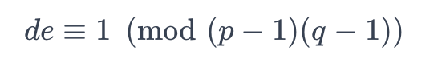
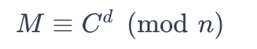

#### RSA参数设置

1. 选择两个大素数$p$和$q$，计算它们的乘积$n=pq$。
2. 计算$(p-1)(q-1)$，并选择一个与之互质的公钥$e$。
3. 计算私钥$d$，使得。

#### 解密操作

RSA的解密操作表达式为：。

根据欧拉定理，公钥和私钥的关系可以表示为：

e⋅d≡1(modϕ(n))*e*⋅*d*≡1(mod*ϕ*(*n*))

其中，$\phi(n) = (p-1)(q-1)$。

现在，我们将解密操作带入证明：

Cd≡(Me)d(modn)*C**d*≡(*M**e*)*d*(mod*n*)

≡Med(modn)≡*M**e**d*(mod*n*)

由于$ed \equiv 1 \pmod{\phi(n)}$，我们可以用欧拉定理的形式代入：

Med≡M1(modn)*M**e**d*≡*M*1(mod*n*)

≡M(modn)≡*M*(mod*n*)

因此，我们证明了解密操作的正确性，即$M \equiv C^d \pmod{n}$。RSA的解密操作是有效的。

这就完成了对RSA解密操作正确性的证明。

数据库

80,81,82,86,88,89,94
