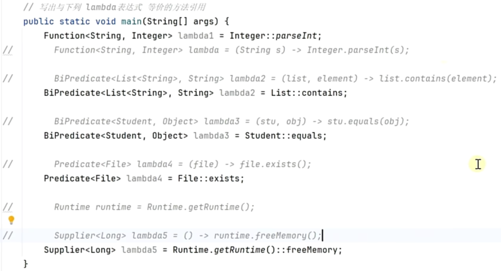

---

# 引言

行为参数化

```java
interface Lambda {
  boolean test(Student student);
}

static List<Student> filter(List<Student> students, Lambda lambda) {
  List<Student> result = new ArrayList<>();
  for(Student student : students) {
    //好处：判断逻辑就不用写死在内部了
    if(lambda.test(student)) {
      result.add(student);
    }
  }
  return result;
}

//上面写好之后客户端就能够自定义规则来过滤条件
public static void main(String[] args) {
  //从外界传递规则，学名：行为参数化
	System.out.println(filter(students -> student.age < 18));
}
```

---

延迟执行

```java
public class Sample{
  public static void main(String[] args) {
    log.debug("{}", expensive());
  }
  
  static String expensive() {
    log.info("执行耗时操作...");
    return "日志";
  }
}
```

​	如果日志级别是info，那么debug就不应该被执行。通过程序执行结果可以发现：不会输出debug了，但还是会输出"执行耗时操作..."，也就是执行了expensive的方法。但是我日志级别调成了info，就也不希望expensive方法执行呀。

解决方法1：加if判断

```java
public class Sample{
  public static void main(String[] args) {
    if(日志级别是debug) {
      log.debug("{}", expensive());
    }
  }

  static String expensive() {
    log.info("执行耗时操作...");
    return "日志";
  }
}
```

更好的方法：

```java
public class Sample{
  public static void main(String[] args) {
    log.debug("{}", () -> expensive());
  }
  
  static String expensive() {
    log.info("执行耗时操作...");
    return "日志";
  }
}
```

执行结果正确，什么也不输出。

# 函数

---

## Lambda

1、Lambda表达式：功能更全面

口诀：**Lambda表达式是一个对象**

```java
(int a, int b) -> a + b;
明确指出参数类型
```

```java
(int a,int b) -> {int c = a + b;  return c};
多行必须要有 大括号并且return
```

```java
interface Lambda {
  int op(int a, int b);
}

interface Lambda1 {
  int op(double a, double b)
}
Lambda lambda = (a,b) -> a + b;  //推断结果是int类型
Lambda1 lambda1 = (a,b) -> a + b; //推断结果是double类型
上下文代码能够推导出参数类型，类型就可以省略了。
```

```java
a -> a;
如果只有一个参数，那么可以省略小括号
```

2、方法引用：写法更简洁

口诀：方法引用也是一个函数对象

```java
Math::max               <==>      (int a, int b) -> Math.max(a, b);  静态方法
```

```java
Student::getName				<==>   (Student stu) -> stu.getName();  非静态方法，参数是学生，返回结果就是学生的name 
```

```java
System.out::println     <==>   (Object obj) -> System.out.println(obj);  左侧是对象，右侧是对象的成员方法
```

```java
Student::new						<==>    () -> new Student();       左侧是类型，右侧是new关键字
```

方法引用对应的函数对象内部逻辑就是调用这个方法，参数部分就是为了调用这些方法的**未知的部分**作为方法的参数。

---

**练习**

**1）判断语法正确性**

```java
interface Lambda1 {
  int op(int a, int b);
}
interface Lambda2 {
  void op(Object obj);
}
```

1.`Lambda1 lambda = a, b -> a - b`	❌  参数多于1个要加小括号

2.`Lambda1 lambda = (c, d) -> c * d`   ✅

3.`Lambda1 lambda = (int a, b) -> a + b`   ❌  要么都不加，要么都加。不能一个加了一个不加

4.`Lambda2 lambda = Object a -> System.out.println(a) `  ❌  只有一个参数可以省略小括号，但是不能声明类型。改成`(Object a)`即可

**2）写出等价的lambda表达式**

```java
1.Math::random
  答：() -> Math.random()
2.Math::sqrt
  答：(double number) -> Math.sqrt(number)
3.Student::getName
  答：(Student stu) -> stu.getName();
4.Student::setName
  答：(Student stu, String newName) -> stu.setName(newName);
5.Student::hashCode
  答：(Student stu) -> stu.hashCode()
6.Student::equals
  答：(Student stu, Object o) -> stu.equeals(o)
```

---

假设已经有了对象`Student stu = new Student("张三")`

```java
1.stu::getName
  答：() -> stu::getName()   //因为对象已知了,所以不需要写Student stu
2.stu::setName
  答：(String name) -> stu.setName(name)
3.Student::new  //假设Student没有无参构造
  答：(String name) -> new Student(name)
```

---

## 函数对象类型

归类：参数个数类型相同，返回值类型相同。归类为函数式接口

归类练习


```java
public static void main(String[] args) {
        Type1 type1 = (int a) -> (a & 1) == 0;
        Type1 type11 = (int a) -> BigInteger.valueOf(a).isProbablePrime(100);
        Type2 type2 = (int a, int b, int c) -> a + b + c;
        Type3 type3 = (int a, int b) -> a - b;
        Type3 type33 = (int a, int b) -> a * b;
        Type4 type4 = () -> new Student();
        Type5 type5 = () -> new ArrayList<Student>();
        Type6 type6 =  s -> s.getName();
        Type<Integer, Student> type =  s -> s.getAge();
    }

    interface Type1 {
        boolean op(int a);
    }
    interface Type2 {
        int op(int a, int b, int c);
    }
    interface Type3 {
        int op(int a, int b);
    }
    interface Type4 {
        Student op();
    }
    interface Type5 {
        ArrayList<Student> op();
    }
    interface Type55 <T> {
        T op();
    }
    interface Type6 {
        String op(Student s);
    }
    interface Type <T, I> {
        T op(I input);
    }
```

jdk也提供了很多函数式接口

```java
public static void main(String[] args) {
  IntPredicate obj1 = (int a) -> (a & 1) == 0;
  IntPredicate obj11 = (int a) -> BigInteger.valueOf(a).isProbablePrime(100);

  IntBinaryOperator type3 = (int a, int b) -> a - b;
  IntBinaryOperator type33 = (int a, int b) -> a * b;
  
  Supplier<Student> type4 = () -> new Student();
  Supplier<List<Student>> type5 = () -> new ArrayList<Student>();
  
  Function<Student, String> type6 = (Student s) -> s.getName();
  Function<Student, Integer> type = (Student s) -> s.getAge();
}


```

常见函数接口：

 


## 函数接口习题

将下列方法中可能存在变化的部分，抽象为函数对象，从外界传递进来

```java
//题目
static List<Integer> filter(List<Integer> list) {
  List<Integer>result=new ArrayList<>();
  for (Integer number : list){
    //筛选：判断是否是偶数，但以后可能改变判断规则 
    if((number & 1)== 0) { 
      result.add(number)；
    }
    return result;
  }
}

//改造
static List<Integer>filter(List<Integer> list, Predicate<Integer> predicate) {
  List<Integer>result=new ArrayList<>();
  for (Integer number : list){
    //筛选：判断是否是偶数，但以后可能改变判断规则 
    if(predicate.test(number)) { 
      result.add(number)；
    }
    return result;
  }
}

//调用
public static void main(String[] args) {
	filter(List.of(1,2,3), (Integer number) -> (number & 1) == 0)  
}
```


```java
//题目
static List<String> map(List<Integer> list) {
  List<String> result = new ArrayList<>();
  for(Integer number : list) {
    //将数字转化为字符串，但以后可能改变转换规则
    result.add(String.valueOf(number));
  }
  return result;
}

//改造
static List<String> map(List<Integer> list, Function<Integer, String> func) {
  List<String> result = new ArrayList<>();
  for(Integer number : list) {
    result.add(func.apply(number));
  }
  return result;
}

//调用
public static void main(String[] args) {
	map(list, (Integer number) -> String.valueOf(number));  
}
```

---

## 方法引用

```java
//静态方法
(String s) -> Integer.parseInt(s)   Integer::parseInt

//非静态方法
(stu) -> stu.getName()     Student::getName
  
//构造方法
() -> new Student()  Student::new
```


  类名::非静态方法的要求：

​	第一点：接口方法的参数比引用方法的参数多一个
​	第二点：接口方法的第一个参数恰巧是调用引用方法的对象（其引用方法所在类或其父类的实例）

 

---

# 闭包

 ```java
 public class ClosureTest1 {
   @FunctinoalInterface
   interface Lambda {
     int op(int y);
   }
   
   static void highOrder(Lambda lambda) {
     System.out.println(lambda.op(1));
   }
   
   public static void main(String[] args) {
     int x = 10;
     highOrder((int y) -> x + y);
   }
   
   
 }
 ```

程序能够正确输出11。这种函数外界的变量和函数内部绑在一起，形成的整体，叫做闭包。规范：外部变量必须被final修饰，或者变量是的`effective final`的

（effective final表示虽然没有被final修饰，但是这个变量是无状态的）

---

什么是闭包：函数对象和它的外界变量绑定在一起

闭包的限制：闭包变量必须是final或effective final

闭包的作用：给我们函数对象提供了除参数以外的其他数据

---

案例：创建10个任务对象，并且每个任务对象给一个任务编号

```java
public class Test {
  public static void main(String[] args) {
    //传统方法
    Runnable task1 = () -> System.out.println("执行任务1");
    Runnable task2 = () -> System.out.println("执行任务2");
    
    //闭包方法
    List<Runnable> list = new ArrayList<>();
    for(int i = 0; i < 10; i++) {
      int k = i + 1;
      Runnable task = () -> System.out.println("执行任务" + k);
      list.add(task);
    }
    
    ExecutorService service = Executors.newVirtualThreadPerTaskExecutor();
    for(Runnable task : list) {
      service.submit(task);
    }
    System.in.read();
  }
}
```

