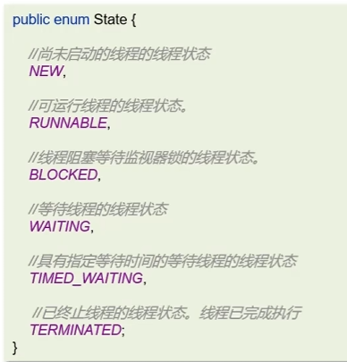
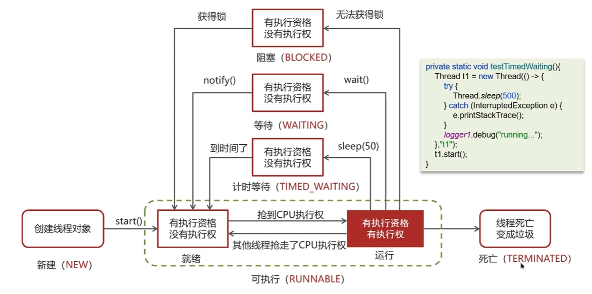

# 线程基础

问：线程和进程的区别

答：

* 进程是正在运行程序的实力，进程中包含了线程，每个线程执行不同的任务
* 不同的进程使用不同的内存空间，在当前进程下的所有线程可以共享内存空间
* 线程更轻量，线程上下文切换成本一般要比进程上下文切换低

---

问：创建线程的方式有哪些

一共有四种方式

* 继承Thread类
* 实现runnable接口
* 实现Callable接口
* 线程池创建线程（项目中使用方式）

---

问：runnable和callable都可以创建线程，他们有什么区别？

答：

* Runnable接口run方法没有返回值，无法拿到线程执行之后的结果

* Callable接口call方法有返回值，是个泛型，和Future、FutureTask配合可以用来获取一步执行的结果
* Callable接口的call方法允许抛出异常；而Runnable接口的run方法的异常只能在内部消化，不能继续上抛

---

问：run方法和start方法有什么区别

* start：**用来启动线程**，通过该线程调用run方法执行run方法中所定义的逻辑代码。start方法只能被调用一次
* run：封装了要被线程执行的代码，可以被调用多次

---

线程包括哪些状态，状态之间是如何变化的

线程的状态可以参考JDK中Thread类中的枚举State

具体的线程流程如下

创建完线程对象后，线程处于新建状态。调用start方法，线程进入Runnable状态，runnable状态中有就绪态和运行态，如果抢到了cpu，那么就变成运行态。执行完代码以后就是终止态了。

在运行的过程中，如果线程没抢到我们加的Synchronize锁，就变成阻塞态。释放锁才重新变成Runnable状态。

在运行的过程中，调用了wait方法，就变成等待状态。被notify后才回到runnable状态。

在运行的过程中，调用了sleep方法，就变成计时等待状态。时间结束后才回到runnable状态。

---

新建T1、T2、T3三个线程，如何保证他们按顺序执行？

答：使用join。T1中写`t2.join()`，说明t1要等待t2执行结束。

好理解的方式。原本是t1一个箭头往后走，如果有了`t2.join()`，那么t1就会停住，箭头被切断，然后中间加入t2，t2结束之后，再继续运行t1。字面意思就是t2加入进来了，所以是`t2.join()`。

---

问：`notify()`和`notifyAll()`有什么区别？

* `notifyAll()`：唤醒所有wait的线程
* `notify：`只随机唤醒一个wait线程

---

问：java中wait方法和sleep方法的区别？

**共同点：**

他们都能让当前线程暂时放弃CPU的使用权，进入阻塞状态

**不同点：**

1、方法归属不同

* `sleep(long)`是 Thread 的静态方法
* `wait()、wait(long)`都是 Object 的成员方法，每个对象都有

2、醒来时机不同

* 执行`sleep(long)`和`wait(long)`的线程都会在等待响应毫秒后醒来
* `wait(long)`和`wait()`还可以被notify唤醒，`wait()`如果不唤醒就一直等待下去
* 他们都可以被打断唤醒

3、锁特性不同(重点)

* wait方法的调用必须先获取wait对象的锁（配合synchronize使用），而sleep没有这个限制
* wait方法执行后会释放对象锁，允许其他线程获得该对象锁（我放弃cpu，但你们还能用）
* 而sleep如果在synchronized代码块中执行，并不会释放对象锁（我放弃cpu，你们也用不了）

---

如何停止一个正在运行的线程

有三种方式可以停止线程

* 使用退出标志，使线程正常退出，也就是run方法完成后线程终止

* 使用stop方法强制停止

* 使用interrupt方法中断线程
  * 打断阻塞的线程(sleep，wait，join)，线程会抛出`InterruptedExceptoin`异常
  * 打断正常的线程，可以根据打断状态来标记是否退出线程

# 线程中的并发安全

