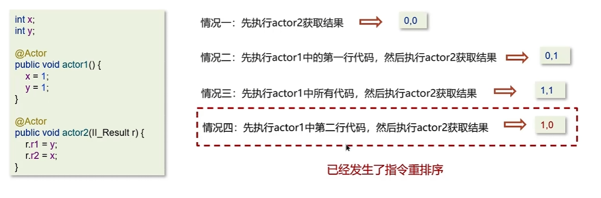

# 线程基础

问：线程和进程的区别

答：

* 进程是正在运行程序的实力，进程中包含了线程，每个线程执行不同的任务
* 不同的进程使用不同的内存空间，在当前进程下的所有线程可以共享内存空间
* 线程更轻量，线程上下文切换成本一般要比进程上下文切换低

---

问：创建线程的方式有哪些

一共有四种方式

* 继承Thread类
* 实现runnable接口
* 实现Callable接口
* 线程池创建线程（项目中使用方式）

---

问：runnable和callable都可以创建线程，他们有什么区别？

答：

* Runnable接口run方法没有返回值，无法拿到线程执行之后的结果

* Callable接口call方法有返回值，是个泛型，和Future、FutureTask配合可以用来获取异步执行的结果
* Callable接口的call方法允许抛出异常；而Runnable接口的run方法的异常只能在内部消化，不能继续上抛

---

问：run方法和start方法有什么区别

* start：**用来启动线程**，通过该线程调用run方法执行run方法中所定义的逻辑代码。start方法只能被调用一次
* run：封装了要被线程执行的代码，可以被调用多次

---

线程包括哪些状态，状态之间是如何变化的

线程的状态可以参考JDK中Thread类中的枚举State


具体的线程流程如下


创建完线程对象后，线程处于新建状态。调用start方法，线程进入Runnable状态，runnable状态中有就绪态和运行态，如果抢到了cpu，那么就变成运行态。执行完代码以后就是终止态了。

在运行的过程中，如果线程没抢到我们加的Synchronize锁，就变成阻塞态。释放锁才重新变成Runnable状态。

在运行的过程中，调用了wait方法，就变成等待状态。被notify后才回到runnable状态。

在运行的过程中，调用了sleep方法，就变成计时等待状态。时间结束后才回到runnable状态。

---

新建T1、T2、T3三个线程，如何保证他们按顺序执行？

答：使用join。T1中写`t2.join()`，说明t1要等待t2执行结束。

好理解的方式。原本是t1一个箭头往后走，如果有了`t2.join()`，那么t1就会停住，箭头被切断，然后中间加入t2，t2结束之后，再继续运行t1。字面意思就是t2加入进来了，所以是`t2.join()`。

---

问：`notify()`和`notifyAll()`有什么区别？

* `notifyAll()`：唤醒所有wait的线程
* `notify：`只随机唤醒一个wait线程

---

问：java中wait方法和sleep方法的区别？

**共同点：**

他们都能让当前线程暂时放弃CPU的使用权，进入阻塞状态

**不同点：**

1、方法归属不同

* `sleep(long)`是 Thread 的静态方法
* `wait()、wait(long)`都是 Object 的成员方法，每个对象都有

2、醒来时机不同

* 执行`sleep(long)`和`wait(long)`的线程都会在等待响应毫秒后醒来
* `wait(long)`和`wait()`还可以被notify唤醒，`wait()`如果不唤醒就一直等待下去
* 他们都可以被打断唤醒

3、锁特性不同(重点)

* wait方法的调用必须先获取wait对象的锁（配合synchronize使用），而sleep没有这个限制
* wait方法执行后会释放对象锁，允许其他线程获得该对象锁（我放弃cpu，但你们还能用）
* 而sleep如果在synchronized代码块中执行，并不会释放对象锁（我放弃cpu，你们也用不了）

---

如何停止一个正在运行的线程

有三种方式可以停止线程

* 使用退出标志，使线程正常退出，也就是run方法完成后线程终止

* 使用stop方法强制停止

* 使用interrupt方法中断线程
  * 打断阻塞的线程(sleep，wait，join)，线程会抛出`InterruptedExceptoin`异常
  * 打断正常的线程，可以根据打断状态来标记是否退出线程


# 线程中的并发安全

## Synchronized

 问：Synchronized的原理

答：

* Synchronized采用互斥的方式让统一时刻最多室友一份线程能持有对象锁
* 底层由monitor实现，monitor是jvm级别的对象（ c++实现），线程获得锁需要使用对象（锁）关联monitor
* 在monitor内部有三个属性，分别是owner、entrylist、waitset。owner是关联的获得锁的线程，并且只能关联一个线程；entrylist关联的事处于阻塞状态的线程；waitset关联的是处于waiting状态的线程

---

问：你了解过锁升级吗？

答：Java中的synchronized有偏向锁、轻量级锁、重量级锁三种形式，分别对应了锁只被一个线程持有、不同线程交替持有、多线程竞争锁三种情况。

偏向锁：只被一个线程使用。第一次获得锁时，会有一个cas操作，之后该线程再获取锁，只需要判断markword中是否是自己的线程id即可，而不是开销相对较大的CAS命令。

轻量级锁：线程加锁的时间是错开的，即无竞争时使用该锁。它修改了对象头的锁标志，相对重量级锁性能提升很多。每次修改都是CAS操作，保证了原子性。

重量级锁：底层使用monitor实现，涉及到了用户态和内核态的转换，进程的上下文切换。成本较高，性能较低。

---

问：说一说JMM（Java内存模型）

答：

* JMM定义了**共享变量**中**多线程程序读写操作**的行为规范，通过这些规则来规范对内存的读写操作，从而保证指令的正确性
* JMM把内存分为两块，一块是私有线程的工作区域（工作内存），一块是素有线程的共享区域（主内存）
* 线程和线程之间相互隔离，线程和线程交互需要通过主内存

---

说一说CAS

CAS全称是Compare and Swap，体现的是乐观锁的思想，在无锁情况下保证线程操作共享数据的原子性。在JUC包下实现的很多类都用到了CAS操作。

* AQS
* AtomicXXX类

自旋锁：

```java
while(true) {
    int old = V;
    int newVal = old + 1;
    if(compareAndSwap(old, newVal)) {
        //成功，退出循环
    }
}
```

CAS底层依赖于一个`Unsafe`类来直接调用操作系统底层的CAS指令


问：说一说CAS

答：

* CAS全称是Compare and Swap，它体现的是乐观锁的思想，**在无锁状态下保证线程操作数据的原子性**
* AQS框架、AtomicXXX类都使用到了CAS
* 在操作共享变量的时候使用自旋锁，效率上更高一些
* CAS的底层调用Unsafe类中的方法，是操作系统提供的

---

问：乐观锁和悲观锁的区别

答：

CAS是基于乐观锁的思想：最乐观的估计，不怕别的线程来修改，如果被改了，那我就重试。

synchronized是基于悲观锁的思想：我上锁了，你们都不能改，我解锁了你们才可以改。

---

## volatile

说说volatile

一旦一个共享变量（类的成员变量、类的静态成员变量）被volatile修饰之后，MAME就具备了两层语义：

* **保证线程间的可见性**

  用volatile修饰共享变量，能防止编译器优化。让一个线程对共享变量的修改一定对另一个线程可见。

  ```java
  class VolatileDemo {
      //不加volatile程序就会死循环
      private volatile static int run = 0;
  
      public static void main(String[] args) throws InterruptedException {
          new Thread(() -> {
              while (run == 0) {
              }
          }).start();
          Thread.sleep(1000);
          run = 1;
          System.out.println(run);
      }
  }
  ```

* **禁止进行指令重排序**

​		用volatile修饰共享变量会在读、写共享变量时加入不同的屏障，阻止其他读写操作越过屏障，从而达到阻止重排序的效果。



在**变量y**上添加volatile，禁止指令重排序，可以解决问题


如果变量x加上volatile，是无法解决问题的。原因：


所以volatile的使用技巧是：

* volatile修饰的**写**变量，在代码最后的位置
* volatile修饰的**读**变量，在代码最前的位置


ps：volatile不保证原子性

---

问：谈谈对volatile的理解

答：

1）保证线程之间的可见性

​	用volatile修饰共享变量，能防止编译器等优化发生，让一个线程对共享变量的修改对另一个线程可见

2）禁止指令重排序

指令重拍：用volatile修饰共享变量会在读、写共享变量时加入不同的屏障，阻止其他读写操作越过屏障，从而达到阻止重排序的效果

---
问：说说volatile原理

答：

volatile 可以保证线程可见性且提供了一定的有序性，但是无法保证原子性。在 JVM 底层是基于**内存屏障**实现的。

- 当对非 volatile 变量进行读写的时候，每个线程先从内存拷贝变量到 CPU 缓存中。如果计算机有多个 CPU，每个线程可能在不同的 CPU 上被处理，这意味着每个线程可以拷贝到不同的 CPU cache 中
- 而声明变量是 volatile 的，JVM 保证了每次读变量都从内存中读，跳过 CPU cache 这一步，所以就不会有可见性问题
  - **对 volatile 变量进行写操作时，会在写操作后加一条 store 屏障指令，将工作内存中的共享变量刷新回主内存；**
  - **对 volatile 变量进行读操作时，会在读操作前加一条 load 屏障指令，从主内存中读取共享变量；**

---

## 单例模式

```java
package com.sll.practise.juc.singleton;

/**
 * 懒汉式单例
 */
public class Lazy {
    private Lazy() {
        System.out.println(Thread.currentThread().getName() + " ok ");
    }

    private volatile static Lazy lazy;

    //double check
    public static Lazy getInstance() {
        if(lazy == null) {
            synchronized (Lazy.class) {
                if(lazy == null) {
                    //该操作不是原子性操作
                    /**
                     * 1.分配内存空间
                     * 2.执行构造方法，初始化对象
                     * 3.分配指针
                     */
                    lazy = new Lazy();
                }
            }
        }
        return lazy; //指令重拍：先3再2，会出问题。所以要加上volatile
    }

    //多线程并发
    public static void main(String[] args) {
        for (int i = 0; i < 10; i++) {
            new Thread(()-> {
                Lazy.getInstance();
            }).start();
        }
    }
}

```


## AQS

什么是AQS

全称是`AbstractQueuedSynchronizer`，即抽象队列同步器，他是构建锁或者其他同步组件的**基础框架**

AQS和Synchronized的区别


AQS的常见实现类：

* ReentrantLocak 阻塞式锁
* Semaphore 信号量
* CountDownLatch 倒计时锁

---

问：什么是AQS？

* AQS是多线程中的队列同步器，是一种锁机制，它是作为一个**基础框架**的使用的。`ReentrantLocak、Semephore`都是基于AQS实现的
* AQS内部维护了一个先进先出的双向队列，队列中存储排队的线程
* 在AQS内部还有一个属性state，这个state就相当于是一个资源，默认是0（无锁状态），如果队列中有一个线程成功修改了state为1，则当前线程就等于获取了资源
* 在对state修改的时候使用了cas操作，保证多个线程修改时的原子性

---

## ReentrantLocak

ReentrantLock的实现原理

ReentrantLock叫做可重入锁，相对于synchronized具备以下特点：

* 可中断
* 可以设置超时时间
* 可以设置公平锁
* 支持多个条件变量
* 与synchronized一样，都支持重入

```java
//创建锁对象
ReentrantLock lock = new ReentarantLock();
try{
    //获取锁
    lock.lock();
} finally {
    //释放锁
    lock.unlock();
}
```

ReentrantLock主要**利用CAS +AQS队列**实现，支持公平锁和非公平锁，两者的实现类似

构造方法接受一个可选的公平参数（默认不公平），当设置为true时，表示公平。公平锁的效率没有非公平锁高。

-----

问：说一说ReentrantLock的原理

* ReentrantLock表示支持重新进入的锁，调用lock方法获取了锁以后，再次调用lock就不会再阻塞
* ReentrantLock主要利用CAS + AQS队列实现

* 支持公平锁和非公平锁

---

synchronized和lock有什么区别？

* 语法层面
* 功能层面
* 性能层面

1、语法层面

synchronized是关键字，源码在jvm中，用c++语言实现。lock是接口，源码由jdk提供，用java语言实现。使用synchronized时，退出同步代码块锁会自动释放，而使用lock时，需要手动调用unlock方法释放锁。

2、功能层面

二者都是悲观锁，lock比synchronized更加强大，比如公平锁、可打断、可超时、多条件变量。

Lock由适合不同场景的实现，比如ReentrantLock， ReentrantReadWriteLock（读写锁）

3、性能层面

没有竞争时，synchronized做了很多优化，比如偏向锁、轻量级锁，性能较好

竞争激烈时，Lock的实现会提供更好的性能。

---

问：死锁产生的条件是什么

答：

* 互斥：资源只供一个线程使用
* 请求并保持：线程持有的同时还在请求别的资源
* 不可剥夺：线程持有就不可以被剥夺
* 环路等待释放：多个线程请求资源形成环路等待释放

---

问：如何进行死锁诊断？

* jdk自带的工具：jps，jstack
* 可视化工具jconsole、VisualVM

---

问：说一说`ConcurrentHashMap`

答：ConcurrentHashMap是一种线程安全的高效Map集合

底层数据结构：

* JDK1.7采用分段数组+链表

* JDK1.8采用数组+链表/红黑树

  * CAS控制数组节点的添加
  * synchronized只锁定当前链表或红黑二叉树的**首节点**，只要hash不冲突，就不会产生并发问题，效率得到提升

  


---

导致并发程序出现问题的根本原因是什么？（Java程序中怎么保证多线程的执行安全）

Java并发编程三大特征：

* 原子性  synchronized 、 lock
* 可见性  volatile、synchronized、 lock
* 有序性（指令重排序）   volatile

---

# 线程池

问：说一下线程池的核心参数

答：

* `corePoolSize`核心线程数目
* `maximumPoolSize `最大线程数目 = 核心线程+ 究极线程的最大数目
* `keepAliveTime`生存时间 ： 救急线程的生存时间，生存时间内没有新任务，次线程资源会释放
* `unit` 时间单位：救急线程的生存时间单位，如秒、毫秒等
* workQueue：当没有空闲核心线程时，新来任务会加入到此队列排列，队列满会创建救急线程执行任务
* threadFactory：线程工厂，可以定制线程队形的创建
* handler：拒绝策略，当所有线程都在繁忙，workQueue也放满时，会触发拒绝策略

---

问：说一下线程池的执行原理


---

问：线程池中有哪些常见的阻塞队列

---

# ThreadLocal


**什么是ThreadLocal？**

ThreadLoca就是线程本地量，它其实是一种线程的隔离机制，保障了多线程环境下对于共享变量访问的安全性。

**和Synchronized区别是什么？**


通过上图发现ThreadLocal其实是一种线程隔离机制，而Synchronized是一种基于Happens-Before规则中的监视器锁规则从而保证同一个时刻只有一个线程能够对共享变量进行更新。通俗来说，ThreadLocal是将共享变量从公共区域拿到自己的领地去处理，而Synchronized是线程前往公共区域去处理共享变量。

**ThreadLocal的使用场景**

1.用来替代参数链传递：在编写API接口时，可以将需要传递的参数放入ThreadLocal中，从而不需要在每个调用的方法上都显式地传递这些参数。这种方法虽然不如将参数封装为对象传递来得常见，但在某些情况下可以简化代码结构。

2.数据库连接和会话管理：在某些应用中，如Web应用程序，ThreadLocal可以用来保持对数据库连接或会话的管理，以简化并发控制并提高性能。例如，可以使用ThreadLocal来维护一个连接池，使得每个请求都能共享相同的连接，而不是每次都需要重新建立连接。

3.全局存储信息：例如在前后端分离的应用中，ThreadLocal可以用来在服务端维护用户的上下文信息或者一些配置信息，而不需要通过HTTP请求携带大量的用户信息。这样做可以在不改变原有架构的情况下，提供更好的用户体验。

**ThreadLocal原理**


对应上述图中，解释一下。

1. 图中有两个线程Thread1以及Thread2。
2. Thread类中有一个叫做threadLocals的成员变量，它是ThreadLocal.ThreadLocalMap类型的。
3. ThreadLocalMap内部维护了Entry数组，每个Entry代表一个完整的对象，key是ThreadLocal本身，value是ThreadLocal的泛型对象值。


