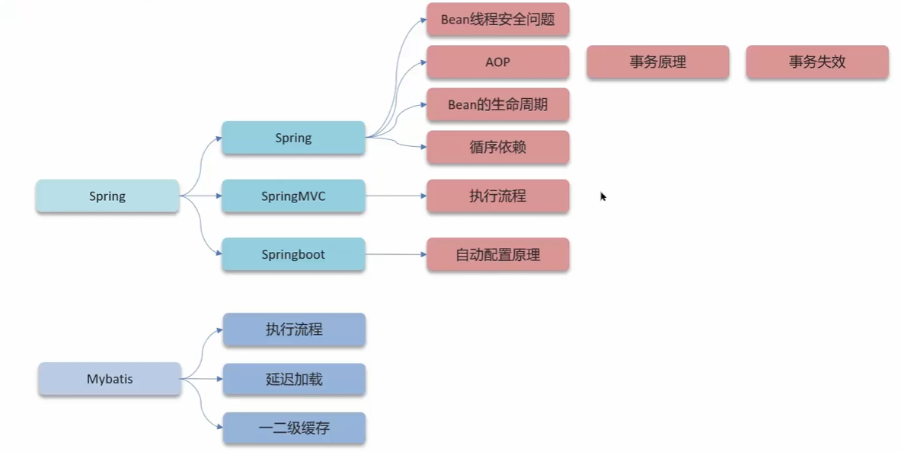

# Spring

问：Spring框架中的bean是单例的吗？

```java
@Service
@Scope
public class UserServiceImpl implements UserService {
    
}
```

* singleton：bean在每个Spring IOC容器中只有一个实例。
* prototype：一个bean的定义可以有多个实例。


---

问：Spring框架中的单例bean是线程安全的吗？

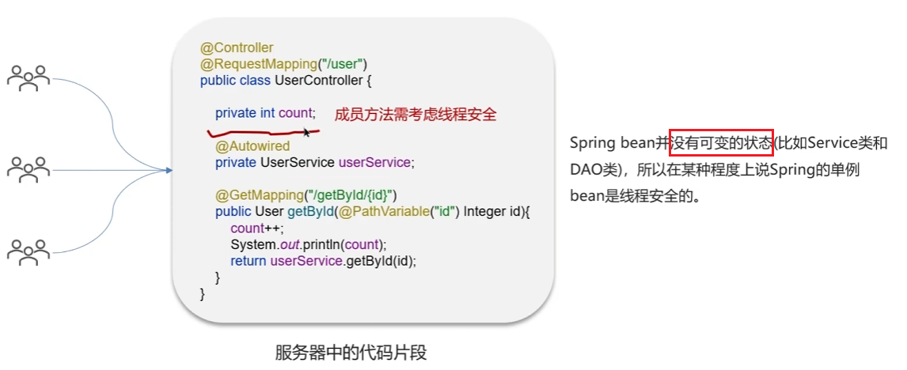

答：不是线程安全的，Spring中有一个`@Scope`注解，默认是`singleton`，即是单例的。因为一般在spring的bean中都是注入的**无状态**（不会被修改的）对象，没有线程安全问题。如果在bean中定义了可修改的成员变量，是要考虑线程安全的，可以使用多例或者加锁来解决。

---

问：什么是AOP

答：AOP称为面向切面编程，用于将那些与业务无关，但却**对多个对象产生影响的公共行为和逻辑**，抽取并封装为一个可重用的模块，这个模块被命名为切面，减少系统中的重复代码，降低了模块间的耦合度，同时提高了系统的可维护性。

问：项目中有没有用到AOP

答：记录操作的日志，缓存，spring实现的事务。核心是：使用aop中的环绕通知+切点表达式（找到要记录日志的方法），通过环绕通知的参数获取请求方法的参数（类、方法、注解、请求方式等），获取到这些参数以后，保存到数据库

问：Spring中的事务是如何实现的

答：本质是通过AOP功能，对方法前后进行拦截，在执行方法开始之前开启事务，在执行完目标方法之后根据执行情况提交或者回滚事务。

---

问：Spring中事务失效的场景有哪些？

* 异常捕获处理
* 抛出受检异常
* 非public方法

1、异常捕获处理：

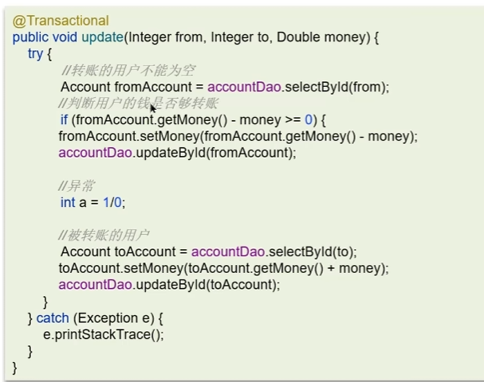

a的钱少了，但是b的钱没加上。

原因：事务通知只有捉到了目标抛出的异常，才能进行后序的回滚处理，如果目标自己处理掉异常，事务通知无法知悉。

解决方法：在catch块添加`throw new RuntimeException(e)`抛出

2、抛出受检异常

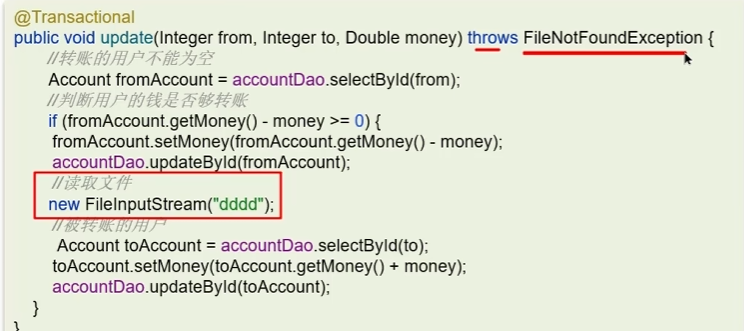

原因：Spring默认只会回滚非受检异常。

解决：配置`rollbackFor`属性

`@Transactional(rollbackFor=Exception.class)`

3、非public方法：

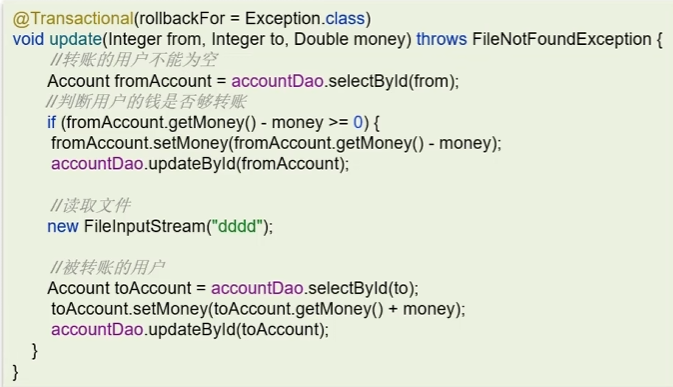

原因：Spring为方法创建代理、添加事务通知，前提条件是该方法必须是public的

解决：改为public方法

---

问：Spring中事务失效的场景有哪些？

答：

* 异常捕获处理，自己处理了异常，没有抛出。解决：手动抛出
* 抛出受检异常，配置`rollbackFor`的属性为`Exception`
* 非public方法导致的事务失效，改为public即可

---

Spring中bean的生命周期

**BeanDefinition**：Spring容器在进行实例化时，会将xml配置的`<bean>`的信息封装成一个`BeanDefinitino`对象，Spring根据BeanDefinition来创建Bean对象，里面有很多属性用来描述Bean。

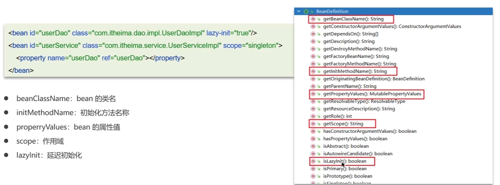

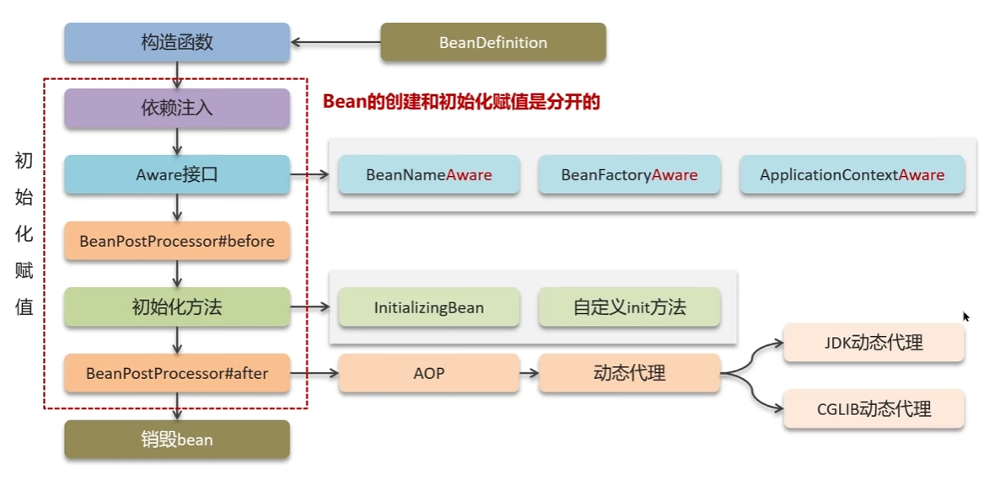

---

问：说说Spring中bean的生命周期

答：

​	1）通过`BeanDefinition`获取bean的定义信息

​	2）调用构造函数实例化bean

​	3）bean的依赖注入（set方法）

​	4）处理Aware接口（实现Aware接口后要重写他们的方法然后执行就可以了）

​	5）Bean的后置处理器`BeanPostProcessor-前置`

​	6）初始化方法（`InitializingBean 、 init-method`）

​	7）Bean的后置处理器`BeanPostProcessor-后置`：增强对象

​	8）销毁bean

---

Spring中的循环引用

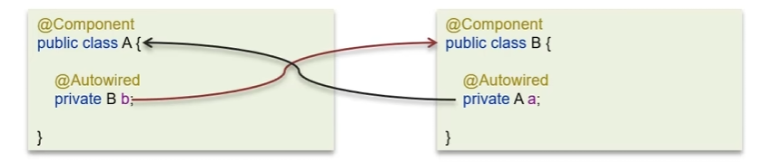

  

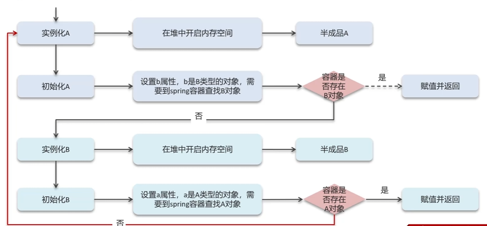

**三级缓存解决循环依赖**

Spring解决循环依赖是通过三级缓存，对应的三级缓存如下所示：

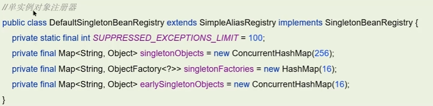

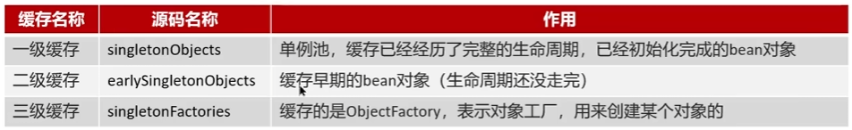

一级缓存作用：限制bean在beanFactory中只存一份，即实现singleton scope，解决不了循环依赖。

如果要想打破循环依赖，就需要一个中间人的参与，这个中间人就是二级缓存。

二级缓存解决：

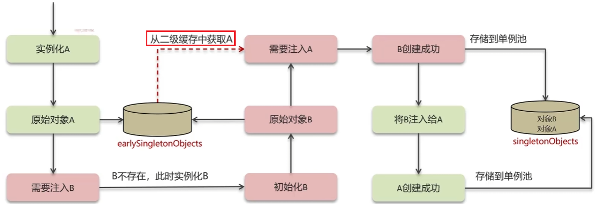

三级缓存解决：

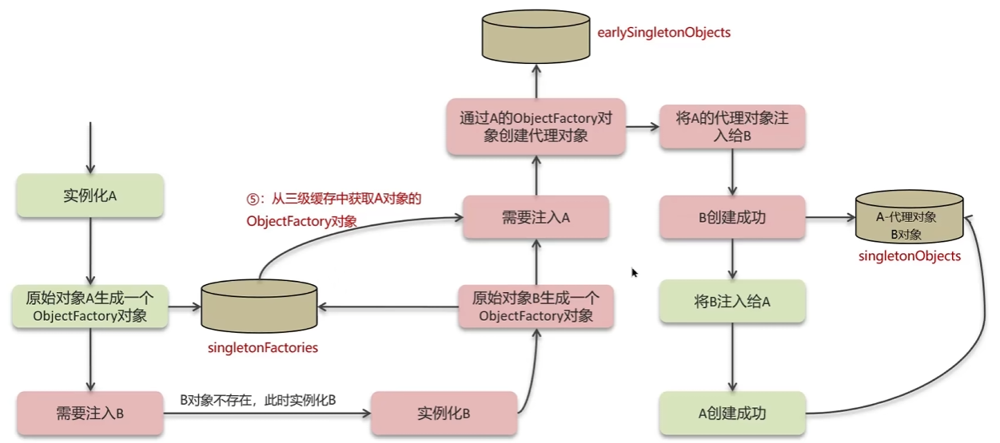

---

构造方法出现了循环依赖怎么解决？

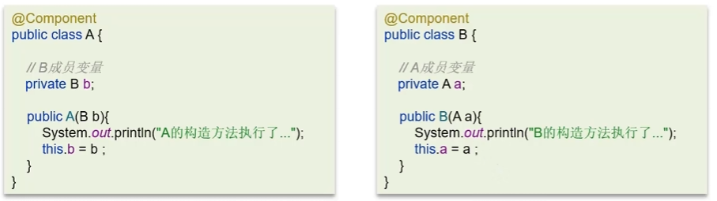

三级缓存只能解决构造函数后面步骤的循环依赖。

这个时候只需要加注解即可：

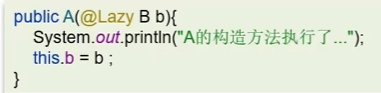

---

问：Spring中的循环引用是什么

答：

* 循环依赖就是循环引用，也就是两个或两个以上的bean互相持有对方，最终形成闭环。比如A依赖于B，B依赖于A
* 循环依赖在spring中是允许存在，spring框架依据三级缓存已经解决了大部分的循环依赖
  * 一级缓存：单例池，缓存已经经历了完整的生命周期，已经初始化完成的bean对象
  * 二级缓存：缓存早期的bean对象（生命周期还没走完）
  * 三级缓存：缓存的是`ObjectFactory`，表示对象工厂，用来创建某个对象的

​	实例化A的时候需要B，spring生成一个b的对象工厂放入三级缓存中。然后从工厂中拿到A，判断A需要什么样的对象。如果需要代理对象，那么就生成代理的A放进二级缓存，然后注入给B。这样B就注入成功，然后B放进单例池中。再从单例池中拿B注入进A中。A创建成功后也放进单例池。

---

问：构造方法出现了循环依赖怎么解决？

原因：由于bean的生命周期中构造函数是第一个执行的，spring框架并不能解决构造函数的依赖注入。

解决方案：使用`@Lazy`进行懒加载，什么时候需要对象再进行bean对象的创建


---

问：SpringMVC的执行流程知道嘛？

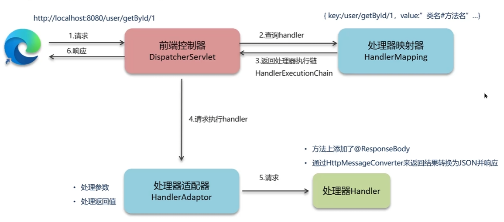

答：

​	1）用户发送出请求到前端控制器`DispatcherServlet`

​	2）`DispatcherServlet`收到请求调用`Handlermapping`(处理器映射器)：他的key是路径，value是controller中对应的方法

​	3）`HandlerMapping`找到具体的处理器(`controller`)，生成处理器对象及处理器拦截器（如果有），再一起返回给`Dispathcerservlet`。

​	4）`DispatcherServlet`调用`HandlerAdapter`（处理器适配器）

​	5）`HandlerAdapter`经过适配调用具体的处理器(Handler/Control ler)

​	6）方法上添加了`@ResponseBody`

​	7）通过`HttpMessageConverter`来返回结果转化为JSON并响应

---

Springboot的自动配置原理

首先观察`@SpringBootApplication`注解

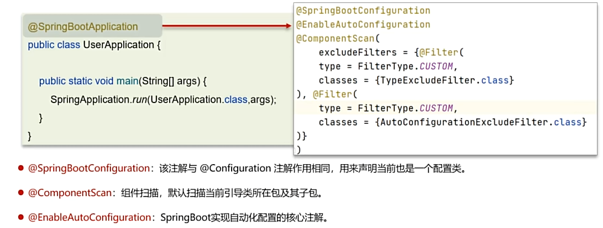

然后看`@EnableAutoConfiguration`注解

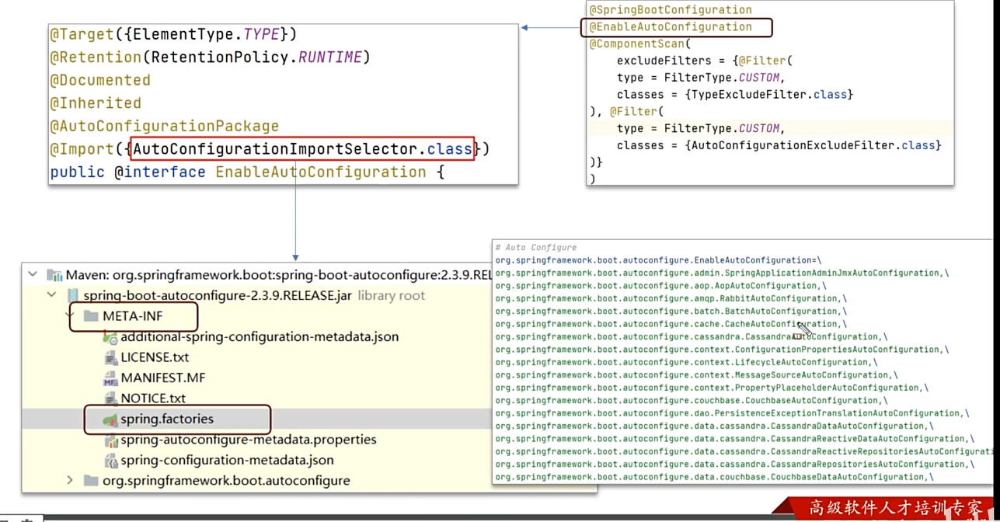

回答：

1、在SpringBoot项目中的引导类上有一个注解`@SpringBootApplication`，这个注解是对三个注解进行了封装，分别是：

* `@SpringBootConfiguration`
* `@EnableAutoconfiguration`
* `@ComponentScan`：扫描的包 

2、其中`@EnableAutoconfiguration`是实现自动化配置的核心注解。该注解通过`@Import`注解导入对应的配置选择器。内部是读取了该项目和该项目引用的Jar包的classpath路径下**META-INF/spring.factories**文件中的所配置的类的全类名。在这些配置类中所定义的Bean会根据条件注解**所指定的条件**来决定是否需要将其导入到Spring容器中。

3、条件判断会有像`@ConditionalOnClass`这样的注解，判断是否在pom文件中引入了依赖，如果有则加载该类，把这个配置类的所有Bean放入spring容器中使用

---

Spring、SpringMVC、SpringBoot的常见注解有哪些？

  1、Spring：bean的实例化

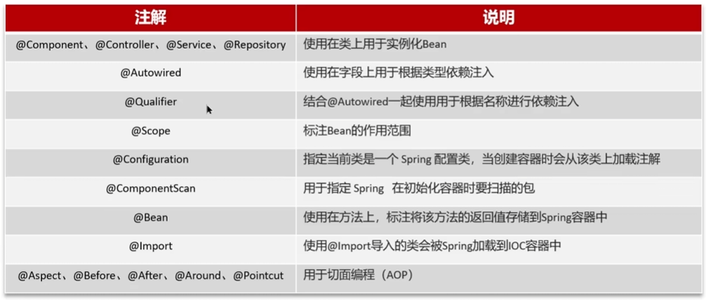

2、SpringMVC：请求和响应

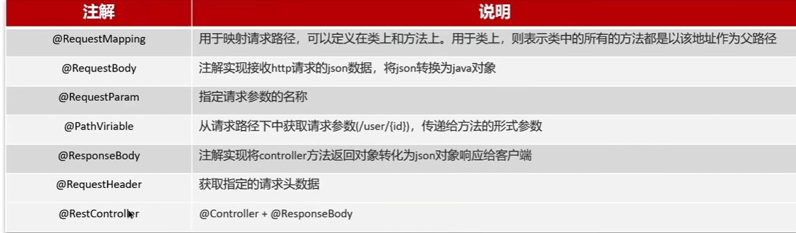

3、SpringBoot：自动配置

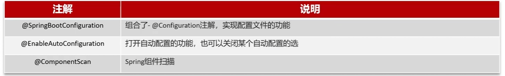

---

# MyBatis

MyBatis的执行流程

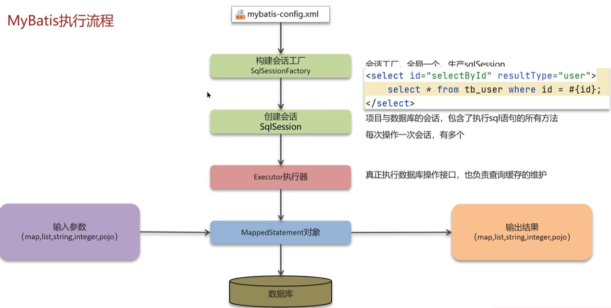

答：

* 1）读取MyBatis配置文件：mybatis-config.xml加载运行环境和映射文件
* 2）构建会话工厂`SqlSessionFactory`
* 3）会话工厂创建`SqlSession`对象（包含了执行SQL语句的所有方法）
* 4）Executor执行器操作数据库的接口，同时负责查询缓存的维护
* 5）Executor接口的执行方法中有一个MappedStatement类型的参数，封装了映射信息
* 6）输入参数映射（java数据类型 ->数据库的数据类型）
* 7）输出结果映射（数据库的数据类型 ->java数据类型）

----

MyBatis是否支持延迟加载


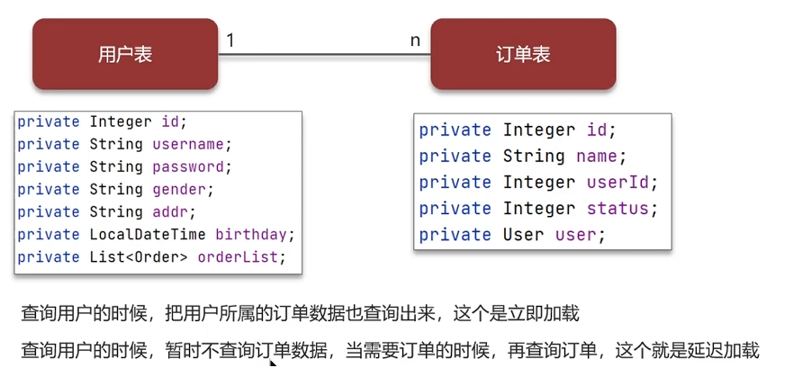

 加入`fetchType="lazy"`，实现懒加载

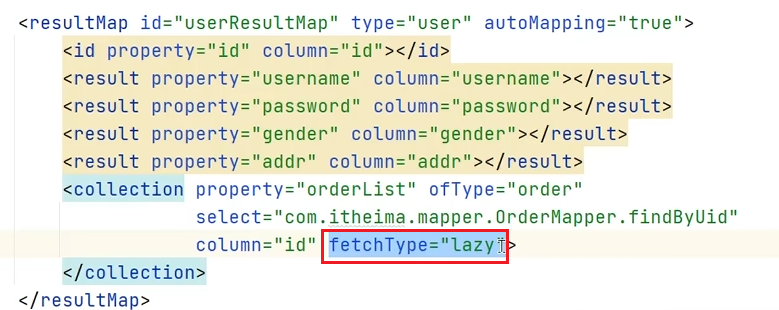

如果实现全局懒加载

在mybatis-config.xml中加入设置：

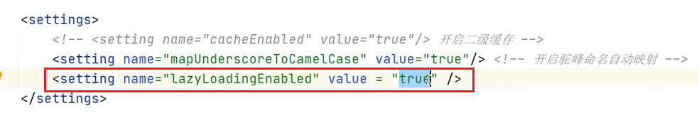

---

问：Mybatis是否支持延迟加载？

* 延迟加载的意思是：需要用到数据时才进行加载，不需要用到数据时就不加载数据
* Mybatis支持一对一关联对象和一对多关联集合对象的延迟加载
* 在Mybatis配置文件中，可以配置是否启用懒加载`lazyLoadingEnabled = true`。默认是关闭的

---

问：延迟加载的底层原理

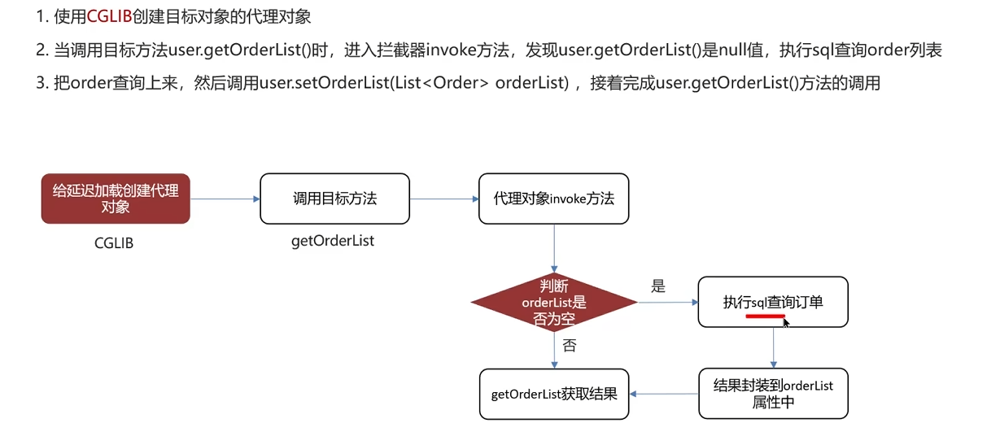

答：

* 1）使用CGLIB创建目标对象的代理对象
* 2）当调用目标方法时，进入拦截器invoke方法，如果发现目标方法是null值，执行sql查询
* 3）获取数据以后，调用set方法设置属性值，再继续查询目标方法，就有值了

---

Mybatis的一级、二级缓存用过吗？

一级缓存：基于`PerpetualCache`的`HashMap`本地缓存，其存储作用于为`Session`，当session进行flush或close之后，该Session中的所有Cache就清空，默认打开一级缓存。

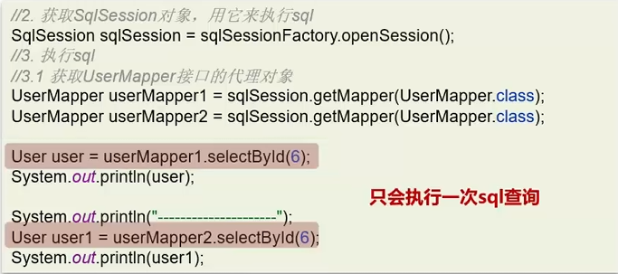

二级缓存：基于namespace和mapper的作用域起作用的，不是依赖于SQL session，默认也是采用`PerpetualCache`，HashMap存储

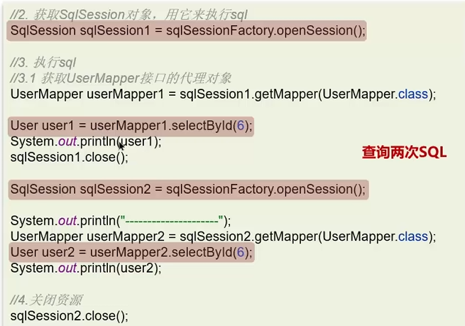

二级缓存默认关闭，他的开启方式需要两步：

1）全局配置文件

```xml
<settings>
	<setting name="cacheEnabled" value="true"/>
</settings>
```

2）使用`<cache/>`标签让**当前**mapper生效二级缓存

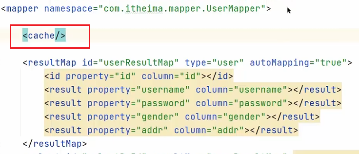

**注意事项：**

* 对于缓存数据更新机制，当某一个作用域（以及缓存Session/二级缓存Namespaces）进行了增删改操作后，默认该作用域下所有的select缓存被清空
* 二级缓存的数据需要实现Serializable接口
* 只有会话提交或者关闭以后，一级缓存中的数据才会转移到二级缓存中

---

问：Mybatis的一级、二级缓存用过吗？

* 一级缓存：基于 **PerpetualCache 的 HashMap 本地缓存**，存储作用域为 Session，当 Session 进行flush或close之后，该Session中的所有Cache被清空。默认一级缓存是打开的
* 二级缓存是基于 **namespace和 mapper的作用域起作用的**，不是依赖于SQL session，默认也是采用PerpetualCache， HashMap存储。需要单独开启，一个是核心配置，一个是mapper映射文件

---

问：Mybatis的二级缓存什么时候会清理缓存中的数据？

当某一个作用域（一级缓存Session/二级缓存Namespaces）进行了**增删改**操作后，默认该作用域下所有的select缓存被清空

---

