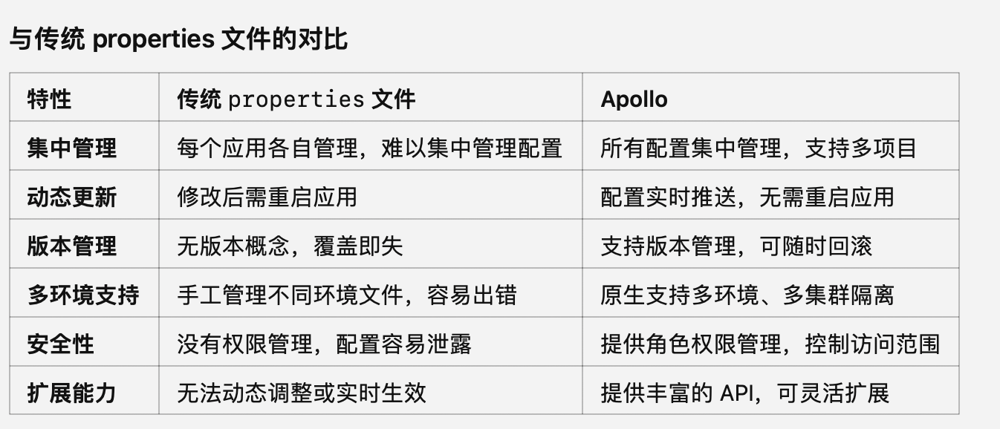
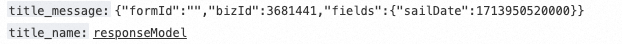

---

在接口编排中看日志：

```python
 Loggers.BIZ.warn("responseModel", JSONUtil.toJsonStr(responseModel));
```

然后拿traceI_id去sls中看:



---

调试看到的内容和打印出来的内容不一致，是因为打印的话是调用toString的，而调试工具直接用的反射，所以调试工具是真正的。

---

日志中埋点是什么意思：

**埋点的作用**

1. **问题排查**：

当系统出现异常时，可以通过埋点记录的日志快速定位问题所在。

2. **性能监控**：

记录程序执行的关键时间点，分析性能瓶颈，例如接口耗时、SQL查询时间等。

3. **业务行为分析**：

收集用户行为数据，例如点击、访问路径等，用于业务决策。

4. **安全审计**：

对敏感操作（如修改权限、删除数据等）进行日志记录，方便后续审计。

**埋点的类型**

1. **手动埋点**：

开发者在代码中明确插入日志。例如：

```java
Log.info("User clicked the 'Buy' button");
```

2. **自动埋点**：

​	使用工具自动采集日志数据，不需要开发者手动插入。例如使用 AOP（面向切面编程）拦截方法调用并记录日志。

3. **无埋点**：

​	借助一些第三方工具（如全埋点工具），自动监测页面或接口的行为，减少对代码的侵入。

**常见的埋点内容**

1. **请求级别埋点**：请求的开始时间、结束时间、响应时间、请求参数等。

2. **数据库操作埋点**：SQL语句执行时间、影响的行数、是否出现错误等。

3. **业务逻辑埋点**：记录业务操作，例如用户下单、支付成功等。

4. **异常埋点**：捕获异常信息，记录错误的详细信息，如堆栈、异常类型等。

5. **性能埋点**：记录关键模块或方法的执行耗时。
