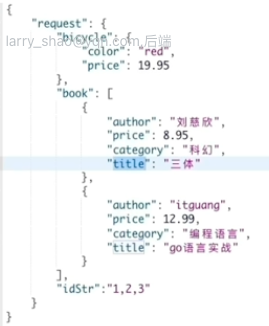
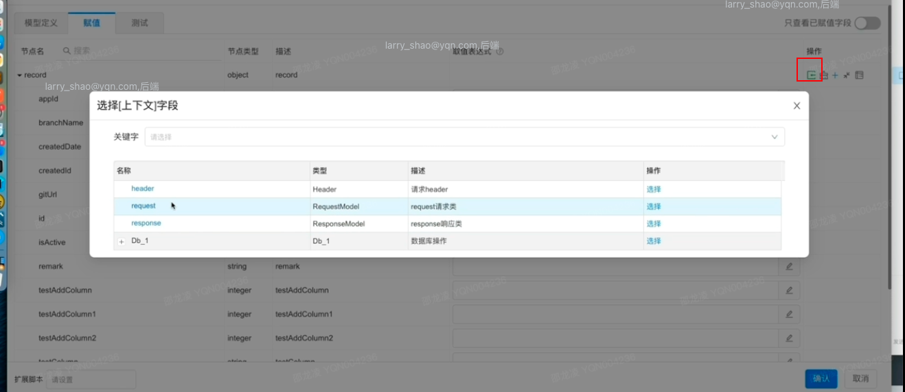
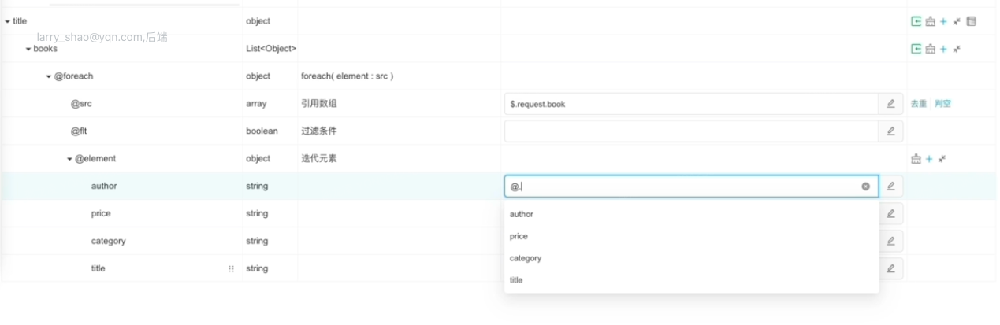

脚本组件：java的一个方法

服务调用：调用第三方接口的组件

* 执行条件：http节点必须满足这个执行条件才会执行节点的调用。不满足就跳过了

* 参数组装（**就是入参**）：调用第三方接口的话，要传递入参。
  * java脚本和DSL
* 断言逻辑：第三方接口的返回是不是满足需求
* 返回结果适配：第三方接口返回的结果可能数据类型不能直接使用，要进行加工
* 忽略异常：默认否，当前异常会中断整个接口的执行。选是，如果当前节点有异常，就跳过

消息发送：发送MQ消息

数据库操作：选择mapper（mapper根据实体类直接创建，在数据库那一块），方法是增删改查都行

DSL数据组装：BeanCopy的动作。

结束节点要选择返回。

# dsl操作



## 常用脚本

**获取数组元素的其中一个组成新的数组**

book是一个数组，里面的元素有一个属性是author。想要获取所有元素的author并且拿到新的数组中返回。这样操作就行了：


**把单个元素组成一个数组：**

```java
$.request.bicycle.color
```

**数组中获取第一个元素下的字段：**

```java
$.request.book[0].title
```

**写死的值：**

数字直接输入就行，字符串加双引号，数组直接就[1,2,3]

**判断非空：**

DSL不关心是不是null，不会导致空指针异常

## 导入自动匹配

先定义契约，然后点击



然后选择上下文或者别的。就直接自动匹配了

## foreach



@代表数组中循环的当前元素。$代表request的根节点

过滤条件：利用@xxx写布尔表达式

## if

1：06：16	

