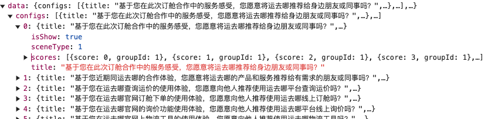
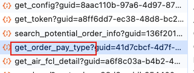

[TOC]


# 接口

## 点击查运价

调用接口1：

```python
https://gateway.yqn.com/api/39001/api/call/getAirFclItemList
```

入参:

```python
{
  "page": 1,
  "size": 20,
  "sortType": 1,              #排序类型:1:价格最低  2：航程最短
  "fromTerminalId": 1035004,    #起运港编号
  "fromTerminalType": 11,       #起运港类型
  "destinationTerminalId": 1040736,  
  "destinationTerminalType": 11,
  "packageNum": 0,     #件数
  "weight": 167,       #毛重
  "volume": 1,         #体积
  "etdDate": 1732847590765,   #预计开航日期
  "channelId": 3       #售卖渠道：2:QSHIPPING  3:新电商
}
```

出参：

```python
{
  "content": [
    {
      "carrier": {   #承运人信息
        "carrierId": 101118,  
        "carrierName": "博立航空",  
        "carrierCode": "PO", #承运人编码
        "carrierLogoUrl": "https://srfiles.yqn.com/fe/63001/fd42ddd6-3c46-4cbd-923b-9eb6c8e80e46/QQ%E6%88%AA%E5%9B%BE20240115102534.png", #承运人Logo
        "scac": "PO"  #标准承运人代码
      },
      "fromTerminal": {  #起运港信息
        "terminalId": 1035004,  
        "terminalEnName": "SHENZHEN BAOAN INTERNATIONAL APT",
        "terminalCnName": "深圳宝安机场",
        "countryCnShortName": "中国",
        "countryEnName": "CHINA",  #港口国家英文名
        "terminalCode": "SZX",   #港口代码
        "terminalEnNameCountry": "CHINA",  #港口英文名，英文国家
        "countryTwoCode": "CN", #国家二字码
        "countryId": null  #国家
      },
      "destinationTerminal": {
        "terminalId": 1040736,
        "terminalEnName": "PHOENIX,AZ",
        "terminalCnName": null,
        "countryCnShortName": "美国",
        "countryEnName": "UNITED STATES",
        "terminalCode": "PHX",
        "terminalEnNameCountry": "UNITED STATES",
        "countryTwoCode": "US",
        "countryId": null
      },
      "etdDate": 1732847590765,   #预计开航时间
      "etaDate": null,  #预计到达时间
      "viaWay": {  #中转方式
        "id": 2,
        "desc": "中转" 
      },
      "price": "9519.0",  #价格
      "sortPrice": 9519,  #排序用的价格
      "productTagList": null,   #商品标签集合
      "isLowestPrice": null,    #是否价格最低
      "isShortestVoyage": null, #是否航程最短
      "id": 1,                  #唯一项id 
      "currencySymbol": "¥",    #币种符号
      "currency": "CNY",        #币种
      "validFrom": 1732464000000, #有效期起始时间
      "validTo": 1732982400000,   #有效期截止时间
      "airBubbleRatioAndPrices": [ #商品泡重比价格信息
        {
          "bubbleRatio": "1:120.1 - 1:199.9",   #泡重比
          "sortBubbleRatio": 167,  #泡重比排序字段
          "isHitPrice": true,     #是否命中泡重比
          "productId": 114001707,  #商品ID
          "palletUnitPrice": 2,   #托盘单价
          "airProductPrice": [    #空运单价价格信息（数组）
            {
              "weightGrade": 6,   #单价档位枚举 1:+45kg,2:+100kg,3:+300kg,4:+500kg,5:+1000kg
              "unitPrice": null,  #单价
              "weightGradePriceId": 728897200,  #定档的价格id
              "billingWeight": null,  #商品计费重量
              "isHitWeightGrade": null, #是否命中档位
              "currencyCode": {    #币种code
                "id": null,
                "name": null,
                "chineseName": "人民币",
                "englishName": "CNY",
                "shortCode": "CNY",  #简码
                "currencySymbol": "¥"
              }
            }
          ]
      "transitDay": 0,   #没有注释
      "scheduleList": [  #班期集合
        1,
        2,
        3,
        4,
        5,
        6,
        7
      ],
      "serviceLevel": 3  #服务等级
    }
  ],
  "page": 1,
  "size": 20,
  "total": 1,
  "totalPage": null,
  "isLast": null
}
```


依赖接口：

通用数据枚举


---

接口2：

```python
https://gateway.yqn.com/api/39001/api/call/getBillingWeightProportion
```

入参

```python
{
  "packageNum": "1",   #商品件数
  "weight": 167,
  "volume": 1
}
```


出参

```python
{
  "billingWeight": 167,    #计费重量
  "proportion": 167,				#货物比重: = 毛重 / 体积 ,四舍五入保留整数
  "proportionStr": "1:167", #货物比重: = 毛重 : 体积
  "proportionDesc": {   #货物比重描述：抛货，平货，重货，通用配置数据
    "id": null,
    "name": null,
    "chineseName": "平货",
    "englishName": "平货",
    "shortCode": null,
    "additionalProperties": {}
  },
  "weightGrade": 2,		#计费重量满足的档位1:+45kg,2:+100kg,3:+300kg,4:+500kg,5:+1000kg
  "additionalProperties": {}
}
```


## 点击订舱

接口1：获取评分配置

```python
https://gateway.yqn.com/api/39001/api/call/score/v2/get_config
```

入参：

```python
{
  "channelId": 2
}
```

出参：



---

接口2：获取用户信息（宁波2）

```python
/api/39001/account/info/get_account_info
```

没有在页面上看到相关的出参，先跳过

无入参

出参：

```python
{
  "isSupplierRole": null,
  "electricityRole": {
    "id": 3657,
    "desc": "公司财务"
  },
  "hasUnconfirmedCustomerContacts": true,
  "companyAdminVOS": [
    {
      "companyAdminName": "周颖隽",
      "companyAdminMail": "yingjuan.zhou@fuyaogroup.com"
    },
    {
      "companyAdminName": "Jessie Li",
      "companyAdminMail": "foc.jli@walmay.com"
    }
  ],
  "notHasSaleContactNumber": false,
  "isDemonstrateAccount": false,
  "user_id": 1920372,
  "head_pic_url": null,
  "company_title": "福建沃美综合物流股份有限公司",
  "company_types": [
    {
      "type": 1,
      "desc_cn": "货运代理",
      "desc_en": "Supplier"
    },
    {
      "type": 4,
      "desc_cn": "报关代理",
      "desc_en": "CDSupplier"
    }
  ],
  "user_name": "test",
  "cellphone": "",
  "email": "fuyao@test.com",
  "wx_nick_name": null,
  "if_staff": 0,
  "if_set_password": 1,
  "telephone": "",
  "self_introduction": null,
  "info_complete_level": null,
  "user_identified": 1,
  "company_identified": 1,
  "show_workspace": 0,
  "shadow_key": "lrccLZLyZmryznUm4mwQfg==",
  "country_type": 0,
  "temp_company_title": "福建沃美综合物流股份有限公司",
  "invite_email": null,
  "user_role_id": 606,
  "account_verified": {
    "id": 2,
    "desc": "认证成功"
  },
  "user_company_level": null,
  "company_id": 50954,
  "obligation": null,
  "agreements": [
    {
      "sign_company_id": 1595866,
      "sign_company_name": "运去哪（厦门）供应链科技有限公司",
      "credit_limit": 1300000,
      "credit_limit_currency_id": 20,
      "credit_limit_currency_name": "USD",
      "clearing_form_name": "月结按固定日每月30号支付上月（前第1个月）开航费用"
    }
  ],
  "user_level": 3,
  "registry_type_id": 1,
  "company_verify_status": 1,
  "user_verify_status": 1,
  "company_manager_name": null,
  "had_completed_guide": 1,
  "if_follow_wechat_official_account": null,
  "if_follow_cwy_applet": null,
  "customer_type": 1,
  "account_id": 1810530,
  "is_switch_identity": 0,
  "identity_type": 2
}
```

---

接口3：电商空运下单-初始化token

```python
https://gateway.yqn.com/api/39001/api/call/air/online_retailers/init_token
```

入参:

```python
{
  "etd": 1732847590765,
  "productId": 114001707,
  "airTransport": {
    "pieces": "1",
    "grossWeight": 167,
    "volume": 1
  },
  "cargoType": 1
}
```

出参：

```python
{
  "etd": 1732847590765,
  "bpId": "50954",
  "token": "83d920ed78c2ec2d330eee781fe60997"
}
```

---

接口4：

```python
https://gateway.yqn.com/api/39004/service/official_website/home_page_config/get_official_website_home_page_config


```

入参：

```python
{
  "type": [
    17
  ],
  "channel": 1
}
```

出参：

```python
tab信息
```

应该直接调用原来的就好了

---

接口5：

```python
https://gateway.yqn.com/api/9706/api/call/yqn_market/bg/coupons/v2/query_coupons_count

```

入参：空

出参：

```python
{
  "validStatus": 0,
  "validCount": 0,
  "couponsTag": 0,
  "usedCount": 0
}
```

不知道该接口干啥的

---

接口6：电商空运下单-根据商品ld查询 token

```python
https://gateway.yqn.com/api/39001/api/call/air/online_retailers/get_token
```

入参:

```python
{
  "productId": "114001707"
}
```

出参:

```python
{
  "etd": 1732847590765,
  "bpId": "50954",
  "token": "83d920ed78c2ec2d330eee781fe60997"
}
```

---

接口7：**电商空运下单-查询预订单信息（费用 + 会员部分的数据）**

<font color=red> 费用要多一个附加费 </font>

```python
https://gateway.yqn.com/api/39001/api/call/air/online_retailers/search_potential_order_info

```

入参：

```python
{
  "token": "83d920ed78c2ec2d330eee781fe60997"
}
```

出参：

```python
{
  "servicesList": [],
  "potentialOrderBaseInfoVo": {
    "productId": "114001707",
    "etd": "2024-11-29 10:33:10",
    "airTransport": {
      "volume": 1,
      "grossWeight": 167
    },
    "trailerBriefInfoVos": [],
    "oceanShippingInfoVOList": []
  },
  "tranMethod": 0,
  "memberBenefits": [
    "20/40 ocean freight/服务费",
    "每月二次 free cancel"
  ],
  "orderInfoBoxPriceRespVO": {
    "charges": [
      {
        "priceUnit": [
          {
            "price": "9,519",
            "currencyCode": "CNY"
          }
        ],
        "chargeName": "空运运费"
      }
    ],
    "totalPriceSubtotal": [
      {
        "price": "9,519",
        "currencyCode": "CNY"
      }
    ],
    "exchangeRate": 7.109,
    "airExpensesDetail": {
      "airProductPrice": {},
      "airPrice": []
    },
    "erUpdateTime": "2024-10-28 09:39:52",
    "transferToCNY": "9,519"
  }
}
```

---

接口8：**电商空运下单-查询商品(运价)信息**

```python
https://gateway.yqn.com/api/39001/api/call/air/air_freight_inquiry/get_air_fcl_detail

```

入参：

```python
{
  "token": "83d920ed78c2ec2d330eee781fe60997"
}
```

出参：

```python
{
  "headers": {},
  "code": 200,
  "data": {
    "lineCode": "",
    "viaWay": {
      "id": 2,
      "desc": "中转"
    },
    "carrierInfo": {
      "carrierName": "博立航空",
      "carrierCode": "PO",
      "carrierLogoUrl": "https://srfiles.yqn.com/fe/63001/fd42ddd6-3c46-4cbd-923b-9eb6c8e80e46/QQ%E6%88%AA%E5%9B%BE20240115102534.png",
      "carrierId": 101118
    },
    "airProductPrice": {
      "price100": 57,
      "price300": 57,
      "price1000": 56,
      "price500": 56,
      "currencyCode": {
        "englishName": "CNY",
        "selectValue": 10,
        "shortCode": "CNY"
      }
    },
    "currencySymbol": "¥",
    "toTerminalInfo": {
      "terminalEnName": "PHOENIX,AZ",
      "countryEnName": "UNITED STATES",
      "terminalId": 1040736,
      "terminalCode": "PHX",
      "countryCnShortName": "美国"
    },
    "etdDate": 1732847590765,
    "validFrom": 1732464000000,
    "id": 114001707,
    "fromTerminalInfo": {
      "terminalEnName": "SHENZHEN BAOAN INTERNATIONAL APT",
      "countryEnName": "CHINA",
      "terminalId": 1035004,
      "terminalCode": "SZX",
      "countryCnShortName": "中国",
      "terminalCnName": "深圳宝安机场"
    },
    "viaTerminalId": {
      "terminalEnName": "LOS ANGELES INTERNATIONAL",
      "countryEnName": "UNITED STATES",
      "terminalId": 15172,
      "terminalCode": "LAX",
      "countryCnShortName": "美国",
      "terminalCnName": "洛杉矶机场"
    },
    "validTo": 1732982400000
  },
  "success": true,
  "msgCode": "SUCCESS"
}
```


## 点击下一步



除了红框的接口，剩下的点击订舱也调用了

接口：

```python
https://gateway.yqn.com/api/39001/api/call/air/online_retailers/Workbench/get_order_pay_type


```

入参:

```python
{
  "token": "83d920ed78c2ec2d330eee781fe60997"
}
```

出参：

```python
{
  "payTypeRespVOs": [
    {
      "status": 0,
      "contractId": -1,
      "isEnable": 1,
      "paymentType": 1,
      "paymentTypeName": "公账",
      "settlementType": 10,
      "settlementTypeName": "付款买单",
      "sourceBranchId": 1,
      "sourceBranchName": "运去哪物流科技集团有限公司",
      "type": 1,
      "additionalProperties": {}
    },
    {
      "status": 1,
      "contractId": 53282,
      "isEnable": 1,
      "paymentType": 1,
      "paymentTypeName": "公账",
      "settlementType": 1,
      "settlementTypeName": "月结",
      "sourceBranchId": 48,
      "sourceBranchName": "运去哪（厦门）供应链科技有限公司",
      "type": 2,
      "additionalProperties": {}
    }
  ],
  "additionalProperties": {}
}
```

---

## 再点击下一步

调用接口1：

```python
https://gateway.yqn.com/api/20030/agreement/getAccountPeriodSelected
```

入参：

```python
2
```

出参：

```python
{
  "accountageTypes": [
    {
      "id": 1,
      "chineseName": "按开航日",
      "englishName": "SetSail",
      "shortCode": "KH",
      "cnName": "按开航日"
    },
    {
      "id": 2,
      "chineseName": "按固定日",
      "englishName": "Fixed",
      "shortCode": "GD",
      "cnName": "按固定日"
    },
    {
      "id": 3,
      "chineseName": "按到港日",
      "englishName": "Arrival",
      "shortCode": "DG",
      "cnName": "按到港日"
    },
    {
      "id": 4,
      "chineseName": "按到仓日",
      "englishName": "DC",
      "shortCode": "DC",
      "cnName": "按到仓日"
    },
    {
      "id": 5,
      "chineseName": "按见票日",
      "englishName": "JP",
      "shortCode": "JP",
      "cnName": "按见票日"
    },
    {
      "id": 6,
      "chineseName": "按签收日",
      "englishName": "QS",
      "shortCode": "QS",
      "cnName": "按签收日"
    }
  ],
  "settlementTypes": [
    {
      "id": 1,
      "chineseName": "月结",
      "englishName": "Monthly",
      "shortCode": "YJ",
      "cnName": "月结"
    },
    {
      "id": 2,
      "chineseName": "票结",
      "englishName": "TicketSettlement",
      "shortCode": "PJ",
      "cnName": "票结"
    },
    {
      "id": 3,
      "chineseName": "托收",
      "englishName": "Collection",
      "shortCode": "TS",
      "cnName": "托收"
    },
    {
      "id": 4,
      "chineseName": "月结(单票)",
      "englishName": "SingleTicket",
      "shortCode": "YJDP",
      "cnName": "月结(单票)"
    },
    {
      "id": 10,
      "chineseName": "付款买单",
      "englishName": "Paybypayment",
      "shortCode": "FKMD",
      "cnName": "付款买单"
    },
    {
      "id": 5,
      "chineseName": "无",
      "englishName": "Without",
      "shortCode": "W",
      "cnName": "无"
    }
  ],
  "settlementDateTypes": [
    {
      "id": 1,
      "chineseName": "开航费用（无实际开航时，按预计开航）",
      "englishName": "kh",
      "shortCode": "KHFY",
      "cnName": "开航费用（无实际开航时，按预计开航）"
    },
    {
      "id": 2,
      "chineseName": "到港费用（无实际到港时，按预计到港）",
      "englishName": "dg",
      "shortCode": "DGFY",
      "cnName": "到港费用（无实际到港时，按预计到港）"
    },
    {
      "id": 3,
      "chineseName": "到仓费用（无实际到仓时，取预计到仓）",
      "englishName": "dc",
      "shortCode": "DCFY",
      "cnName": "到仓费用（无实际到仓时，取预计到仓）"
    },
    {
      "id": 4,
      "chineseName": "见票费用（大陆客户为开票时间，非大陆客户为客户对账单确认时间）",
      "englishName": "jp",
      "shortCode": "JPFY",
      "cnName": "见票费用（大陆客户为开票时间，非大陆客户为客户对账单确认时间）"
    },
    {
      "id": 5,
      "chineseName": "签收费用（无实际签收日期，取开航日期）",
      "englishName": "qs",
      "shortCode": "QSFY",
      "cnName": "签收费用（无实际签收日期，取开航日期）"
    }
  ],
  "serviceTypes": [
    {
      "id": 1,
      "chineseName": "海运进出口",
      "englishName": "SEAIMPORT",
      "shortCode": "HYJCK",
      "cnName": "海运进出口"
    },
    {
      "id": 2,
      "chineseName": "陆运进出口",
      "englishName": "LANDIMPORT",
      "shortCode": "LYJCK",
      "cnName": "陆运进出口"
    },
    {
      "id": 3,
      "chineseName": "空运进出口",
      "englishName": "AIRIMPORT",
      "shortCode": "KYJCK",
      "cnName": "空运进出口"
    }
  ],
  "lastMonth": [
    {
      "id": 1,
      "chineseName": "上月（前第1个月）",
      "englishName": "sy",
      "shortCode": "SY",
      "cnName": "上月（前第1个月）"
    },
    {
      "id": 2,
      "chineseName": "上上月（前第2个月）",
      "englishName": "ssy",
      "shortCode": "SSY",
      "cnName": "上上月（前第2个月）"
    },
    {
      "id": 3,
      "chineseName": "上上上月（前第3个月）",
      "englishName": "sssy",
      "shortCode": "SSSY",
      "cnName": "上上上月（前第3个月）"
    },
    {
      "id": 4,
      "chineseName": "上上上上月（前第4个月）",
      "englishName": "ssssy",
      "shortCode": "SSSSY",
      "cnName": "上上上上月（前第4个月）"
    }
  ],
  "balanceProtocolTypes": [
    {
      "id": 1,
      "chineseName": "未签协议",
      "englishName": "未签协议",
      "shortCode": "WQXY",
      "cnName": "未签协议"
    },
    {
      "id": 2,
      "chineseName": "月结协议",
      "englishName": "月结协议",
      "shortCode": "YJXY",
      "cnName": "月结协议"
    },
    {
      "id": 3,
      "chineseName": "付款买单",
      "englishName": "付款买单",
      "shortCode": "FKDM",
      "cnName": "付款买单"
    }
  ],
  "protocolType": [
    {
      "id": 1,
      "chineseName": "永远有效",
      "englishName": "永远有效",
      "shortCode": "YYYX",
      "cnName": "永远有效"
    },
    {
      "id": 2,
      "chineseName": "设置有效期",
      "englishName": "设置有效期",
      "shortCode": "SZYXQ",
      "cnName": "设置有效期"
    }
  ]
}
```

---

调用接口2：

```python
https://gateway.yqn.com/api/40002/saas/v2/search/air/searchOrder
```

入参：

```python
{
  "page": 1,
  "size": 20,
  "pod_id": null,
  "customs_declaration_status": 1,
  "pol_id": null,
  "service_types": null
}
```

出参：

```python
{
  "content": [
    {
      "customsNo": null,
      "contractConsigneeName": null,
      "contractShipperName": null,
      "scheduleEstimateArrPortDate": null,
      "scheduleEstimateDeliveryDate": 1732847590000,
      "scheduleActualDeliveryDate": null,
      "cargoPieces": 1,
      "cargoGrossWeight": "167.0",
      "cargoVolume": "1.0",
      "carrier": null,
      "voyageDays": null,
      "viaWayDesc": null,
      "estimateArrPortDate": null,
      "estimate_arrive_date": null,
      "actualArrPortDate": null,
      "estimateArrPortDateDischargePort": null,
      "actualArrPortDateDischargePort": null,
      "riskInfo": "",
      "btnList": [
        {
          "title": "COPY_ORDER_BTN",
          "key": 1
        }
      ],
      "jumpLink": null,
      "orderCategoryType": 5,
      "orderContainerList": null,
      "containerStr": null,
      "fromTerminalExport": "SHENZHEN BAOAN INTERNATIONAL APT,CHINA",
      "toTerminalExport": "PHOENIX,AZ,UNITED STATES",
      "containerNumStr": null,
      "orderTypeListStr": "",
      "serviceTypeListStr": "订舱",
      "order_id": 3275509,
      "order_key": "tlVKmX7R45FLk8Gs3tyPOQ==",
      "order_no": "YQNXMAE3275509",
      "customer": null,
      "contact": null,
      "bl_no": "",
      "work_no": "",
      "containers": null,
      "from_terminal": {
        "terminal_id": 1035004,
        "terminal_id_old": null,
        "terminal_code": null,
        "terminal_en_name": "SHENZHEN BAOAN INTERNATIONAL APT",
        "terminal_cn_name": null,
        "country_cn_short_name": null,
        "country_en_name": "CHINA",
        "country_three_code": null,
        "city_en_name": null,
        "city_cn_name": null,
        "terminal_en_name_country": null
      },
      "to_terminal": {
        "terminal_id": 1040736,
        "terminal_id_old": null,
        "terminal_code": null,
        "terminal_en_name": "PHOENIX,AZ",
        "terminal_cn_name": null,
        "country_cn_short_name": null,
        "country_en_name": "UNITED STATES",
        "country_three_code": null,
        "city_en_name": null,
        "city_cn_name": null,
        "terminal_en_name_country": null
      },
      "vessel_name": "",
      "voyage": "",
      "transit_days": null,
      "voyage_percent": null,
      "estimate_berthing_date": null,
      "actural_berthing_date": null,
      "estimate_leave_date": null,
      "actural_leave_date": null,
      "create_date": 1732866865000,
      "closing_date": null,
      "arrival_port_date": null,
      "open_port_date": null,
      "close_port_date": null,
      "customs_clearance": "未海放",
      "wharf_clearance": "未码放",
      "stowage_mark": "未配载",
      "seal_no_list": null,
      "container_num": null,
      "progress_axis_text": null,
      "order_type_list": [
        {
          "id": 1,
          "desc": "待获得预配"
        },
        {
          "id": 2,
          "desc": "待开航"
        }
      ],
      "service_type_list": [
        {
          "id": 3,
          "desc": "订舱"
        }
      ],
      "it_pickup_dates": null,
      "trade_term": {
        "id": 0,
        "desc": "-"
      },
      "risks": null,
      "box_state": null,
      "carrier_id": null,
      "carrier_code": null,
      "carrier_name": null
    },
    {
      "customsNo": null,
      "contractConsigneeName": null,
      "contractShipperName": null,
      "scheduleEstimateArrPortDate": null,
      "scheduleEstimateDeliveryDate": 1733032800000,
      "scheduleActualDeliveryDate": null,
      "cargoPieces": 2,
      "cargoGrossWeight": "167.0",
      "cargoVolume": "2.0",
      "carrier": null,
      "voyageDays": null,
      "viaWayDesc": null,
      "estimateArrPortDate": null,
      "estimate_arrive_date": null,
      "actualArrPortDate": null,
      "estimateArrPortDateDischargePort": null,
      "actualArrPortDateDischargePort": null,
      "riskInfo": "",
      "btnList": [
        {
          "title": "COPY_ORDER_BTN",
          "key": 1
        }
      ],
      "jumpLink": null,
      "orderCategoryType": 5,
      "orderContainerList": null,
      "containerStr": null,
      "fromTerminalExport": "SHANGHAI PUDONG INTERNATIONAL APT,CHINA",
      "toTerminalExport": "JOHN F. KENNEDY APT/NEW YORK,NY,UNITED STATES",
      "containerNumStr": null,
      "orderTypeListStr": "",
      "serviceTypeListStr": "订舱",
      "order_id": 3264798,
      "order_key": "FWDu9YGJU9Hrj34bYQyOTQ==",
      "order_no": "YQNXMAE3264798",
      "customer": null,
      "contact": null,
      "bl_no": "",
      "work_no": "",
      "containers": null,
      "from_terminal": {
        "terminal_id": 1034999,
        "terminal_id_old": null,
        "terminal_code": null,
        "terminal_en_name": "SHANGHAI PUDONG INTERNATIONAL APT",
        "terminal_cn_name": null,
        "country_cn_short_name": null,
        "country_en_name": "CHINA",
        "country_three_code": null,
        "city_en_name": null,
        "city_cn_name": null,
        "terminal_en_name_country": null
      },
      "to_terminal": {
        "terminal_id": 1040168,
        "terminal_id_old": null,
        "terminal_code": null,
        "terminal_en_name": "JOHN F. KENNEDY APT/NEW YORK,NY",
        "terminal_cn_name": null,
        "country_cn_short_name": null,
        "country_en_name": "UNITED STATES",
        "country_three_code": null,
        "city_en_name": null,
        "city_cn_name": null,
        "terminal_en_name_country": null
      },
      "vessel_name": "",
      "voyage": "",
      "transit_days": null,
      "voyage_percent": null,
      "estimate_berthing_date": null,
      "actural_berthing_date": null,
      "estimate_leave_date": null,
      "actural_leave_date": null,
      "create_date": 1732515024000,
      "closing_date": null,
      "arrival_port_date": null,
      "open_port_date": null,
      "close_port_date": null,
      "customs_clearance": "未海放",
      "wharf_clearance": "未码放",
      "stowage_mark": "未配载",
      "seal_no_list": null,
      "container_num": null,
      "progress_axis_text": null,
      "order_type_list": [
        {
          "id": 1,
          "desc": "待获得预配"
        },
        {
          "id": 2,
          "desc": "待开航"
        }
      ],
      "service_type_list": [
        {
          "id": 3,
          "desc": "订舱"
        }
      ],
      "it_pickup_dates": null,
      "trade_term": {
        "id": 3,
        "desc": "FOB"
      },
      "risks": null,
      "box_state": null,
      "carrier_id": null,
      "carrier_code": null,
      "carrier_name": null
    }
  ],
  "sort": [],
  "page": 1,
  "size": 20,
  "total": 2,
  "totalPage": 1,
  "isLast": 0
}
```

---

调用接口3:

```python
https://gateway.yqn.com/api/9903/api/call/yqn_general/bg/general_setting/category_details/v2/get_by_key
```

入参：

```python
{
  "key": "customsCode",
  "page": 1,
  "size": 100
}
```

出参：

```python
{
  "page": 1,
  "size": 100,
  "total": 3,
  "totalPage": 1,
  "isLast": 0,
  "content": [
    {
      "id": 16548,
      "categoryId": 113,
      "chineseName": "全部",
      "description": null,
      "englishName": "all",
      "groupKey": null,
      "isDefault": true,
      "key": "customsCode",
      "parentId": "0",
      "selectedValue": 1,
      "shortCode": "1",
      "sort": 1
    },
    {
      "id": 16549,
      "categoryId": 113,
      "chineseName": "已报关",
      "description": null,
      "englishName": "Have customs clearance",
      "groupKey": null,
      "isDefault": false,
      "key": "customsCode",
      "parentId": "0",
      "selectedValue": 2,
      "shortCode": "2",
      "sort": 2
    },
    {
      "id": 16550,
      "categoryId": 113,
      "chineseName": "待报关",
      "description": null,
      "englishName": "For customs declaration",
      "groupKey": null,
      "isDefault": false,
      "key": "customsCode",
      "parentId": "0",
      "selectedValue": 3,
      "shortCode": "3",
      "sort": 3
    }
  ]
}
```

---

调用接口3：

```python
https://gateway.yqn.com/api/40002/search/getSearchConfigs
```

入参：

```python
613011203
```

出参：

```python
{
  "filterColumnNames": [],
  "columnNames": [],
  "columnWidth": [],
  "filterConfig": "",
  "columnsConfig": "",
  "uniqueType": ""
}
```

---

接口：

```python
https://gateway.yqn.com/api/39001/api/call/air/online_retailers/create_air_transport_order

```

入参：

```python
83d920ed78c2ec2d330eee781fe60997
```

出参:

```python
{
  "orderKey":"rl0-xbkTn3MgbgChmXq54w==","code":0,"orderId":3276007
}
```


# 数据库

## 建表语句

```sql
CREATE TABLE `air_outside_booking_operation_log` (
  `id` bigint(20) unsigned NOT NULL AUTO_INCREMENT COMMENT '日志主键',
  `trace_id` varchar(128) NOT NULL COMMENT '分布式跟踪traceId',
  `operator_id` bigint(20) NOT NULL COMMENT '操作者id',
  `operate_type` tinyint(3) NOT NULL COMMENT '操作类型: 1-新增; 2-修改; 3-删除',
  `content` text NOT NULL COMMENT '操作内容',
  `created_id` bigint(20) NOT NULL COMMENT '创建人id',
  `created_date` datetime NOT NULL DEFAULT CURRENT_TIMESTAMP COMMENT '创建时间',
  `updated_id` bigint(20) DEFAULT NULL COMMENT '修改人id',
  `updated_time` timestamp NULL DEFAULT CURRENT_TIMESTAMP ON UPDATE CURRENT_TIMESTAMP COMMENT '修改时间',
  `is_active` tinyint(1) NOT NULL DEFAULT 1 COMMENT '是否有效，1-有效，0-无效',
  `business_key` varchar(128) DEFAULT NULL COMMENT '业务主键，如合同ID或订单号',
  `source` varchar(64) DEFAULT NULL COMMENT '操作来源，例如: 汉莎系统、人员、job',
  `remarks` text DEFAULT NULL COMMENT '备注信息，记录额外信息或特殊说明',
  PRIMARY KEY (`id`),
  UNIQUE KEY `idx_trace_id` (`trace_id`)
) ENGINE=InnoDB DEFAULT CHARSET=utf8mb4 ROW_FORMAT=DYNAMIC COMMENT='实际订舱操作日志表';
```

canal接的表：
```
air_outside_booking_record
air_outside_booking_flight_item
air_outside_booking_expense_item
air_outside_booking_commodity_item
```


记录订舱日志：

新增订舱日志，调用我的方法。

