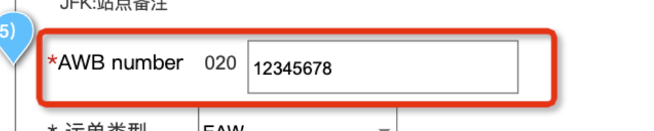
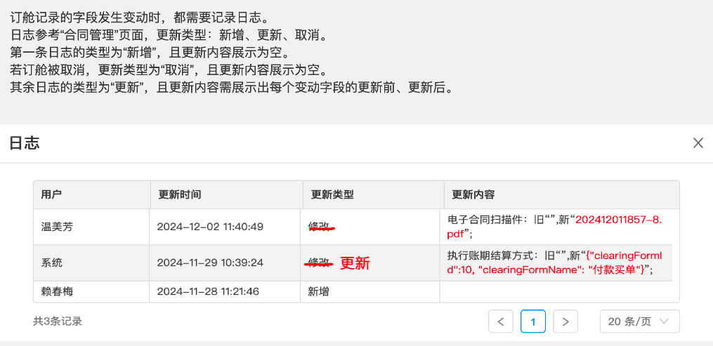
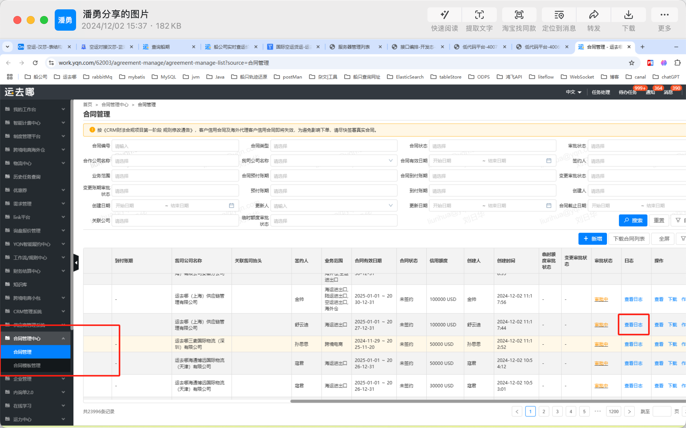
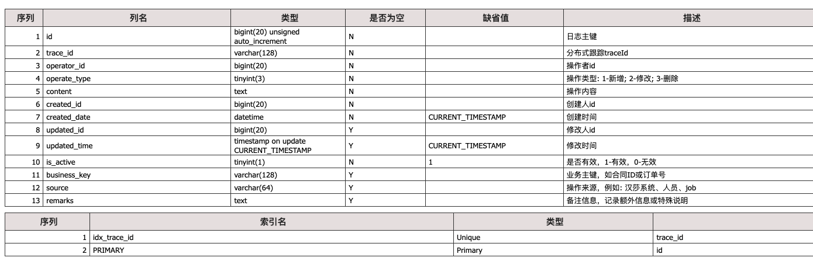

vm

```java
-Denv=UAT
-Dapollo.cluster=qa4
-Dapollo.meta=http://apollo.qa4.yqn.corp:8080
-Dspring.profiles.active=dev
-Dapp.log.local=true
```


发布：

项目管理、版本管理、迭代-履约、发布清单


项目上线前，不能提前下班，要给与支持

40065的1211

40062的1211

---


- [ ] 这个地方去数据库校验是否存在，已存在就不能创建




- [ ] 日志





日志的表结构：



- [ ] 接订单配置中心，是用户自己勾选的，用户选择了什么服务，才推送什么信息。


点击提交订舱按钮：订舱新增、航班明细新增、  货物明细新增、费用信息新增   需要记录日志

点击取消订舱按钮：订舱删除 、航班明细删除、 货物明细删除、费用信息删除   需要记录日志

点击确定更新按钮： 订舱修改 、航班明细修改(可能)、货物明细修改(可能)、费用信息修改(可能)   需要记录日志

收到booking push推送的更新信息： 和点击确定更新按钮一致。

job推送更新信息


- [ ] 按照更新时间排序


canal作用：观察配置的表是否发生变更，如果变更了，记录变更前的表数据，和变更后的表数据。

外部只能通过调用接口，通过传业务主键(businessKey)，来获取到指定表指定行数据发生变更的前后内容。

但是我们的需求是：不仅更新外部订舱要记录日志，而且更新了航班详情、费用信息、以及货物信息。都要记录日志。并且航班详情、费用信息、货物信息通过outside_key记录它所属于哪一个订舱id。

要实现的效果：点击查看日志，找到当前订舱记录的订舱id，通过该订舱id(订舱的businessKey)去查查看日志。不仅要看到订舱记录表的日志，还要找到航班详情、费用信息、以及货物信息 关关联 该订舱id下的日志。


```
https://ops.iyunquna.com
/integrated-development/interface/detail/559664?apiId=17392&appVersionId=null&source=%E5%BA%94%E7%94%A8%E5%88%97%E8%A1%A8


```

