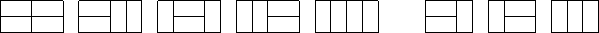

[TOC]

# dp

## 状态机

### 打家劫舍

题目：不能偷相邻两家的钱，总共最多能偷多少钱。

把一个点扩展为某一个过程，被成为状态机。

打家劫舍新的分析方式：

一般方法用到了i-1。增加限制：**只用i-1**，不用i-2，就要使用状态机了。

如果i-1选了，i就不能选，如果i-1没选，i就可以选。

引入两个状态，把每个dp[i]分解成两个状态，`dp[i][0]`和`dp[i][1]`

`dp[i][0]`没有选第i个店铺，`dp[i][1]`选择了第i个店铺

一般做法选和不选是混在一起的，现在将他分离开了，非常的清楚。

转移模型：


不选 ->不选， 不选->选，  选->不选。这三种可以，但是选->选是不行的。

因此这个状态机就是两个点三条边。

> 在rsa中，两个私钥p和q是很大的指数，公钥N = p * q，这样如果只知道N，找不到p和q
>
> 但是要是有p和q，就能找到N。
>
> 这就是状态机的应用，有N的话，N是p和q混在一起的，难以解决，分开了，就好解决了。

从`dp[i]到dp[i+1]`，通过边来走。

任何一个抢劫的方案都能对应状态机的走法


这个图太吊了：状态走法正好对应上状态计算。

代码：

```c++
vector<vector<int>> dp(vec.size() + 1, vector<int> (2,0));
dp[0][0] = 0;
dp[0][0] = 0;
dp[1][0] = 0;
dp[1][1] = vec[0];
int res = 0;
for(int i = 1; i <= vec.size(); i++) {
    dp[i][0] = max(dp[i-1][0], dp[i-1][1]);
    dp[i][1] = dp[i-1][0] + vec[i-1];
    res = max(res, dp[i][1]);
}
cout << res << endl;
```

### 股票

状态机：


入口：初始状态，也就是手中无货，所以初始化值初始化入口

```c++
for(int i = 0; i <= prices.size(); i++) {
    dp[i][0][0] = 0;
}
```

出口：结束状态，手中无货，结束的res从出口找

```c++
int res =  0;
for(int j = 0;  j <= k; j++) {
    res = max(res, dp[prices.size()][j][0]);
}
```


`f[i][j][k]`，前i天，第j次交易，持有或者不持有股票所 得到的钱。

**使用j的原因：限制了交易次数，所以要有j。**

卖出：第i天第j次交易不持有股票 = max(第i-1天，第j次交易，不持有股票 |  第i-1天，==第j次交易==，持有股票) 

买入：第i天第j次交易持有股票 = max(第i-1天，第j次交易，持有股票 |  第i-1天，==第j-1次交易==，不持有股票) 

**交易开始  -> 买入 ->  持有  -> 卖出   -> 不持有 ->  交易结束**

不持有股票 = 卖出，卖出相当于结束一次交易，因此是j转移而来

持有股票 = 买入， 买入就相当于开始新的一次交易，因此是j-1转移而来


初始化为0：表示状态合法	

初始化为负无穷：表示状态不合法，不希望从这个不合法的状态转移到别的状态

初始情况：`dp[i][0][0]`和`dp[i][0][1]`

`dp[i][0][0]`：第i天的第0次交易不持有股票，肯定是合法的。`dp[i][0][1]`不合法，因为持有必须从上一轮的不持有而来，所以第0次交易持有不合法，初始化为负无穷。

其他情况都是能够转移了，因为是找最大值，所以初始化为负无穷或者0即可。

代码：

```c++
int maxProfit(int k, vector<int>& prices) {
    int dp[prices.size()+ 1][k + 1][2];
    memset(dp, -0x3f, sizeof dp);
    for(int i = 0; i <= prices.size(); i++) {
        dp[i][0][0] = 0;
    }
    for(int i = 1; i <= prices.size(); i++) {
        for(int j = 1; j <= k; j++) {
            dp[i][j][0] = max(dp[i-1][j][0],  dp[i-1][j][1] + prices[i-1]);
            dp[i][j][1] = max(dp[i-1][j][1], dp[i-1][j-1][0] - prices[i-1]);
        }
    }
    int res =  0;
    for(int j = 0;  j <= k; j++) {
        res = max(res, dp[prices.size()][j][0]);
    }
    return res;
}
```


#### 有冷冻期


入口：初始状态

出口：结果

代码：

```c++
int maxProfit(vector<int>& prices) {
    int n = prices.size();
    int dp[n+1][3];
    memset(dp, -0x3f, sizeof dp);
    for(int i = 0; i <= n; i++) {
        dp[i][2] = 0;
    }
    for(int i = 1; i <= n; i++) {
        dp[i][0] = max(dp[i-1][0], dp[i-1][2] - prices[i-1]);
        dp[i][1] = max(dp[i-1][1], dp[i-1][0] + prices[i-1]);
        dp[i][2] = max(dp[i-1][2], dp[i-1][1]);
    }
    int res = 0;
    for(int i = 0; i <= n; i++) {
        res = max(res, dp[i][1]);
    }
    return res;
}
```


## 状态压缩dp

### 蒙德里安的梦想

求把 *N*×*M* 的棋盘分割成若干个 1×2的长方形，有多少种方案。

例如当 *N*=2，*M*=4时，共有 5 种方案。当 *N*=2，*M*=3 时，共有 3 种方案。

如下图所示：

 


思路：横放的情况确定了，竖着放的情况也就确定下来了，因此只看横着放的就行。

> 竖着按照列来看：
>
> 1. (j-1 & j） == 0     
>
> 2.  j -1  |  j  不存在连续奇数个0


## 树形dp

找树的直径：

1.任取一点作为起点，找到距离该点最远的一个点u，

2.找到距离u最远的点v

这样u和v之间的路径就是一条直径


# 高级数据结构

## 并查集

1、合并两个集合

2、查询你某个元素的祖宗节点

操作：
	1）记录每个集合大小 （绑定到根节点）

​	2） 每个点到根节点的距离 （绑定到每个元素上）


> 2维图像转一维公式:  x * n + y   , n是确定好二维的大小
>
> get(int x, iny ) {
>
> ​	return  x * n + y
>
> }
>
> 从0,0开始才能用，如果题目是从1,1开始的。就在拿到x,y以后，让他们减减。


## trie树

定义：高效地**存储和查找**字符串集合的数据结构

题目局限：要不就全是小写字母，要不就全是数字，要不就全是大写字母。总之类型不会很多。

> 使用树来存储字符串，并且在结尾处打上标记，表示到这里有一个单词。
>
> 比如有一个abcd，d打标记了，然后查abc，是能找到c，但是c没标记，所以也算作没有找到abc这个单词

